some preliminary analyses of the GOA pcod 2021 samples
================
Kimberly Ledger
2023-08-03

load libraries

``` r
library(tidyverse)
```

    ## ── Attaching packages ─────────────────────────────────────── tidyverse 1.3.2 ──
    ## ✔ ggplot2 3.4.2     ✔ purrr   1.0.1
    ## ✔ tibble  3.2.1     ✔ dplyr   1.1.2
    ## ✔ tidyr   1.3.0     ✔ stringr 1.5.0
    ## ✔ readr   2.1.3     ✔ forcats 0.5.2
    ## ── Conflicts ────────────────────────────────────────── tidyverse_conflicts() ──
    ## ✖ dplyr::filter() masks stats::filter()
    ## ✖ dplyr::lag()    masks stats::lag()

``` r
library(ggplot2)
library(vegan)
```

    ## Loading required package: permute
    ## Loading required package: lattice
    ## This is vegan 2.6-4

``` r
library(treemapify)
library(RColorBrewer)     
```

read in sample metadata

``` r
metadata <- read.csv("/genetics/edna/workdir/GOApcod_2021/GOA2021_metadata_20230630.csv")

#illumina output changed "_" to "-"
metadata$Sample_ID <- gsub("_", "-", metadata$Sample_ID) 
```

read in decontaminated sample table

``` r
decontam_reads <- read.csv("/home/kimberly.ledger/GOApcod_2021/decontamination_output_20230707.csv") %>%
  select(!sample_type) %>%   ## clean-up this table - remove irrelevant columns 
  select(!loc.asv) %>%
  select(!new_ID) %>%
  select(!site_biorep)
```

read in taxonomic assignments

``` r
taxonomy <- read.csv("/home/kimberly.ledger/GOApcod_2021/taxonomy_assignments.csv") %>%
  select(!X)
```

now join the decontaminated read numbers with taxonomic assignments and
remove ASVs with no taxon ID

``` r
asv_w_id <- decontam_reads %>%
  left_join(taxonomy, by = "ASV") %>%
  filter(!is.na(taxon)) 
```

plot the proportion of reads for a taxon assigning to individual ASV’s
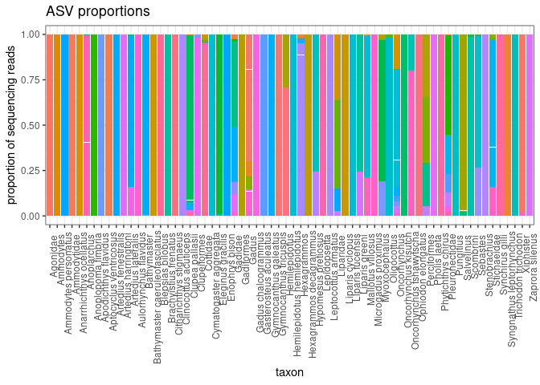<!-- -->

okay, so most taxa (especially species-level) are only made up of one
ASV, while other taxa have several ASVs

since a focus of this project is on the gadids, let me take a closer
look at those ASVS

``` r
asv_w_id %>%
  filter(order == "Gadiformes") %>%
  group_by(taxon) %>%
  mutate(sum=sum(reads)) %>%
  mutate(prop = reads/sum) %>%
  ggplot(aes(x=taxon, y=prop, fill=ASV)) +
  geom_bar(stat = "identity") + 
    theme_bw() +
  labs(
    y = "proportion of sequencing reads",
    x = "taxon",
    title = "ASV proportions") + 
  theme(
    axis.text.x = element_text(angle = 90, hjust = 0.95),
    legend.text = element_text(size = 8),
    legend.key.size = unit(0.3, "cm"),
    legend.position = "none",
    legend.title = element_blank()
  )
```

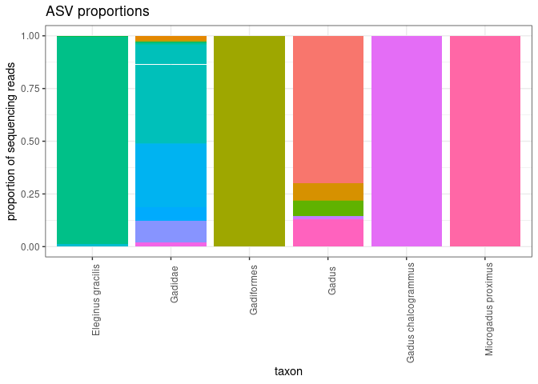<!-- -->

asv summary table - only keeping order and below because everything
above that (i.e. class) is identical

``` r
asv_id_table <- asv_w_id %>%
 select(ASV, order, family, genus, species, taxon, reads) %>%
 group_by(taxon) %>%
 filter(taxon != "NA") %>%
 mutate(sum=sum(reads)) %>%
 mutate(prop = reads/sum) %>%
 arrange(order, family, genus, species)
```

arrange taxons by taxonomy instead of alphabetical

``` r
asv_order <- asv_w_id %>%
 arrange(order, family, genus, species) %>%
 select(taxon) %>%
 unique()
```

change to factors… maybe want to join more metadata here. for now i’m
just using what’s already in the tables

``` r
asv_w_id$Sample_ID <- as.factor(asv_w_id$Sample_ID)
asv_w_id$ASV <- as.factor(asv_w_id$ASV)
asv_w_id$pcr_replicate <- as.factor(asv_w_id$pcr_replicate)
asv_w_id$biological_replicate <- as.factor(asv_w_id$biological_replicate)
asv_w_id$extraction_ID <- as.factor(asv_w_id$extraction_ID)
#asv_w_id$extraction_replicate <- as.factor(asv_w_id$extraction_replicate)
#asv_w_id$run <- as.factor(asv_w_id$run)
asv_w_id$location1 <- as.factor(asv_w_id$location1)
#asv_w_id$sample_type <- as.factor(asv_w_id$sample_type)
asv_w_id$taxon <- as.factor(asv_w_id$taxon)

summary(asv_w_id)
```

    ##     Sample_ID          ASV            reads         biological_replicate
    ##  e00530-A:   42   ASV5   :  692   Min.   :    0.0   e02092 :  156       
    ##  e00530-B:   42   ASV2   :  666   1st Qu.:    0.0   e02093 :  156       
    ##  e00530-C:   42   ASV1   :  662   Median :  103.5   e02096 :  150       
    ##  e00531-A:   42   ASV6   :  633   Mean   : 1078.9   e02082 :  144       
    ##  e00531-B:   42   ASV4   :  556   3rd Qu.: 1041.5   e02083 :  144       
    ##  e00531-C:   42   ASV8   :  489   Max.   :56544.7   e02084 :  144       
    ##  (Other) :15008   (Other):11562                     (Other):14366       
    ##  pcr_replicate extraction_ID     location1                 taxon     
    ##  A:4526        e00530 :  126   97     :  432   Gadus          :2028  
    ##  B:4480        e00531 :  126   100    :  416   Oncorhynchus   :1664  
    ##  C:4395        e00532 :  126   99     :  400   Clupea pallasii:1067  
    ##  D: 632        e00423 :  102   54     :  378   Hexagrammos    : 940  
    ##  E: 596        e00560 :   99   102    :  374   Pleuronectidae : 760  
    ##  F: 631        e00561 :   99   94     :  368   Pholis laeta   : 633  
    ##                (Other):14582   (Other):12892   (Other)        :8168  
    ##      rank             kingdom             phylum             class          
    ##  Length:15260       Length:15260       Length:15260       Length:15260      
    ##  Class :character   Class :character   Class :character   Class :character  
    ##  Mode  :character   Mode  :character   Mode  :character   Mode  :character  
    ##                                                                             
    ##                                                                             
    ##                                                                             
    ##                                                                             
    ##     order              family             genus             species         
    ##  Length:15260       Length:15260       Length:15260       Length:15260      
    ##  Class :character   Class :character   Class :character   Class :character  
    ##  Mode  :character   Mode  :character   Mode  :character   Mode  :character  
    ##                                                                             
    ##                                                                             
    ##                                                                             
    ## 

relevel the taxon factor

``` r
desired_order <- asv_order$taxon

asv_w_id <- asv_w_id %>%
  mutate(taxon = factor(taxon, levels = desired_order))

#levels(asv_w_id$taxon)
```

make a table with taxons and total read counts

``` r
asv_w_id %>%
  group_by(taxon) %>%
  summarise(total_reads = sum(reads)) %>%
  arrange(desc(total_reads))
```

    ## # A tibble: 66 × 2
    ##    taxon                total_reads
    ##    <fct>                      <dbl>
    ##  1 Gadus                   3596208.
    ##  2 Clupea pallasii         2393627.
    ##  3 Oncorhynchus            2121132.
    ##  4 Ammodytes personatus    1143246.
    ##  5 Hexagrammos             1059587.
    ##  6 Pholis laeta             712811.
    ##  7 Anoplarchus              509508.
    ##  8 Pleuronectidae           499097 
    ##  9 Cottidae                 406250.
    ## 10 Gadidae                  322412.
    ## # ℹ 56 more rows

how many taxa and reads are assigned to each taxonomic rank?

``` r
asv_w_id %>%
  group_by(rank) %>%
  summarize(n_taxa = n_distinct(taxon),
            n_reads = sum(reads))
```

    ## # A tibble: 4 × 3
    ##   rank    n_taxa  n_reads
    ##   <chr>    <int>    <dbl>
    ## 1 family       8 1519275.
    ## 2 genus       15 8534090.
    ## 3 order        3   53864 
    ## 4 species     40 6357194.

okay well operating at the genus level would encompass 55/66 (83%) of
the taxa and 90% of the reads. not sure if i should do this though….

list of things i might want to calculate with this dataset (just using
the eDNA results and not incorporating any catch/environmental data just
yet)

1- Alpha diversity: total species richness for each site (then compare
sites using an ANOVA) \* this will surely be influenced by the different
taxonomic ranks in the data set…

``` r
richness <- asv_w_id %>%
  group_by(location1) %>%
  summarize(richness = n_distinct(taxon)) 

summary(richness$richness)
```

    ##    Min. 1st Qu.  Median    Mean 3rd Qu.    Max. 
    ##    2.00   11.00   14.00   13.92   17.00   25.00

this version just considers richness at the genus level (ranks above
genus are grouped as one..)

``` r
richness_genus <- asv_w_id %>%
  group_by(location1, genus) %>%
  summarize(richness = n_distinct(taxon)) %>%
  group_by(location1) %>%
  summarize(genus.richness = n_distinct(genus))
```

    ## `summarise()` has grouped output by 'location1'. You can override using the
    ## `.groups` argument.

``` r
summary(richness_genus$genus.richness)
```

    ##    Min. 1st Qu.  Median    Mean 3rd Qu.    Max. 
    ##    2.00   10.00   12.00   11.78   14.00   21.00

okay, since i have 83 different sites it doesn’t make sense to compare
richness between sites at this point in time. maybe an ANOVA would be
useful if there is some way to group sites together according to
something ecological(?)

let’s plot the genus richness for fun

``` r
richness.plot <- richness_genus %>%   
  ggplot(aes(x = location1, y= genus.richness)) +
  geom_point() +
  lims (y= c(0,max(richness_genus$genus.richness))) +
  labs (y = "Genus richness")

richness.plot
```

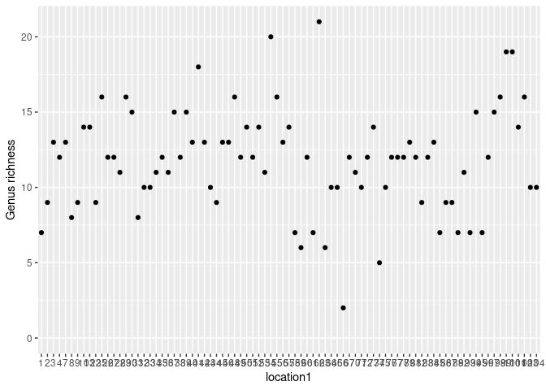<!-- -->

NEXT - rarify read count to account for uneven sampling between samples

reformat data

``` r
# arrange by sample id 
asv_w_id <- asv_w_id %>%
  arrange(Sample_ID)

#for rarefaction i need taxa in the columns and samples in rows 
ASV_table <- asv_w_id %>%
  group_by(Sample_ID, taxon) %>%
  summarize(total_reads = sum(reads)) %>%
  pivot_wider(names_from = "taxon", values_from = "total_reads")
```

    ## `summarise()` has grouped output by 'Sample_ID'. You can override using the
    ## `.groups` argument.

``` r
ids <- as.character(ASV_table$Sample_ID)
ASV_table <- ASV_table[,-1]

ASV_table[is.na(ASV_table)] <- 0
ASV_table <- as.data.frame(lapply(ASV_table, as.integer))
rownames(ASV_table) <- ids

#save metadata associated with ASV_table
rrMeta <- metadata %>%
  arrange(Sample_ID) %>%
  filter(Sample_ID %in% ids)
```

rarify read counts

``` r
rr_ASV <- as.data.frame(rrarefy(ASV_table, sample = min(rowSums(ASV_table))))
```

do i lose any taxa by doing this??

``` r
colSums(rr_ASV)
```

    ##        Cymatogaster.aggregata               Clupea.pallasii 
    ##                         12611                        187299 
    ##                  Clupeiformes                       Gadidae 
    ##                          2846                         22289 
    ##           Microgadus.proximus                   Oligocottus 
    ##                           605                          9337 
    ##        Gasterosteus.aculeatus                   Anoplarchus 
    ##                          3453                         39418 
    ##                     Scombrini      Syngnathus.leptorhynchus 
    ##                          9816                           360 
    ##                         Gadus       Citharichthys.stigmaeus 
    ##                        269126                           793 
    ##                  Oncorhynchus          Oncorhynchus.kisutch 
    ##                        162019                         19562 
    ##         Brachyistius.frenatus                      Cottidae 
    ##                           145                         27170 
    ##   Hemilepidotus.hemilepidotus       Hexagrammos.decagrammus 
    ##                          8662                         20040 
    ##                  Pholis.laeta                      Sebastes 
    ##                         58451                         12829 
    ##                   Stichaeidae      Oncorhynchus.tshawytscha 
    ##                         13037                           669 
    ##                    Salvelinus           Hypomesus.pretiosus 
    ##                         24157                         15714 
    ##           Leptocottus.armatus                Liparis.greeni 
    ##                          3451                         12363 
    ##                   Perciformes                Pleuronectidae 
    ##                           562                         40013 
    ##           Gadus.chalcogrammus          Ammodytes.personatus 
    ##                           384                         99336 
    ##                   Hexagrammos                     Xiphister 
    ##                         91253                         20417 
    ##             Eleginus.gracilis          Artedius.fenestralis 
    ##                         18467                          6498 
    ##         Clinocottus.acuticeps                 Myoxocephalus 
    ##                           821                         23178 
    ##                    Gadiformes       Anarrhichthys.ocellatus 
    ##                           314                            49 
    ##            Artedius.lateralis          Apodichthys.flavidus 
    ##                          6172                          3627 
    ##            Phytichthys.chirus             Mallotus.villosus 
    ##                           136                         10996 
    ##              Blepsias.bilobus        Gymnocanthus.tricuspis 
    ##                           968                           144 
    ##                   Bathymaster                 Hemilepidotus 
    ##                          6591                          1032 
    ##         Aulorhynchus.flavidus            Ophiodon.elongatus 
    ##                           413                           555 
    ##                     Liparidae           Trichodon.trichodon 
    ##                           636                         12197 
    ##                Enophrys.bison               Synchirus.gilli 
    ##                          4794                          1670 
    ##        Aptocyclus.ventricosus              Liparis.cyclopus 
    ##                            42                            92 
    ##                      Agonidae                 Stenobrachius 
    ##                          2499                            57 
    ##         Gymnocanthus.galeatus                     Pungitius 
    ##                            58                            91 
    ##                     Ammodytes                  Lepidopsetta 
    ##                           295                            93 
    ## Bathymaster.caeruleofasciatus            Anoplopoma.fimbria 
    ##                           304                           196 
    ##               Zaprora.silenus                   Ammodytidae 
    ##                          3806                           794 
    ##          Artedius.harringtoni              Liparis.fucensis 
    ##                          2692                           129

nope, all are still \>0

2- test for differences among fish communities based on read count
transformed to eDNA index score (i.e. Bray-Curtis similarity distances
on eDNA index scores)

- calculate variance in fish communities at different hierarchical
  levels
  - among geographic zones (not exactly sure what this would be but
    perhaps define some zones)
  - among geographic sites (N = 83) - seems like too many to compare
  - among biological replicates taken at a site/sampling event (N = 3)
  - among extraction replicates taken from biological replicates (N = 2;
    only for subset of samples)
  - among PCR replicates on biological replicates (N = 3 or 6; depending
    on if there were extraction replicates) \*\* use PERMANOVA test on
    Bray-Curtis (ASV read count data) dissimilarity across replicates -
    check if variance among PCR reps and biological reps was relatively
    small compared to sampling events/sites \*\* also use pres/abs
    matrix (jaccard similarity) later on???

first let me use the eDNA index function from:
<https://github.com/ramongallego/eDNA.and.Ocean.Acidification.Gallego.et.al.2020/blob/master/Scripts/eDNAindex.R>

before i can use the function, i need to reformat the rr_ASV table into
long format and rejoin with some metadata

``` r
rr_ASV$Sample_ID <- ids
rr_ASV_long <- rr_ASV %>%
  pivot_longer(cols = c(1:66), names_to = "taxon", values_to = "rr_reads") %>%
  left_join(rrMeta, by = "Sample_ID")
```

the eDNA index

``` r
# Usage eDNAindex(x, sample, taxa, nReads) all elements without quotes


eDNAindex<- function(df, Sample_column, OTU_column, Counts_column, Biological.replicate ){ # 
  
  require(dplyr)
  require(rlang)
  
  
  Sample_column <- rlang::enquo(Sample_column)
  OTU_column    <- rlang::enquo(OTU_column)
  Counts_column <- rlang::enquo(Counts_column)
  Biological.replicate <- rlang::enquo(Biological.replicate)
  
  
  if (quo_name(Biological.replicate) %in% colnames(df)){
    
    print ("Averaging ratios between Biological replicates")
    
    df %>% 
      
      group_by(!!Sample_column, !!OTU_column, !!Biological.replicate) %>%
      
      summarise ( sumreads = sum(!!Counts_column))  %>%  # This sums technical replicates
      
      group_by(!!Sample_column,!!Biological.replicate) %>%
      
      mutate (Tot = sum(sumreads),
              Row.prop = sumreads / Tot)  %>%                      # This creates the proporttion on each biological replicate
      
      group_by(!!Sample_column) %>%
      
      mutate (nreps = length(unique(!!Biological.replicate))) %>%
      
      group_by(!!Sample_column, !!OTU_column) %>%
      
      summarise (mean.prop = sum (Row.prop) / max(nreps))   %>%
      
      group_by (!!OTU_column) %>%
      
      mutate (Colmax = max (mean.prop),
              Normalized.reads = mean.prop / Colmax) %>%
      
      dplyr::select( -Colmax, -mean.prop) -> output
    return(output)
  }
  
  
  print("Calculating eDNAindex directly")
  
  # IF THERE ARE TECHNICAL REPLICATES, WE NEED TO SUM THOSE VALUES FIRST
  #return(!!Technical_replicate)
  
  
  df %>%
    
    group_by(!!Sample_column, !!OTU_column) %>%
    
    summarise (sumreads = sum(!!Counts_column)) %>% # In case the sample column is of a higher group than the nrows
    
    group_by(!!Sample_column) %>%
    
    mutate (Tot = sum(sumreads),
            Row.prop = sumreads / Tot) %>%
    
    group_by (!!OTU_column) %>%
    
    mutate (Colmax = max (Row.prop),
            Normalized.reads = Row.prop / Colmax) %>%
    dplyr::select(-Tot, -Row.prop, -Colmax, -sumreads)  #note, specifying dplyr::select to avoid conflict w MASS package
  
  
  
}
```

``` r
index_table <- rr_ASV_long %>%
  eDNAindex(Sample_column = Sample_ID,
            OTU_column = taxon,
            Counts_column = rr_reads,
            Biological.replicate = biological_replicate)
```

    ## Loading required package: rlang

    ## 
    ## Attaching package: 'rlang'

    ## The following objects are masked from 'package:purrr':
    ## 
    ##     %@%, flatten, flatten_chr, flatten_dbl, flatten_int, flatten_lgl,
    ##     flatten_raw, invoke, splice

    ## [1] "Averaging ratios between Biological replicates"

    ## `summarise()` has grouped output by 'Sample_ID', 'taxon'. You can override
    ## using the `.groups` argument.

    ## `summarise()` has grouped output by 'Sample_ID'. You can override using the
    ## `.groups` argument.

okay, now that the eDNA index has been calculated, let’s get the data
back in the format for distance matrices

``` r
index_table_wide <- index_table %>%
  pivot_wider(names_from = "taxon", values_from = "Normalized.reads")

ids <- index_table_wide$Sample_ID
index_table_wide <- index_table_wide[,-1]
rownames(index_table_wide) <- ids
```

    ## Warning: Setting row names on a tibble is deprecated.

## create distance matrices

``` r
rr_ASV <- rr_ASV %>%
  select(!Sample_ID)

count.distance <- as.matrix(vegdist(rr_ASV, method = "bray", diag = F, upper = F, binary = F))
index.distance <- as.matrix(vegdist(index_table_wide, method = "bray", diag = F, upper = F, binary = F))
```

## apportioning variance - using adonis2() PEMANOVA (vegan)

order of rows need to match for this to work. i think they do but might
want to double check…

``` r
#count.adonis <- adonis2(count.distance~rrMeta$location1+rrMeta$biological_replicate+rrMeta$pcr_replicate)
#index.adonis <- adonis2(index.distance~rrMeta$location1+rrMeta$biological_replicate+rrMeta$pcr_replicate)


##save these outputs because functions take a long time run... 
#saveRDS(count.adonis, file = "data/count_adonis.rds")
#saveRDS(index.adonis, file = "data/index_adonis.rds")

count.adonis <- readRDS("data/count_adonis.rds")
index.adonis <- readRDS("data/index_adonis.rds")

count.adonis
```

    ## Permutation test for adonis under reduced model
    ## Terms added sequentially (first to last)
    ## Permutation: free
    ## Number of permutations: 999
    ## 
    ## adonis2(formula = count.distance ~ rrMeta$location1 + rrMeta$biological_replicate + rrMeta$pcr_replicate)
    ##                              Df SumOfSqs      R2        F Pr(>F)    
    ## rrMeta$location1              1    9.873 0.04276 175.9023  0.001 ***
    ## rrMeta$biological_replicate 243  190.839 0.82664  13.9925  0.001 ***
    ## rrMeta$pcr_replicate          5    0.458 0.00198   1.6329  0.007 ** 
    ## Residual                    529   29.691 0.12861                    
    ## Total                       778  230.861 1.00000                    
    ## ---
    ## Signif. codes:  0 '***' 0.001 '**' 0.01 '*' 0.05 '.' 0.1 ' ' 1

``` r
index.adonis
```

    ## Permutation test for adonis under reduced model
    ## Terms added sequentially (first to last)
    ## Permutation: free
    ## Number of permutations: 999
    ## 
    ## adonis2(formula = index.distance ~ rrMeta$location1 + rrMeta$biological_replicate + rrMeta$pcr_replicate)
    ##                              Df SumOfSqs      R2        F Pr(>F)    
    ## rrMeta$location1              1   12.570 0.04772 171.0873  0.001 ***
    ## rrMeta$biological_replicate 243  211.411 0.80257  11.8416  0.001 ***
    ## rrMeta$pcr_replicate          5    0.571 0.00217   1.5535  0.001 ***
    ## Residual                    529   38.866 0.14754                    
    ## Total                       778  263.418 1.00000                    
    ## ---
    ## Signif. codes:  0 '***' 0.001 '**' 0.01 '*' 0.05 '.' 0.1 ' ' 1

results look pretty similar for the two methods…

plot read count adonis results

``` r
q<-as.data.frame(count.adonis)
        row.names(q)<-c("Site", "Biological Rep", "PCR Rep", "Residuals", "Total")
        q<-data.frame(row.names(q), q)
        names(q)[1]<-"Level"
        q<-q[-which(row.names(q)=="Total"),]
        q$Level<-paste(q$Level, "\n",
                       round(q$R2,2), " (", q$Pr..F., ")", 
                       sep="")
        
q0.plot<-ggplot(q, aes(area = R2, label=Level))+
  geom_treemap(fill=brewer.pal(6, "Blues")[2:5], color=1, alpha=.8)+
  geom_treemap_text(colour = "black", place = "centre", grow = FALSE, size=10)+
  ggtitle("A -- All Sites")+
  theme(aspect.ratio=1/1.618, plot.margin = margin(2, 2, -2, 2, "pt"), plot.background = element_blank())

q0.plot 
```

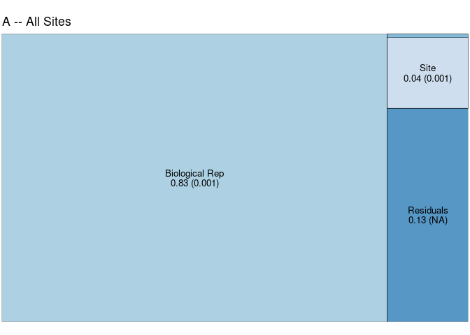<!-- -->

plot eDNA index adonis results

``` r
q <-as.data.frame(index.adonis)
        row.names(q)<-c("Site", "Biological Rep", "PCR Rep", "Residuals", "Total")
        q<-data.frame(row.names(q), q)
        names(q)[1]<-"Level"
        q<-q[-which(row.names(q)=="Total"),]
        q$Level<-paste(q$Level, "\n",
                       round(q$R2,2), " (", q$Pr..F., ")", 
                       sep="")
        
q1.plot<-ggplot(q, aes(area = R2, label=Level))+
  geom_treemap(fill=brewer.pal(6, "Blues")[2:5], color=1, alpha=.8)+
  geom_treemap_text(colour = "black", place = "centre", grow = FALSE, size=10)+
  ggtitle("A -- All Sites")+
  theme(aspect.ratio=1/1.618, plot.margin = margin(2, 2, -2, 2, "pt"), plot.background = element_blank())

q1.plot 
```

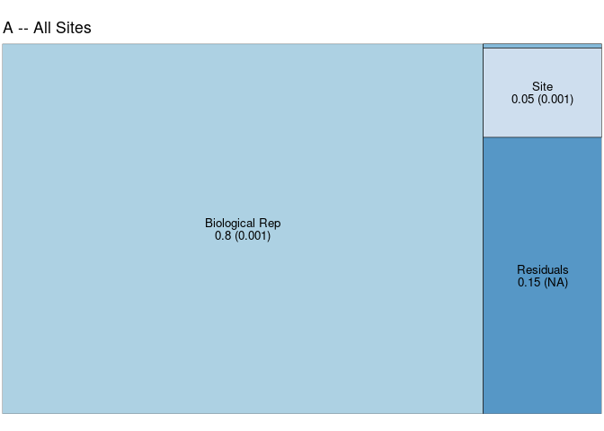<!-- -->

so i think that this is telling me that most of the variation in the
data is at the level of the biological replicate. not exactly sure what
this means for our ability to analyze the data across sites \*\* should
also do this using jaccard (pres/abs)

visualize using NMDS/CAP (constrained analysis of principle
components) - see if there are any (and how many) distinct ecological
communities are present - if so, then test for association of those
communities with geography, other variables

## NMDS

``` r
#count.nmds <- metaMDS(count.distance, diag=T, upper.tri=T, trymax=1000, trace=0)
#index.nmds <- metaMDS(index.distance, diag=T, upper.tri=T, trymax=1000, trace=0)

## this also takes awhile to run.. will save object 
#saveRDS(count.nmds, "data/count_nmds.rds")

count.nmds <- readRDS("data/count_nmds.rds")
```

``` r
nmds.results <- data.frame(count = scores(count.nmds),
                           sample = row.names(scores(count.nmds)),
                           rrMeta$location1, rrMeta$biological_replicate)
```

``` r
nmds.figure <- ggplot() + 
  geom_polygon(data= nmds.results,aes(x=count.NMDS1,y=count.NMDS2,fill=rrMeta.location1,group=rrMeta.biological_replicate), alpha=0.3) +
      geom_text(data= nmds.results,aes(x=count.NMDS1,y=count.NMDS2,label=rrMeta.location1),alpha=0.4,size=2)+
      #scale_fill_manual(values = (c("navy", "skyblue"))) +
      coord_equal() +
      theme_bw() +
      xlab("NMDS1") + ylab("NMDS2") +
      #annotate("text", x=0.9*max(NMDS.RESULTS$OTU.count.NMDS1), y=0.9*max(NMDS.RESULTS$OTU.count.NMDS2),label="A")+
      theme(axis.text.x = element_blank(),  # remove x-axis text
            axis.text.y = element_blank(), # remove y-axis text
            axis.ticks = element_blank(),  # remove axis ticks
            axis.title.x = element_text(size=12), # remove x-axis labels
            axis.title.y = element_text(size=12), # remove y-axis labels
            panel.background = element_blank(), 
            panel.grid.major = element_blank(),  #remove major-grid labels
            panel.grid.minor = element_blank(),  #remove minor-grid labels
            plot.background = element_blank(), 
            legend.position = "right",
            plot.title = element_text(hjust = 0.5),
            plot.margin = margin(0,0,20,0, unit="pt"),
            aspect.ratio = 1
            )

nmds.figure
```

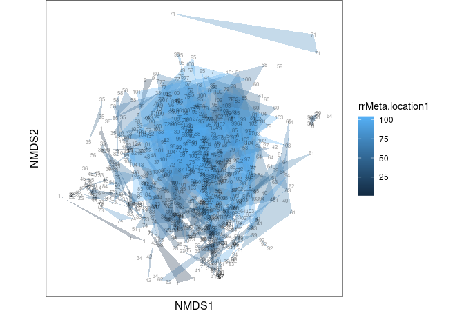<!-- -->

lots of overlap in terms of fish communities across the sites. not any
obvious groupings.

## make a plot of rarified read proportions

relevel the taxon factor by the taxonomic order relevel the location
factor from west to east

``` r
sample_order <- rr_ASV_long %>%
  arrange(longitude)

sample_order <- unique(sample_order$Sample_ID)

taxon_order_sub <- gsub(" ", ".", desired_order)

rr_ASV_long$Sample_ID <- as.factor(rr_ASV_long$Sample_ID)
rr_ASV_long$taxon <- as.factor(rr_ASV_long$taxon)
str(rr_ASV_long)
```

    ## tibble [51,414 × 22] (S3: tbl_df/tbl/data.frame)
    ##  $ Sample_ID           : Factor w/ 779 levels "e00373-A","e00373-B",..: 1 1 1 1 1 1 1 1 1 1 ...
    ##  $ taxon               : Factor w/ 66 levels "Agonidae","Ammodytes",..: 23 20 21 26 45 47 30 6 58 63 ...
    ##  $ rr_reads            : int [1:51414] 227 1202 33 0 0 32 0 108 0 65 ...
    ##  $ pcr_replicate       : chr [1:51414] "A" "A" "A" "A" ...
    ##  $ biological_replicate: chr [1:51414] "e00373" "e00373" "e00373" "e00373" ...
    ##  $ extraction_ID       : chr [1:51414] "e00373" "e00373" "e00373" "e00373" ...
    ##  $ extraction_replicate: int [1:51414] 1 1 1 1 1 1 1 1 1 1 ...
    ##  $ run                 : chr [1:51414] "A" "A" "A" "A" ...
    ##  $ collection_year     : int [1:51414] 2021 2021 2021 2021 2021 2021 2021 2021 2021 2021 ...
    ##  $ collection_month    : int [1:51414] 6 6 6 6 6 6 6 6 6 6 ...
    ##  $ collection_day      : int [1:51414] 19 19 19 19 19 19 19 19 19 19 ...
    ##  $ location1           : int [1:51414] 2 2 2 2 2 2 2 2 2 2 ...
    ##  $ longitude           : num [1:51414] -135 -135 -135 -135 -135 ...
    ##  $ latitude            : num [1:51414] 56.9 56.9 56.9 56.9 56.9 ...
    ##  $ sample_type         : chr [1:51414] "sample" "sample" "sample" "sample" ...
    ##  $ time_of_day         : chr [1:51414] "19:59" "19:59" "19:59" "19:59" ...
    ##  $ extraction_date     : chr [1:51414] "2022_01_11" "2022_01_11" "2022_01_11" "2022_01_11" ...
    ##  $ plate_or_vial       : chr [1:51414] "vial" "vial" "vial" "vial" ...
    ##  $ extraction_plate    : chr [1:51414] "20_2023" "20_2023" "20_2023" "20_2023" ...
    ##  $ extraction_well     : chr [1:51414] "A01" "A01" "A01" "A01" ...
    ##  $ dna_conc            : num [1:51414] 2.82 2.82 2.82 2.82 2.82 ...
    ##  $ pcr_conc            : num [1:51414] 8.39 8.39 8.39 8.39 8.39 ...

``` r
rr_ASV_long  <- rr_ASV_long  %>%
  mutate(taxon = factor(taxon, levels = taxon_order_sub)) %>%
  mutate(Sample_ID = factor(Sample_ID, levels = sample_order))
```

plot each pcr replicate as a column.

``` r
rr_ASV_long %>%
  group_by(Sample_ID) %>%
  mutate(sum=sum(rr_reads)) %>%
  mutate(prop = rr_reads/sum) %>%
  ggplot(aes(x=Sample_ID, y=prop, fill=taxon)) +
  geom_bar(stat = "identity") + 
  labs(
    y = "proportion of sequencing reads",
    x = "west to east",
    title = "read proportion per pcr replicate") + 
  theme_bw() + 
  theme(
    axis.text.x = element_blank(),
    legend.position = "none",
    legend.title = element_blank()
  )  
```

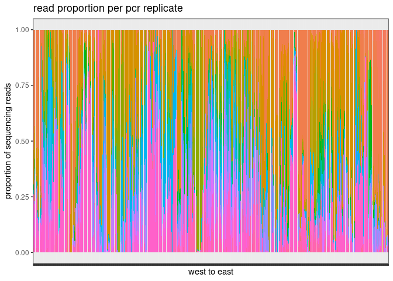<!-- -->

alright, let me plot the legend for reference

    ## 
    ## Attaching package: 'gridExtra'

    ## The following object is masked from 'package:dplyr':
    ## 
    ##     combine

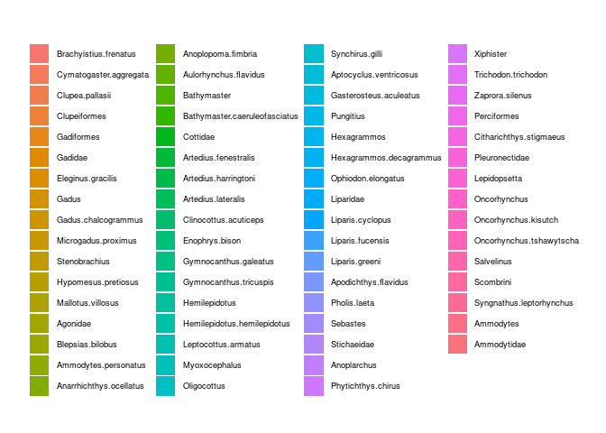<!-- -->

let me transform the proportional data so that i can summarize the pcr
replicates

``` r
library(compositions)
```

    ## Welcome to compositions, a package for compositional data analysis.
    ## Find an intro with "? compositions"

    ## 
    ## Attaching package: 'compositions'

    ## The following objects are masked from 'package:stats':
    ## 
    ##     anova, cor, cov, dist, var

    ## The following objects are masked from 'package:base':
    ## 
    ##     %*%, norm, scale, scale.default

``` r
#i'll use the 'rrASV' table - rarified read counts 


##make sure Sample_ID is not in the table 
#rr_ASV <- rr_ASV[,-Sample_ID]

rrASV_plus1 <- rr_ASV + 1 # Adding a constant value (will use 1) to all data points ensures that there are no zero values in the data, thus preventing infinite results in the transformation.

rrASV_alr <- data.frame(alr(rrASV_plus1))
rrASV_alr$Sample_ID <- ids

meta1 <- rrMeta %>%
  select(Sample_ID, biological_replicate, location1)

rr_ASV_biorep <- rrASV_alr %>%
  left_join(meta1) %>%
  group_by(biological_replicate) %>%
  summarise(across(-c(Sample_ID, location1), mean))
```

    ## Joining with `by = join_by(Sample_ID)`

``` r
biorep <- rr_ASV_biorep$biological_replicate

alr_transformed_data <- rr_ASV_biorep[,-1]                  ## make sure later on that i didn't lose any taxa
```

undo the transformation so that i can plot???

``` r
# Calculate the inverse alr transformation
inverse_alr_data <- data.frame(alrInv(alr_transformed_data))
inverse_alr_data$biological_replicate <- biorep
```

join back some metadata

``` r
meta2 <- rrMeta %>%
  select(biological_replicate, location1, longitude) %>%
  unique()

inverse_alr_data <- inverse_alr_data %>%
  pivot_longer(cols = c(1:66), names_to = "taxon", values_to = "value") %>%
  left_join(meta2, by = "biological_replicate")
```

relevel the taxon factor by the taxonomic order relevel the location
factor from west to east

``` r
sample_order <- inverse_alr_data %>%
  arrange(longitude)

sample_order <- unique(sample_order$biological_replicate)

inverse_alr_data$biological_replicate <- as.factor(inverse_alr_data$biological_replicate)
inverse_alr_data$taxon <- as.factor(inverse_alr_data$taxon)
str(inverse_alr_data)
```

    ## tibble [16,170 × 5] (S3: tbl_df/tbl/data.frame)
    ##  $ biological_replicate: Factor w/ 245 levels "e00373","e00374",..: 1 1 1 1 1 1 1 1 1 1 ...
    ##  $ taxon               : Factor w/ 66 levels "Agonidae","Ammodytes",..: 23 20 21 26 44 46 30 6 57 62 ...
    ##  $ value               : num [1:16170] 0.10278 0.77642 0.01968 0.00061 0.00061 ...
    ##  $ location1           : int [1:16170] 2 2 2 2 2 2 2 2 2 2 ...
    ##  $ longitude           : num [1:16170] -135 -135 -135 -135 -135 ...

``` r
inverse_alr_data <- inverse_alr_data  %>%
  mutate(taxon = factor(taxon, levels = taxon_order_sub)) %>%
  mutate(biological_replicate = factor(biological_replicate, levels = sample_order))
```

``` r
inverse_alr_data %>%
  ggplot(aes(x=biological_replicate, y=value, fill=taxon)) +
  geom_bar(stat = "identity") + 
  labs(
    y = "proportion of sequencing reads",
    x = "west to east",
    title = "read proportion per biological replicate") + 
  theme_bw() + 
  theme(
    axis.text.x = element_blank(),
    legend.position = "none",
    legend.title = element_blank()
  )  
```

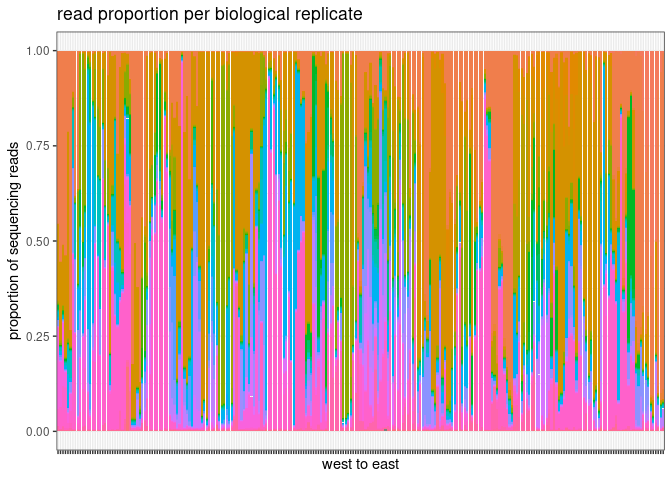<!-- -->

``` r
inverse_alr_data %>%
  filter(biological_replicate == "e00373") %>%
  ggplot(aes(x=biological_replicate, y=value, fill=taxon)) +
  geom_bar(stat = "identity") + 
  labs(
    y = "proportion of sequencing reads",
    x = "west to east",
    title = "read proportion per biological replicate") + 
  theme_bw() + 
  theme(
    axis.text.x = element_blank(),
    legend.position = "none",
    legend.title = element_blank()
  )  
```

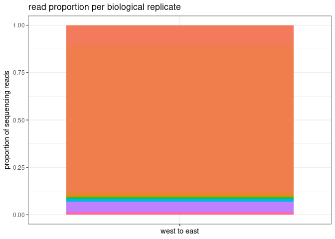<!-- -->

what did this sample look like before???

``` r
rr_ASV_long %>%
  group_by(Sample_ID) %>%
  mutate(sum=sum(rr_reads)) %>%
  mutate(prop = rr_reads/sum) %>%
  filter(biological_replicate == "e00373") %>%
  ggplot(aes(x=Sample_ID, y=prop, fill=taxon)) +
  geom_bar(stat = "identity") + 
  labs(
    y = "proportion of sequencing reads",
    x = "west to east",
    title = "read proportion per pcr replicate") + 
  theme_bw() + 
  theme(
    axis.text.x = element_blank(),
    legend.position = "none",
    legend.title = element_blank()
  )  
```

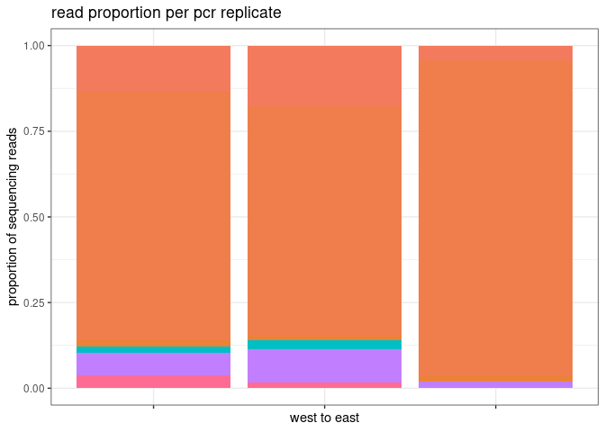<!-- -->

okay, transforming the data to take the mean of pcr replicates seems to
have worked just fine.
