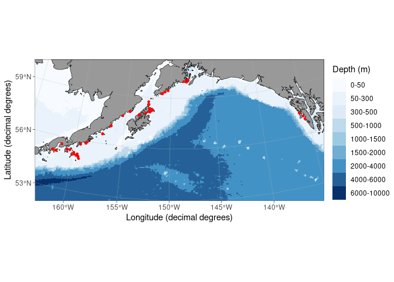

Site Map
================
Kimberly Ledger
2023-08-10

install packages

``` r
#install.packages('remotes')
#library(remotes)
#remotes::install_github("MikkoVihtakari/ggOceanMaps")
#install.packages('ggspatial')

library(tidyverse)
```

    ## ── Attaching packages ─────────────────────────────────────── tidyverse 1.3.2 ──
    ## ✔ ggplot2 3.4.2     ✔ purrr   1.0.1
    ## ✔ tibble  3.2.1     ✔ dplyr   1.1.2
    ## ✔ tidyr   1.3.0     ✔ stringr 1.5.0
    ## ✔ readr   2.1.3     ✔ forcats 0.5.2
    ## ── Conflicts ────────────────────────────────────────── tidyverse_conflicts() ──
    ## ✖ dplyr::filter() masks stats::filter()
    ## ✖ dplyr::lag()    masks stats::lag()

``` r
library(ggOceanMaps)
```

    ## ggOceanMaps: Setting data download folder to a temporary folder
    ## /tmp/RtmpTji1fm. This means that any downloaded map data need to be
    ## downloaded again when you restart R. To avoid this problem, change the
    ## default path to a permanent folder on your computer. Add following
    ## lines to your .Rprofile file: {.ggOceanMapsenv <- new.env();
    ## .ggOceanMapsenv$datapath <- 'YourCustomPath'}. You can use
    ## usethis::edit_r_profile() to edit the file. '~/ggOceanMapsLargeData'
    ## would make it in a writable folder on most operating systems.

``` r
library(ggspatial)
```

``` r
#map <- basemap(c(-163, -135, 53, 60.5), bathymetry = TRUE, rotate = TRUE)
#map
```

read in sample metadata

``` r
metadata <- read.csv("/genetics/edna/workdir/GOApcod_2021/GOA2021_metadata_20230630.csv")

#illumina output changed "_" to "-"
metadata$Sample_ID <- gsub("_", "-", metadata$Sample_ID) 
```

get site info

``` r
sites <- metadata %>%
  select(location1, longitude, latitude) %>%
  unique() %>%
  filter(!is.na(longitude))
```

add sites to map

``` r
map_with_sites <- basemap(c(-163, -135, 53, 60.5), bathymetry = TRUE, rotate = TRUE) + 
  ggspatial::geom_spatial_point(data = sites, aes(x = longitude, y = latitude), color = "red", size = 1)
map_with_sites
```

    ## Assuming `crs = 4326` in stat_spatial_identity()

<!-- -->
