qPCR and beach seine catch
================
Kimberly Ledger
2023-08-15

libraries

``` r
library(tidyverse)
```

    ## ── Attaching packages ─────────────────────────────────────── tidyverse 1.3.2 ──
    ## ✔ ggplot2 3.4.2     ✔ purrr   1.0.1
    ## ✔ tibble  3.2.1     ✔ dplyr   1.1.2
    ## ✔ tidyr   1.3.0     ✔ stringr 1.5.0
    ## ✔ readr   2.1.3     ✔ forcats 0.5.2
    ## ── Conflicts ────────────────────────────────────────── tidyverse_conflicts() ──
    ## ✖ dplyr::filter() masks stats::filter()
    ## ✖ dplyr::lag()    masks stats::lag()

``` r
library(ggplot2)
```

read in beach seine catch data

``` r
catch <- read.csv("GadidCatchBySet.csv")
catch$Set <- as.factor(catch$Set)
```

read in qPCR results

``` r
gama_qPCR <- read.csv("qPCR_results/gama_by_sample.csv") %>%
  select(!X)
gach_qPCR <- read.csv("qPCR_results/gach_by_sample.csv") %>%
  select(!X)
```

plot pcod beach seine catch

``` r
ggplot(catch, aes(x = Set, y = Pacific_cod)) + 
  geom_point() +
  scale_y_sqrt() +
  labs(
    y = "Pacific cod catch",
    x = "Set",
    title = "Beach seine Pcod catch") + 
  theme_bw() + 
  theme(axis.text.x = element_text(size = 6, angle = 45, hjust = 1),
    legend.position = "none",
    legend.title = element_blank()
  )  
```

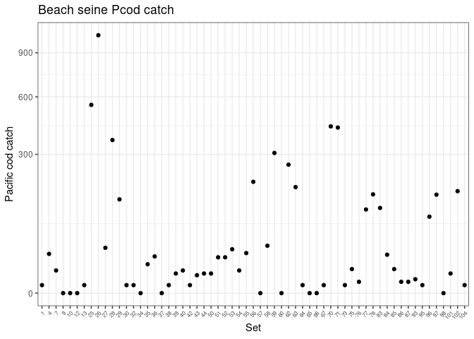<!-- -->

to do: group set by IBM zone and plot

plot pollock beach seine catch

``` r
ggplot(catch, aes(x = Set, y = Walleye_pollock)) + 
  geom_point() +
  scale_y_sqrt() +
  labs(
    y = "Pollock catch",
    x = "Set",
    title = "Beach seine Pollock catch") + 
  theme_bw() + 
  theme(axis.text.x = element_text(size = 6, angle = 45, hjust = 1),
    legend.position = "none",
    legend.title = element_blank()
  )  
```

<!-- -->

to do: group set by IBM zone and plot

plot pcod qPCR copy number

``` r
gama_qPCR <- gama_qPCR %>%
  rename(Set = location1) %>%
  filter(!is.na(Set)) %>%
  mutate(copies = ifelse(is.na(copies), "0", copies))

gama_qPCR$Set <- as.factor(gama_qPCR$Set)
gama_qPCR$copies <- as.numeric(gama_qPCR$copies)
```

``` r
ggplot(gama_qPCR, aes(x = Set, y = copies, color = Detection)) + 
  geom_point() +
  scale_y_sqrt() +  # Apply square root transformation to y-axis
  geom_hline(yintercept = 18.28, linetype = "dashed") +   ## LOD for GAMA 
  labs(
    y = "Pacific cod copy number",
    x = "Set",
    title = "qPCR Pcod") + 
  theme_bw() + 
  theme(axis.text.x = element_text(size = 6, angle = 45, hjust = 1),
    legend.position = "right",
    legend.title = element_text()
  )  
```

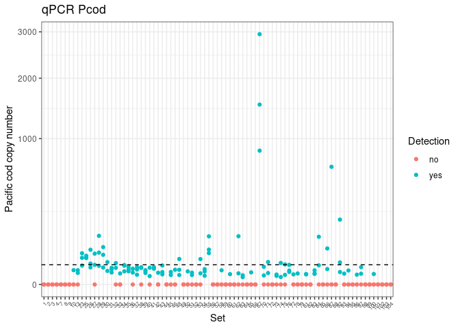<!-- -->

plot pollock qPCR copy number

``` r
gach_qPCR <- gach_qPCR %>%
  rename(Set = location1) %>%
  filter(!is.na(Set)) %>%
  mutate(copies = ifelse(is.na(copies), "0", copies))

gach_qPCR$Set <- as.factor(gach_qPCR$Set)
gach_qPCR$copies <- as.numeric(gach_qPCR$copies)
```

``` r
ggplot(gach_qPCR, aes(x = Set, y = copies, color = Detection)) + 
  geom_point() +
  scale_y_sqrt() +  # Apply square root transformation to y-axis
  geom_hline(yintercept = 11.79, linetype = "dashed") +   ## LOD for GAMA 
  labs(
    y = "Pollock copy number",
    x = "Set",
    title = "qPCR Pollock") + 
  theme_bw() + 
  theme(axis.text.x = element_text(size = 6, angle = 45, hjust = 1),
    legend.position = "right",
    legend.title = element_text()
  )  
```

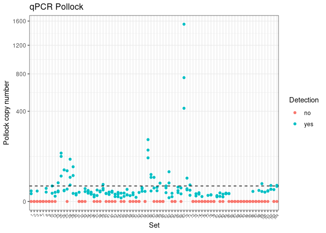<!-- -->

### Pcod

okay, now let’s layer these plots.

first we much put the catch and qPCR data in the same data frame

``` r
catch_pcod <- catch %>%
  select(Set, Pacific_cod)

GAMA <- gama_qPCR %>%
  left_join(catch_pcod, by = "Set") %>%
  mutate(Pacific_cod = ifelse(is.na(Pacific_cod), 0, Pacific_cod)) %>%
  mutate(Detection_catch = ifelse(Pacific_cod == 0, "no_seine", "yes_seine")) %>%
  mutate(Detection = ifelse(Detection == "yes", "yes_qPCR", "no_qPCR"))

gama_table <- table(GAMA$Detection, GAMA$Detection_catch)
gama_table
```

    ##           
    ##            no_seine yes_seine
    ##   no_qPCR        62        72
    ##   yes_qPCR       34        80

``` r
library(RColorBrewer)

selected_colors <- brewer.pal(4, "Paired")
my_color_order <- c(selected_colors[1], selected_colors[3], selected_colors[2], selected_colors[4])
```

plot w/ qPCR detections as boxplots - sqrt transformation of axis

``` r
ggplot(GAMA, aes(x = Set)) +
  geom_boxplot(aes(y = copies, color = Detection)) +
  geom_point(aes(y = Pacific_cod*2, color = Detection_catch)) +
  scale_color_manual(values = my_color_order) +
  scale_y_continuous(
    # Features of the first axis
    name = "copy number",
    # Add a second axis and specify its features
    sec.axis = sec_axis(~./2, name="catch"),
    trans = "sqrt"
  ) + 
  labs(title = "Pcod") +
  geom_hline(yintercept = 18.28, linetype = "dashed")  +  ## LOD for GAMA 
  theme_bw() + 
  theme(axis.text.x = element_text(size = 6, angle = 45, hjust = 1),
    legend.position = "right",
    legend.title = element_text()
  )  
```

<!-- -->

plot with qPCR detections as boxplots - log transformation of axis

``` r
my_color_order2 <- c(selected_colors[3], selected_colors[2], selected_colors[4])

ggplot(GAMA, aes(x = Set)) +
  geom_boxplot(aes(y = copies, color = Detection)) +
  geom_point(aes(y = Pacific_cod*2, color = Detection_catch)) +
  scale_color_manual(values = my_color_order2) +
  scale_y_continuous(
    # Features of the first axis
    name = "copy number",
    # Add a second axis and specify its features
    sec.axis = sec_axis(~./2, name="catch"),
    trans = "log10"
  ) + 
  labs(title = "Pcod") +
  geom_hline(yintercept = 18.28, linetype = "dashed")  +  ## LOD for GAMA 
  theme_bw() + 
  theme(axis.text.x = element_text(size = 6, angle = 45, hjust = 1),
    legend.position = "right",
    legend.title = element_text()
  )  
```

    ## Warning: Transformation introduced infinite values in continuous y-axis
    ## Transformation introduced infinite values in continuous y-axis

    ## Warning: Removed 134 rows containing non-finite values (`stat_boxplot()`).

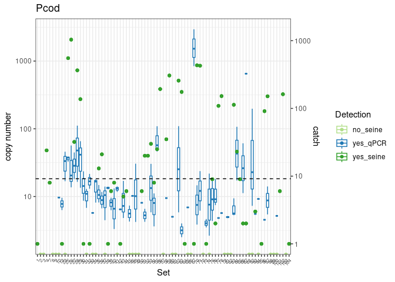<!-- -->

plot with qPCR detections a points - sqrt transformation of axis

``` r
ggplot(GAMA, aes(x = Set)) +
  geom_point(aes(y = copies, color = Detection)) +
  geom_point(aes(y = Pacific_cod*2, color = Detection_catch)) +
  scale_color_manual(values = my_color_order) +
  scale_y_continuous(
    # Features of the first axis
    name = "copy number",
    # Add a second axis and specify its features
    sec.axis = sec_axis(~./2, name="catch"),
    trans = "sqrt"
  ) + 
  labs(title = "Pcod") +
  geom_hline(yintercept = 18.28, linetype = "dashed")  +  ## LOD for GAMA 
  theme_bw() + 
  theme(axis.text.x = element_text(size = 6, angle = 45, hjust = 1),
    legend.position = "right",
    legend.title = element_text()
  )  
```

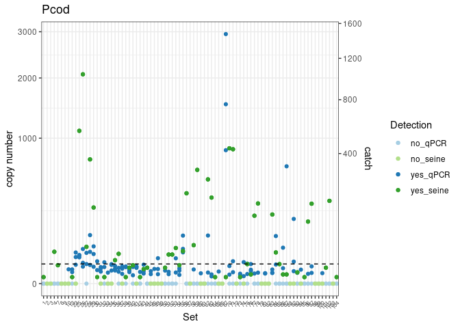<!-- -->

plot with qPCR detections a points - log transformation of axis

``` r
ggplot(GAMA, aes(x = Set)) +
  geom_point(aes(y = copies, color = Detection)) +
  geom_point(aes(y = Pacific_cod*2, color = Detection_catch)) +
  scale_color_manual(values = my_color_order) +
  scale_y_continuous(
    # Features of the first axis
    name = "copy number",
    # Add a second axis and specify its features
    sec.axis = sec_axis(~./2, name="catch"),
    trans = "log10"
  ) + 
  labs(title = "Pcod") +
  geom_hline(yintercept = 18.28, linetype = "dashed")  +  ## LOD for GAMA 
  theme_bw() + 
  theme(axis.text.x = element_text(size = 6, angle = 45, hjust = 1),
    legend.position = "right",
    legend.title = element_text()
  )  
```

    ## Warning: Transformation introduced infinite values in continuous y-axis
    ## Transformation introduced infinite values in continuous y-axis

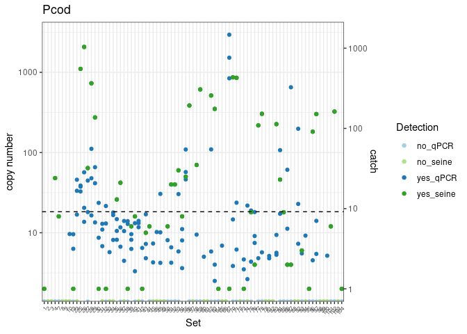<!-- -->

### Pollock

``` r
catch_pollock <- catch %>%
  select(Set, Walleye_pollock)

GACH <- gach_qPCR %>%
  left_join(catch_pollock, by = "Set") %>%
  mutate(Walleye_pollock = ifelse(is.na(Walleye_pollock), 0, Walleye_pollock)) %>%
  mutate(Detection_catch = ifelse(Walleye_pollock == 0, "no_seine", "yes_seine")) %>%
  mutate(Detection = ifelse(Detection == "yes", "yes_qPCR", "no_qPCR"))

gach_table <- table(GACH$Detection, GACH$Detection_catch)
gach_table
```

    ##           
    ##            no_seine yes_seine
    ##   no_qPCR        77        32
    ##   yes_qPCR       78        61

visualize with qPCR as boxplots on log transformed axis

``` r
ggplot(GACH, aes(x = Set)) +
  geom_boxplot(aes(y = copies, color = Detection)) +
  geom_point(aes(y = Walleye_pollock/2, color = Detection_catch)) +
  scale_color_manual(values = my_color_order2) +
  scale_y_continuous(
    # Features of the first axis
    name = "copy number",
    # Add a second axis and specify its features
    sec.axis = sec_axis(~.*2, name="catch"),
    trans = "log10"
  ) + 
  labs(title = "Pollock") +
  geom_hline(yintercept = 11.79, linetype = "dashed")  +  ## LOD for GAMA 
  theme_bw() + 
  theme(axis.text.x = element_text(size = 6, angle = 45, hjust = 1),
    legend.position = "right",
    legend.title = element_text()
  )  
```

    ## Warning: Transformation introduced infinite values in continuous y-axis
    ## Transformation introduced infinite values in continuous y-axis

    ## Warning: Removed 109 rows containing non-finite values (`stat_boxplot()`).

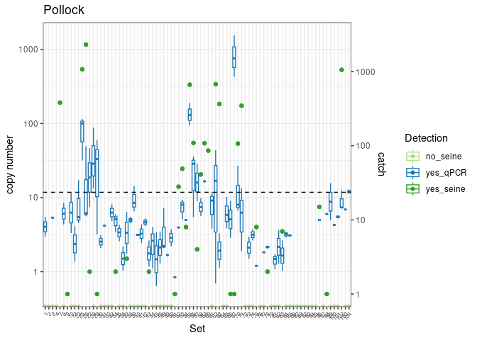<!-- -->

let combine the pcod and pollock catch vs copy number plot

``` r
gama_temp <- GAMA %>%
  select(Set, copies, Pacific_cod) %>%
  rename(count = Pacific_cod) %>%
  mutate(Species = "Pacific_cod")

gach_temp <- GACH %>%
  select(Set, copies, Walleye_pollock) %>%
  rename(count = Walleye_pollock) %>%
  mutate(Species = "Walleye_pollock")

gadus <- gama_temp %>%
  bind_rows(gach_temp)
```

all samples - using sqrt transformation

``` r
hline_positions <- data.frame(Species = c("Pacific_cod", "Walleye_pollock"), hline_y = c(18.28, 11.79), col = c("#F8766D", "#00BFC4"))

ggplot(gadus, aes(x = count, y = copies, color = Species)) +
  geom_point(size = 1, alpha = 0.7) +
  scale_y_sqrt() +  # Apply square root transformation to y-axis
  scale_x_sqrt() +  # Apply square root transformation to x-axis
  geom_hline(data = hline_positions, aes(yintercept = hline_y)) +
  facet_wrap(~ Species, ncol = 2) + 
  labs(
    y = "copy number",
    x = "catch",
    title = "beach seine vs qPCR") + 
  theme_bw() + 
  theme(axis.text.x = element_text(angle = 45),
    legend.position = "right",
    legend.title = element_text() 
  )  
```

<!-- -->

all samples - using log transformation

``` r
hline_positions <- data.frame(Species = c("Pacific_cod", "Walleye_pollock"), hline_y = c(18.28, 11.79), col = c("#F8766D", "#00BFC4"))

ggplot(gadus, aes(x = count, y = copies, color = Species)) +
  geom_point(size = 1, alpha = 0.7) +
  scale_y_log10() +  # Apply log transformation to y-axis
  scale_x_log10() +  # Apply log transformation to x-axis
  geom_hline(data = hline_positions, aes(yintercept = hline_y), linetype = "dashed") +
  facet_wrap(~ Species, ncol = 2) + 
  labs(
    y = "copy number",
    x = "catch",
    title = "beach seine vs qPCR") + 
  theme_bw() + 
  theme(axis.text.x = element_text(angle = 45),
    legend.position = "right",
    legend.title = element_text() 
  )  
```

    ## Warning: Transformation introduced infinite values in continuous y-axis

    ## Warning: Transformation introduced infinite values in continuous x-axis

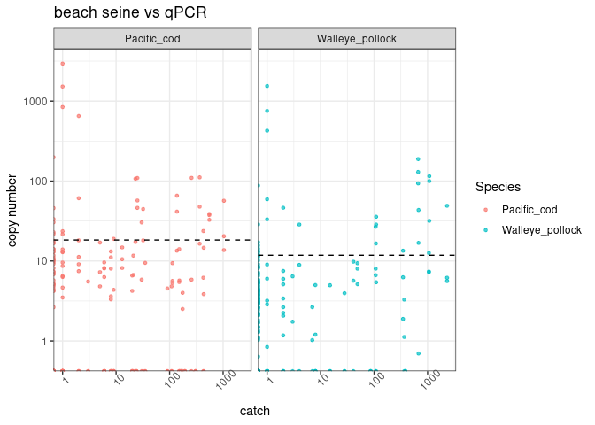<!-- -->

since the log transformation does a better job and separating the
samples for visuals, i’ll continue with that

make samples that are non detection for either catch or copy number gray

``` r
gadus <- gadus %>%
  mutate(detection = ifelse(count == 0 | copies == 0, "no", "yes"))

ggplot(gadus, aes(x = count, y = copies, color = detection)) +
  geom_point(size = 1, alpha = 0.7) +
  scale_color_manual(values = c("grey", "black")) +
  scale_y_log10() +  # Apply log transformation to y-axis
  scale_x_log10() +  # Apply log transformation to x-axis
  geom_hline(data = hline_positions, aes(yintercept = hline_y)) + #, color = col)) +
  facet_wrap(~ Species, ncol = 2) + 
  labs(
    y = "copy number",
    x = "catch",
    title = "beach seine vs qPCR") + 
  theme_bw() + 
  theme(axis.text.x = element_text(angle = 45),
    legend.position = "right",
    legend.title = element_text() 
  )  
```

    ## Warning: Transformation introduced infinite values in continuous y-axis

    ## Warning: Transformation introduced infinite values in continuous x-axis

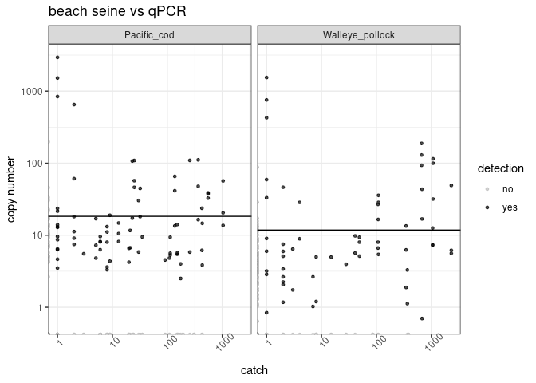<!-- -->

remove samples with no detection in either qPCR or seine and color by
site

``` r
gadus %>%
  filter(detection == "yes") %>%
  ggplot(aes(x = count, y = copies, color = Set)) +
  geom_point(size = 1, alpha = 0.7) +
  geom_smooth(method = "lm", se = FALSE, aes(color = NULL), color = "grey") +
  scale_y_log10() +  # Apply log transformation to y-axis, 
  scale_x_log10() +  # Apply log transformation to x-axis
  geom_hline(data = hline_positions, aes(yintercept = hline_y), linetype = "dashed") + #, color = col)) +
  facet_wrap(~ Species, ncol = 2) + 
  labs(
    y = "copy number",
    x = "catch",
    title = "beach seine vs qPCR") + 
  theme_bw() + 
  theme(axis.text.x = element_text(angle = 45),
    legend.position = "right",
    legend.title = element_text() 
  )  
```

    ## `geom_smooth()` using formula = 'y ~ x'

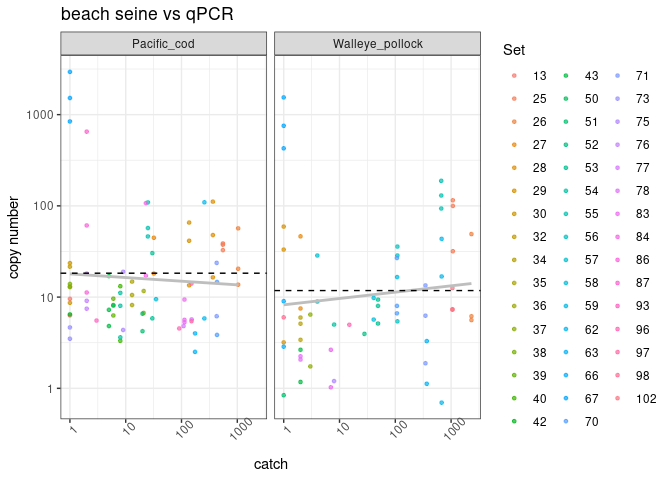<!-- -->

remove samples above the qPCR LOD

``` r
gadus <- gadus %>%
  mutate(above_threshold = ifelse(Species == "Pacific_cod" & copies > 18.28, "yes", "no")) %>%
  mutate(above_threshold = ifelse(Species == "Walleye_pollock" & copies > 11.79, "yes", above_threshold))

gadus %>%
  filter(above_threshold == "yes") %>%
  ggplot(aes(x = count, y = copies, color = Set)) +
  geom_point(size = 1, alpha = 0.7) +
  #scale_color_manual(values = c("grey", "black")) +
  scale_y_log10() +  # Apply log transformation to y-axis
  scale_x_log10() +  # Apply log transformation to x-axis
  geom_hline(data = hline_positions, aes(yintercept = hline_y)) + #, color = col)) +
  facet_wrap(~ Species, ncol = 2) + 
  geom_smooth(method = "lm", se = FALSE, aes(color = NULL), color = "grey") +
  labs(
    y = "copy number",
    x = "catch",
    title = "beach seine vs qPCR") + 
  theme_bw() + 
  theme(axis.text.x = element_text(angle = 45),
    legend.position = "right",
    legend.title = element_text() 
  )  
```

    ## Warning: Transformation introduced infinite values in continuous x-axis
    ## Transformation introduced infinite values in continuous x-axis

    ## `geom_smooth()` using formula = 'y ~ x'

    ## Warning: Removed 15 rows containing non-finite values (`stat_smooth()`).

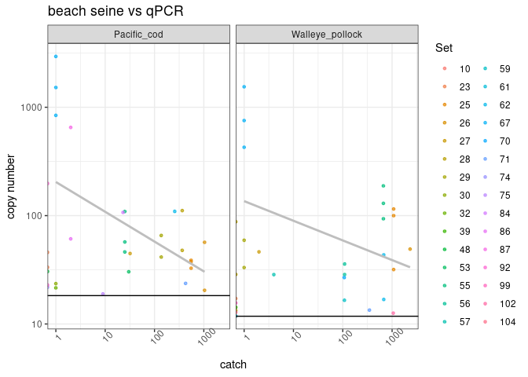<!-- -->

the samples with high copy number but no catch make sense but make these
plots look odd

bin catch data for comparison

``` r
gadus <- gadus %>%
  mutate(catch_level = ifelse(count == 0, "absent", "present")) %>%
  mutate(catch_level = ifelse(count > 0, "1-20", catch_level)) %>%
  mutate(catch_level = ifelse(count > 20, ">20", catch_level))

gadus$catch_level <- as.factor(gadus$catch_level)
new_order <- c("absent", "1-20", ">20")
gadus$catch_level <- factor(gadus$catch_level, levels = new_order)
```

bin catch results and try log transformation of copy number to better
see differences in small values

``` r
ggplot(gadus, aes(x = catch_level, y = copies, color = Species)) +
  geom_boxplot(size = 0.5, alpha = 0.7) +
  geom_jitter(width = 0.15, height = 0, alpha = 0.5) +  # Jitter data points for better visibility
  scale_y_log10() +  # Apply log10 transformation to y-axis
  geom_hline(data = hline_positions, aes(yintercept = hline_y)) +
  facet_wrap(~ Species, ncol = 2) + 
  labs(
    y = "copy number",
    x = "catch level",
    title = "beach seine vs qPCR") + 
  theme_bw() + 
  theme(axis.text.x = element_text(angle = 45),
    legend.position = "right",
    legend.title = element_text() 
  )  
```

    ## Warning: Transformation introduced infinite values in continuous y-axis
    ## Transformation introduced infinite values in continuous y-axis

    ## Warning: Removed 243 rows containing non-finite values (`stat_boxplot()`).

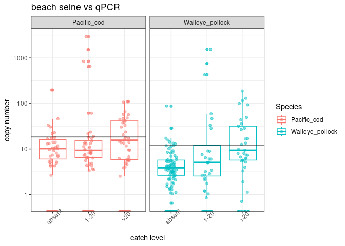<!-- -->

what if i remove qPCR non-detections?

``` r
gadus %>%
  filter(copies != 0) %>%
  ggplot(aes(x = catch_level, y = copies, color = Species)) +
  geom_boxplot(size = 0.5, alpha = 0.7) +
  geom_jitter(width = 0.15, height = 0, alpha = 0.5) +  # Jitter data points for better visibility
  scale_y_log10() +  # Apply log10 transformation to y-axis
  geom_hline(data = hline_positions, aes(yintercept = hline_y)) +
  facet_wrap(~ Species, ncol = 2) + 
  labs(
    y = "copy number",
    x = "catch level",
    title = "beach seine vs qPCR") + 
  theme_bw() + 
  theme(axis.text.x = element_text(angle = 45),
    legend.position = "right",
    legend.title = element_text() 
  )  
```

<!-- -->

okay, that didn’t really change anything…

bin copy number data for comparison

``` r
gadus <- gadus %>%
  mutate(copy_level = ifelse(copies == 0, "absent", "present")) %>%
  mutate(copy_level = ifelse(copies > 0 & above_threshold == "no", "low", copy_level)) %>%
  mutate(copy_level = ifelse(copies > 0 & above_threshold == "yes", "high", copy_level))

gadus$copy_level <- as.factor(gadus$copy_level)
new_order <- c("absent", "low", "high")
gadus$copy_level <- factor(gadus$copy_level, levels = new_order)
```

log transform y-axis

``` r
ggplot(gadus, aes(x = copy_level, y = count, color = Species)) +
  geom_boxplot(size = 0.5, alpha = 0.7) +
  geom_jitter(width = 0.15, height = 0, alpha = 0.5) +  # Jitter data points for better visibility
  scale_y_log10() +  # Apply log transformation to y-axis
  facet_wrap(~ Species, ncol = 2) + 
  labs(
    y = "catch",
    x = "copy level",
    title = "beach seine vs qPCR") + 
  theme_bw() + 
  theme(axis.text.x = element_text(angle = 45),
    legend.position = "right",
    legend.title = element_text() 
  )  
```

    ## Warning: Transformation introduced infinite values in continuous y-axis
    ## Transformation introduced infinite values in continuous y-axis

    ## Warning: Removed 251 rows containing non-finite values (`stat_boxplot()`).

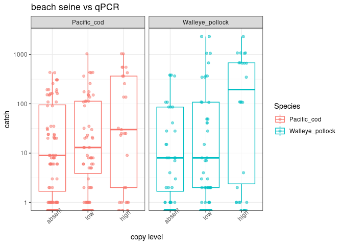<!-- -->

or with sqrt transformation

``` r
ggplot(gadus, aes(x = copy_level, y = count, color = Species)) +
  geom_boxplot(size = 0.5, alpha = 0.7) +
  geom_jitter(width = 0.15, height = 0, alpha = 0.5) +  # Jitter data points for better visibility
  scale_y_sqrt() +  # Apply log transformation to y-axis
  facet_wrap(~ Species, ncol = 2) + 
  labs(
    y = "catch",
    x = "copy level",
    title = "beach seine vs qPCR") + 
  theme_bw() + 
  theme(axis.text.x = element_text(angle = 45),
    legend.position = "right",
    legend.title = element_text() 
  )  
```

<!-- -->
