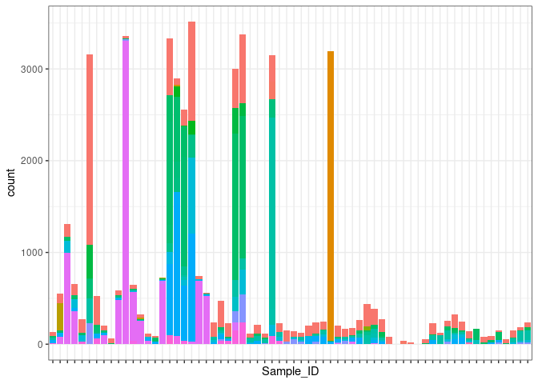
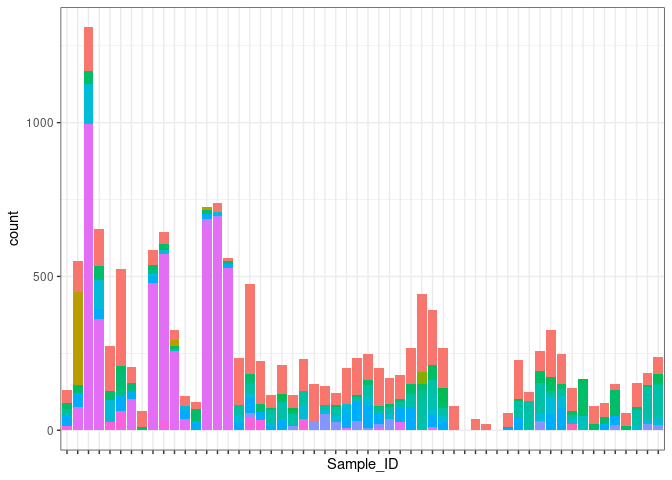
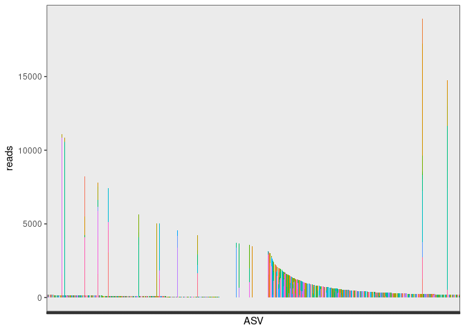
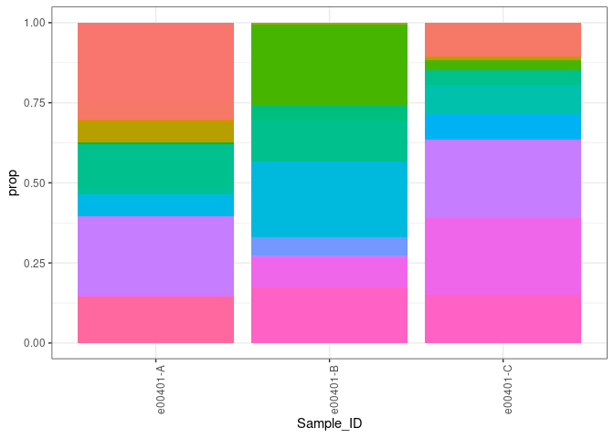
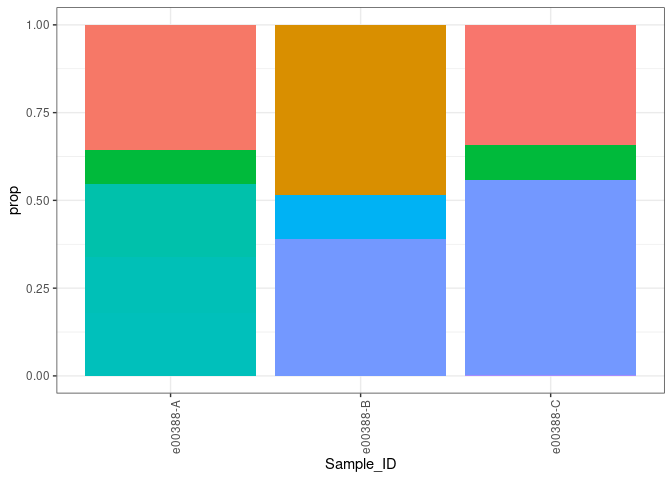
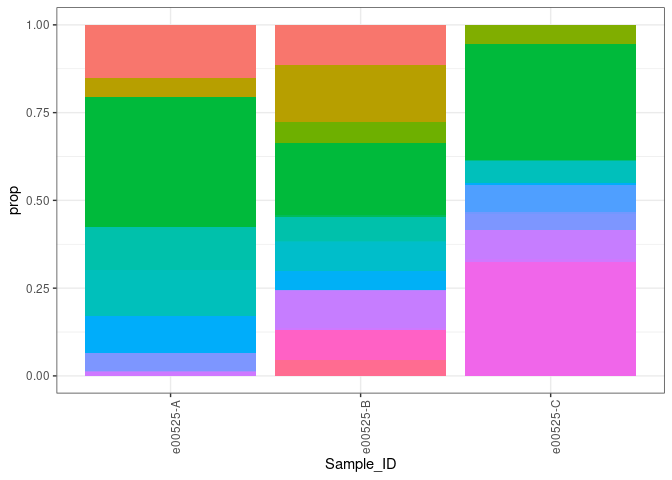
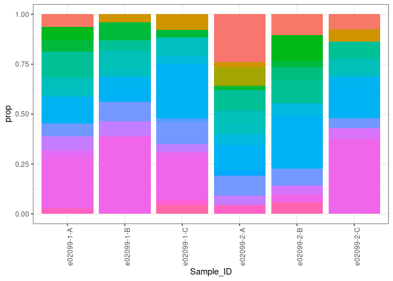
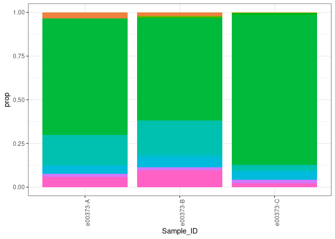
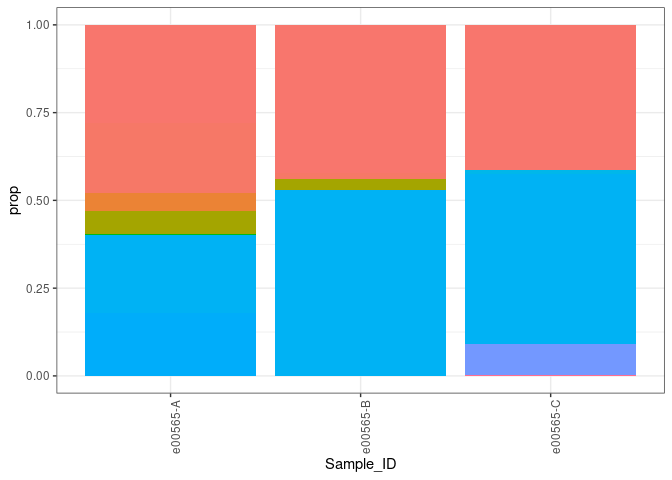
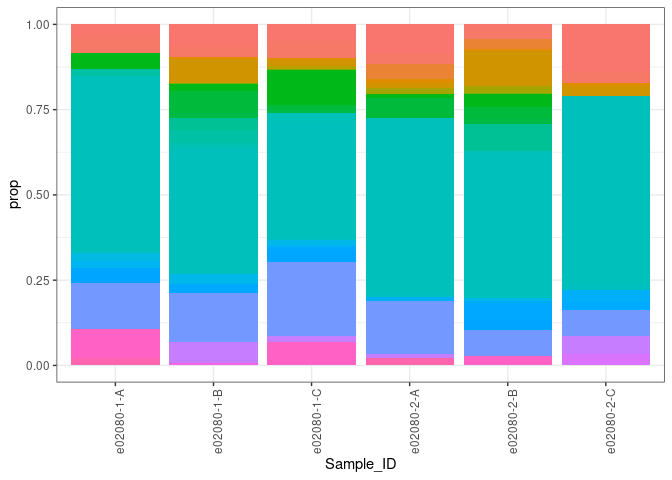

ASV decontamination of GOA pcod eDNA samples
================
Kimberly Ledger
2023-06-19

this script is an updated version of my ASV decontamination pipeline for
the GOA pcod 2021 samples.

load libraries

``` r
library(tidyverse)
```

    ## ── Attaching packages ─────────────────────────────────────── tidyverse 1.3.2 ──
    ## ✔ ggplot2 3.4.0      ✔ purrr   0.3.5 
    ## ✔ tibble  3.2.1      ✔ dplyr   1.0.10
    ## ✔ tidyr   1.2.1      ✔ stringr 1.4.1 
    ## ✔ readr   2.1.3      ✔ forcats 0.5.2 
    ## ── Conflicts ────────────────────────────────────────── tidyverse_conflicts() ──
    ## ✖ dplyr::filter() masks stats::filter()
    ## ✖ dplyr::lag()    masks stats::lag()

``` r
library(fitdistrplus) #for fitdist()
```

    ## Loading required package: MASS
    ## 
    ## Attaching package: 'MASS'
    ## 
    ## The following object is masked from 'package:dplyr':
    ## 
    ##     select
    ## 
    ## Loading required package: survival

the data i am starting with is the ASV table output from DADA2 pipeline
in my sequence_filtering.Rmd in the eDNA_metabarcoding folder

``` r
asv_table <- read.csv("/genetics/edna/workdir/GOApcod_2021/combined/trimmed/filtered/outputs/ASVtable.csv") %>%
  rename(Sample_ID = X)

asv_table$Sample_ID <- as.factor(asv_table$Sample_ID)
```

starting number of ASV’s = 1859

# 1. Estimate index hopping

subtract the proportion of reads that jumped into the control samples
from each environmental sample

we need sample metadata to do this…

``` r
metadata <- read.csv("/genetics/edna/workdir/GOApcod_2021/GOA2021_metadata_20230515.csv")

#illumina output changed "_" to "-"
metadata$Sample_ID <- gsub("_", "-", metadata$Sample_ID) 
```

add column to asv table that labels the sample type

``` r
samp_type <- metadata %>%
  dplyr::select(Sample_ID, sample_type) %>%
  left_join(asv_table, by = "Sample_ID")
```

identify maximum proportion of reads for each ASV found in the positive
controls

``` r
pos_asvs <- samp_type %>%
  filter(sample_type == "positive_control") %>%
  pivot_longer(cols = c(3:1861), names_to = "ASV", values_to = "reads") %>%
  group_by(Sample_ID) %>%
  mutate(TotalReadsPerSample = sum(reads)) %>%
  mutate(Prop = reads/TotalReadsPerSample) %>%
  group_by(ASV) %>%
  summarise(max_prop = max(Prop))
```

now subtract this max proportion for each ASV from environmental samples
and all negative controls

``` r
indexhop_table <- samp_type %>%
  filter(sample_type != "positive_control") %>% ## working all samples except the positive controls 
  pivot_longer(cols = c(3:1861), names_to = "ASV", values_to = "reads") %>%
  group_by(Sample_ID) %>%
  mutate(TotalReadsPerSample = sum(reads)) %>%
  left_join(pos_asvs, by = "ASV") %>%
  mutate(IndexHoppingReads = TotalReadsPerSample*max_prop) %>%
  mutate(reads_IndexHop_removed = reads - IndexHoppingReads) %>%
  mutate(reads_IndexHop_removed = if_else(reads_IndexHop_removed < 0, 0, reads_IndexHop_removed))
```

clean up the table by removing columns no longer needed

``` r
asv_table_filter1 <- indexhop_table %>%
  dplyr::select(Sample_ID, sample_type, ASV, reads_IndexHop_removed) %>%
  rename(reads = reads_IndexHop_removed)
head(asv_table_filter1)
```

    ## # A tibble: 6 × 4
    ## # Groups:   Sample_ID [1]
    ##   Sample_ID sample_type ASV     reads
    ##   <chr>     <chr>       <chr>   <dbl>
    ## 1 e00373-A  sample      ASV1     0   
    ## 2 e00373-A  sample      ASV2  7478.  
    ## 3 e00373-A  sample      ASV3     0   
    ## 4 e00373-A  sample      ASV4     0   
    ## 5 e00373-A  sample      ASV5     2.89
    ## 6 e00373-A  sample      ASV6     0

this is a summary of the number of reads removed by ASV and sample_ID

``` r
reads_removed1 <- indexhop_table %>%
  dplyr::select(Sample_ID, ASV, IndexHoppingReads) %>%
  pivot_wider(names_from = "ASV", values_from = "IndexHoppingReads")
head(reads_removed1)
```

    ## # A tibble: 6 × 1,860
    ## # Groups:   Sample_ID [6]
    ##   Sample_ID  ASV1  ASV2  ASV3  ASV4  ASV5  ASV6  ASV7  ASV8  ASV9 ASV10 ASV11
    ##   <chr>     <dbl> <dbl> <dbl> <dbl> <dbl> <dbl> <dbl> <dbl> <dbl> <dbl> <dbl>
    ## 1 e00373-A   128.  14.0  66.2  60.8  32.1  14.0     0  15.9  15.0  13.9     0
    ## 2 e00374-A   176.  19.2  90.9  83.5  44.1  19.2     0  21.9  20.6  19.2     0
    ## 3 e00375-A   270.  29.6 140.  129.   67.9  29.6     0  33.7  31.7  29.5     0
    ## 4 e00376-A   400.  43.7 207.  190.  100.   43.7     0  49.9  46.9  43.6     0
    ## 5 e00377-A   205.  22.4 106.   97.5  51.5  22.4     0  25.6  24.0  22.4     0
    ## 6 e00378-A   203.  22.1 105.   96.3  50.9  22.1     0  25.3  23.7  22.1     0
    ## # ℹ 1,848 more variables: ASV12 <dbl>, ASV13 <dbl>, ASV14 <dbl>, ASV15 <dbl>,
    ## #   ASV16 <dbl>, ASV17 <dbl>, ASV18 <dbl>, ASV19 <dbl>, ASV20 <dbl>,
    ## #   ASV21 <dbl>, ASV22 <dbl>, ASV23 <dbl>, ASV24 <dbl>, ASV25 <dbl>,
    ## #   ASV26 <dbl>, ASV27 <dbl>, ASV28 <dbl>, ASV29 <dbl>, ASV30 <dbl>,
    ## #   ASV31 <dbl>, ASV32 <dbl>, ASV33 <dbl>, ASV34 <dbl>, ASV35 <dbl>,
    ## #   ASV36 <dbl>, ASV37 <dbl>, ASV38 <dbl>, ASV39 <dbl>, ASV40 <dbl>,
    ## #   ASV41 <dbl>, ASV42 <dbl>, ASV43 <dbl>, ASV44 <dbl>, ASV45 <dbl>, …

and a list of the proportion of reads from ASVs removed

``` r
prop_removed1 <- pos_asvs %>%
  arrange(desc(max_prop))
head(prop_removed1)
```

    ## # A tibble: 6 × 2
    ##   ASV    max_prop
    ##   <chr>     <dbl>
    ## 1 ASV16   0.993  
    ## 2 ASV158  0.0279 
    ## 3 ASV227  0.0259 
    ## 4 ASV1    0.0111 
    ## 5 ASV3    0.00577
    ## 6 ASV4    0.00530

apart from ASV16 which is for sturgeon (the positive control) and a few
ASVs at about 2.5%, the max proportion of reads removed is just over 1%

- this decontamination steps seems to be working okay.

# 2. Discard PCR replicates with low numbers of reads

calculate reads per sample

**just consider the field blanks and environmental samples here???**
**or should i include extraction and pcr negatives??**  
when i include the pcr and extraction negatives, it seems like most have
low reads and get discarded…

``` r
all_reads <- asv_table_filter1 %>%
# filter(sample_type == "field_blank" | sample_type == "sample") %>%
  group_by(Sample_ID) %>%
  summarize(ReadsPerSample = sum(reads))
```

fit a normal distribution

``` r
fit <- fitdist(all_reads$ReadsPerSample, "gamma", lower=c(0,0), start=list(scale=1,shape=1))

all_reads %>%  
  mutate(prob = pgamma(ReadsPerSample, shape = fit$estimate[[2]], scale = fit$estimate[[1]], lower.tail = TRUE,
       log.p = FALSE)) -> all_reads
```

identify and remove the outliers - parameters used in gruinard_decon

``` r
low_dist_probability_cutoff <- 0.05
minimum_read_cutoff <- 1000

outliers <- all_reads %>% 
  filter(prob < low_dist_probability_cutoff  | ReadsPerSample < minimum_read_cutoff) # changed to 0.05 to save the two samples
outlierIDs <- outliers$Sample_ID
```

which samples are removed because of the 5%/1000 reads threshold??

``` r
samples_removed <- asv_table_filter1 %>%
  filter(Sample_ID %in% outlierIDs) %>%
  pivot_wider(names_from = "ASV", values_from = "reads")
samples_removed
```

    ## # A tibble: 66 × 1,861
    ## # Groups:   Sample_ID [66]
    ##    Sample_ID sample_type    ASV1  ASV2  ASV3  ASV4  ASV5  ASV6  ASV7  ASV8  ASV9
    ##    <chr>     <chr>         <dbl> <dbl> <dbl> <dbl> <dbl> <dbl> <dbl> <dbl> <dbl>
    ##  1 e00390-A  sample         68.3 26.3    0     0    44.3     0     0   0     0  
    ##  2 e00395-A  extraction_…  143.  39.4    0   132.    0       0     0   0     0  
    ##  3 NC1-20-A  PCR_blank      78.0  0      0     0     0       0     0   0     0  
    ##  4 e00435-A  sample        313.  21.4    0     0    48.5     0     0  63.3   0  
    ##  5 e00490-A  extraction_…   51.7  3.75   0     0    25.4     0     0   0     0  
    ##  6 NC2-20-A  PCR_blank      75.4 12.8   16.2  15.2   0       0     0   0    18.8
    ##  7 e00395-B  extraction_…  119.  45.2    0    94.5  34.1     0     0   0     0  
    ##  8 e00417-B  sample       2077.   9.94 267.    0     0       0     0   0     0  
    ##  9 NC1-20-B  PCR_blank       0    0      0     0     0       0     0   0     0  
    ## 10 e00490-B  extraction_…   52.2 10.7    0     0     0       0     0   0     0  
    ## # ℹ 56 more rows
    ## # ℹ 1,850 more variables: ASV10 <dbl>, ASV11 <dbl>, ASV12 <dbl>, ASV13 <dbl>,
    ## #   ASV14 <dbl>, ASV15 <dbl>, ASV16 <dbl>, ASV17 <dbl>, ASV18 <dbl>,
    ## #   ASV19 <dbl>, ASV20 <dbl>, ASV21 <dbl>, ASV22 <dbl>, ASV23 <dbl>,
    ## #   ASV24 <dbl>, ASV25 <dbl>, ASV26 <dbl>, ASV27 <dbl>, ASV28 <dbl>,
    ## #   ASV29 <dbl>, ASV30 <dbl>, ASV31 <dbl>, ASV32 <dbl>, ASV33 <dbl>,
    ## #   ASV34 <dbl>, ASV35 <dbl>, ASV36 <dbl>, ASV37 <dbl>, ASV38 <dbl>, …

plot them

``` r
samples_removed %>%
  pivot_longer(cols = c(3:143), names_to = "ASV", values_to = "count") %>%
ggplot(aes(x=Sample_ID, y=count, fill=ASV)) +
  geom_bar(stat = "identity") + 
    theme_bw() + 
  theme(
    axis.text.x = element_blank(),
    legend.position = "none",
    legend.title = element_blank()
  )  
```

<!-- -->

eek. some of these samples definitely should not get removed! maybe go
with an absolute threshold or drop the probability threshold???

i could probably reduce the 5% threshold (maybe to 2%) or just go with
the 1000 read threshold.

identify and remove the outliers - parameters used in gruinard_decon

``` r
low_dist_probability_cutoff <- 0.02
minimum_read_cutoff <- 1000

outliers <- all_reads %>% 
  filter(prob < low_dist_probability_cutoff  | ReadsPerSample < minimum_read_cutoff) # changed to 0.05 to save the two samples
outlierIDs <- outliers$Sample_ID
```

which samples are removed because of the 5%/1000 reads threshold??

``` r
samples_removed <- asv_table_filter1 %>%
  filter(Sample_ID %in% outlierIDs) %>%
  pivot_wider(names_from = "ASV", values_from = "reads")
samples_removed
```

    ## # A tibble: 56 × 1,861
    ## # Groups:   Sample_ID [56]
    ##    Sample_ID sample_type   ASV1   ASV2  ASV3  ASV4  ASV5  ASV6  ASV7  ASV8  ASV9
    ##    <chr>     <chr>        <dbl>  <dbl> <dbl> <dbl> <dbl> <dbl> <dbl> <dbl> <dbl>
    ##  1 e00390-A  sample        68.3  26.3    0     0    44.3     0     0   0     0  
    ##  2 e00395-A  extraction_… 143.   39.4    0   132.    0       0     0   0     0  
    ##  3 NC1-20-A  PCR_blank     78.0   0      0     0     0       0     0   0     0  
    ##  4 e00435-A  sample       313.   21.4    0     0    48.5     0     0  63.3   0  
    ##  5 e00490-A  extraction_…  51.7   3.75   0     0    25.4     0     0   0     0  
    ##  6 NC2-20-A  PCR_blank     75.4  12.8   16.2  15.2   0       0     0   0    18.8
    ##  7 e00395-B  extraction_… 119.   45.2    0    94.5  34.1     0     0   0     0  
    ##  8 NC1-20-B  PCR_blank      0     0      0     0     0       0     0   0     0  
    ##  9 e00490-B  extraction_…  52.2  10.7    0     0     0       0     0   0     0  
    ## 10 NC2-20-B  PCR_blank      0   109.     0     0     0       0     0   0     0  
    ## # ℹ 46 more rows
    ## # ℹ 1,850 more variables: ASV10 <dbl>, ASV11 <dbl>, ASV12 <dbl>, ASV13 <dbl>,
    ## #   ASV14 <dbl>, ASV15 <dbl>, ASV16 <dbl>, ASV17 <dbl>, ASV18 <dbl>,
    ## #   ASV19 <dbl>, ASV20 <dbl>, ASV21 <dbl>, ASV22 <dbl>, ASV23 <dbl>,
    ## #   ASV24 <dbl>, ASV25 <dbl>, ASV26 <dbl>, ASV27 <dbl>, ASV28 <dbl>,
    ## #   ASV29 <dbl>, ASV30 <dbl>, ASV31 <dbl>, ASV32 <dbl>, ASV33 <dbl>,
    ## #   ASV34 <dbl>, ASV35 <dbl>, ASV36 <dbl>, ASV37 <dbl>, ASV38 <dbl>, …

plot them

``` r
samples_removed %>%
  pivot_longer(cols = c(3:143), names_to = "ASV", values_to = "count") %>%
ggplot(aes(x=Sample_ID, y=count, fill=ASV)) +
  geom_bar(stat = "identity") + 
    theme_bw() + 
  theme(
    axis.text.x = element_blank(),
    legend.position = "none",
    legend.title = element_blank()
  )  
```

<!-- -->

okay, will go with this for now. but maybe just use 1000 read
threshold???

filter the data frame

``` r
asv_table_filter2 <- asv_table_filter1 %>%
  filter(!Sample_ID %in% outlierIDs)
```

# 3. Account for contaminants in negative controls

following this from Zack Gold: “For each ASV, we calculate the maximum
proportion, mean proportion, total number of reads, and prevalence of
reads in all samples. If all the statistics are higher in either the
positive or environmental samples, we label the ASV as a control or
environmental sequence. If the statistics conflict, we only remove the
ASVs that have maximum abundance in the positive controls.”

``` r
tempA <- asv_table_filter2 %>%
  group_by(ASV, sample_type) %>%
  summarize(TotalReadsPerASV = sum(reads)) %>%
  arrange(ASV)
```

    ## `summarise()` has grouped output by 'ASV'. You can override using the `.groups`
    ## argument.

``` r
tempB <- asv_table_filter2 %>%
  group_by(Sample_ID) %>%
  mutate(TotalReadsPerSample = sum(reads)) %>%
  mutate(Prop = reads/TotalReadsPerSample) %>%
  group_by(sample_type, ASV) %>%
  summarise(max_prop = max(Prop),
            mean_prop = mean(Prop))
```

    ## `summarise()` has grouped output by 'sample_type'. You can override using the
    ## `.groups` argument.

``` r
tempC <- tempA %>%
  left_join(tempB, by = c("sample_type", "ASV")) %>%
  pivot_wider(names_from = "sample_type", values_from = c("TotalReadsPerASV", "max_prop", "mean_prop"))
```

note: did not calculate prevalence of reads as stated above (since i’m a
little confused on what that is refering too…)

what ASVs have greater read numbers in extraction blanks than samples?

``` r
tempC %>%
  filter(TotalReadsPerASV_extraction_blank > TotalReadsPerASV_sample)
```

    ## # A tibble: 4 × 13
    ## # Groups:   ASV [4]
    ##   ASV    TotalReadsPerASV_extrac…¹ TotalReadsPerASV_fie…² TotalReadsPerASV_PCR…³
    ##   <chr>                      <dbl>                  <dbl>                  <dbl>
    ## 1 ASV184                      3285                      0                      0
    ## 2 ASV350                      1100                      0                      0
    ## 3 ASV406                       837                      0                      0
    ## 4 ASV428                       779                      0                      0
    ## # ℹ abbreviated names: ¹​TotalReadsPerASV_extraction_blank,
    ## #   ²​TotalReadsPerASV_field_blank, ³​TotalReadsPerASV_PCR_blank
    ## # ℹ 9 more variables: TotalReadsPerASV_sample <dbl>,
    ## #   max_prop_extraction_blank <dbl>, max_prop_field_blank <dbl>,
    ## #   max_prop_PCR_blank <dbl>, max_prop_sample <dbl>,
    ## #   mean_prop_extraction_blank <dbl>, mean_prop_field_blank <dbl>,
    ## #   mean_prop_PCR_blank <dbl>, mean_prop_sample <dbl>

what ASVs have a max prop \> in extraction blanks than samples?

``` r
tempC %>%
  filter(max_prop_extraction_blank > max_prop_sample)
```

    ## # A tibble: 5 × 13
    ## # Groups:   ASV [5]
    ##   ASV    TotalReadsPerASV_extrac…¹ TotalReadsPerASV_fie…² TotalReadsPerASV_PCR…³
    ##   <chr>                      <dbl>                  <dbl>                  <dbl>
    ## 1 ASV184                      3285                      0                      0
    ## 2 ASV350                      1100                      0                      0
    ## 3 ASV406                       837                      0                      0
    ## 4 ASV428                       779                      0                      0
    ## 5 ASV43                      19249                      0                      0
    ## # ℹ abbreviated names: ¹​TotalReadsPerASV_extraction_blank,
    ## #   ²​TotalReadsPerASV_field_blank, ³​TotalReadsPerASV_PCR_blank
    ## # ℹ 9 more variables: TotalReadsPerASV_sample <dbl>,
    ## #   max_prop_extraction_blank <dbl>, max_prop_field_blank <dbl>,
    ## #   max_prop_PCR_blank <dbl>, max_prop_sample <dbl>,
    ## #   mean_prop_extraction_blank <dbl>, mean_prop_field_blank <dbl>,
    ## #   mean_prop_PCR_blank <dbl>, mean_prop_sample <dbl>

what ASVs have a mean prop \> in extraction blanks than samples?

``` r
tempC %>%
  filter(mean_prop_extraction_blank > mean_prop_sample)
```

    ## # A tibble: 6 × 13
    ## # Groups:   ASV [6]
    ##   ASV    TotalReadsPerASV_extrac…¹ TotalReadsPerASV_fie…² TotalReadsPerASV_PCR…³
    ##   <chr>                      <dbl>                  <dbl>                  <dbl>
    ## 1 ASV184                      3285                      0                      0
    ## 2 ASV350                      1100                      0                      0
    ## 3 ASV406                       837                      0                      0
    ## 4 ASV428                       779                      0                      0
    ## 5 ASV43                      19249                      0                      0
    ## 6 ASV73                         20                   3640                   7021
    ## # ℹ abbreviated names: ¹​TotalReadsPerASV_extraction_blank,
    ## #   ²​TotalReadsPerASV_field_blank, ³​TotalReadsPerASV_PCR_blank
    ## # ℹ 9 more variables: TotalReadsPerASV_sample <dbl>,
    ## #   max_prop_extraction_blank <dbl>, max_prop_field_blank <dbl>,
    ## #   max_prop_PCR_blank <dbl>, max_prop_sample <dbl>,
    ## #   mean_prop_extraction_blank <dbl>, mean_prop_field_blank <dbl>,
    ## #   mean_prop_PCR_blank <dbl>, mean_prop_sample <dbl>

all the same plus ASV73…

notes: ASV43 is Oncorhynchus nerka. this could be lab contamination.
ASV73 is Homo sapien.  
ASV184 is Oncorhynchus ASV350 is Oncorhynchus ASV406 is Oncorhynchus
ASV428 is Oncorhynchus

**all these ASVs seem reasonable to remove** does this means there is
some human and salmon contamination during the extraction process??

what ASVs have greater read numbers in PCR blanks than samples?

``` r
tempC %>%
  filter(TotalReadsPerASV_PCR_blank > TotalReadsPerASV_sample)
```

    ## # A tibble: 3 × 13
    ## # Groups:   ASV [3]
    ##   ASV     TotalReadsPerASV_extra…¹ TotalReadsPerASV_fie…² TotalReadsPerASV_PCR…³
    ##   <chr>                      <dbl>                  <dbl>                  <dbl>
    ## 1 ASV1262                        0                      0                    120
    ## 2 ASV1382                        0                      0                     98
    ## 3 ASV1511                        0                      0                     74
    ## # ℹ abbreviated names: ¹​TotalReadsPerASV_extraction_blank,
    ## #   ²​TotalReadsPerASV_field_blank, ³​TotalReadsPerASV_PCR_blank
    ## # ℹ 9 more variables: TotalReadsPerASV_sample <dbl>,
    ## #   max_prop_extraction_blank <dbl>, max_prop_field_blank <dbl>,
    ## #   max_prop_PCR_blank <dbl>, max_prop_sample <dbl>,
    ## #   mean_prop_extraction_blank <dbl>, mean_prop_field_blank <dbl>,
    ## #   mean_prop_PCR_blank <dbl>, mean_prop_sample <dbl>

any ASVs max prop \> in PCR blanks than samples?

``` r
tempC %>%
  filter(max_prop_PCR_blank > max_prop_sample)
```

    ## # A tibble: 5 × 13
    ## # Groups:   ASV [5]
    ##   ASV     TotalReadsPerASV_extra…¹ TotalReadsPerASV_fie…² TotalReadsPerASV_PCR…³
    ##   <chr>                      <dbl>                  <dbl>                  <dbl>
    ## 1 ASV1262                        0                      0                    120
    ## 2 ASV1382                        0                      0                     98
    ## 3 ASV1511                        0                      0                     74
    ## 4 ASV1532                        0                      0                      8
    ## 5 ASV73                         20                   3640                   7021
    ## # ℹ abbreviated names: ¹​TotalReadsPerASV_extraction_blank,
    ## #   ²​TotalReadsPerASV_field_blank, ³​TotalReadsPerASV_PCR_blank
    ## # ℹ 9 more variables: TotalReadsPerASV_sample <dbl>,
    ## #   max_prop_extraction_blank <dbl>, max_prop_field_blank <dbl>,
    ## #   max_prop_PCR_blank <dbl>, max_prop_sample <dbl>,
    ## #   mean_prop_extraction_blank <dbl>, mean_prop_field_blank <dbl>,
    ## #   mean_prop_PCR_blank <dbl>, mean_prop_sample <dbl>

what about the mean prop?

``` r
tempC %>%
  filter(mean_prop_PCR_blank > mean_prop_sample)
```

    ## # A tibble: 5 × 13
    ## # Groups:   ASV [5]
    ##   ASV     TotalReadsPerASV_extra…¹ TotalReadsPerASV_fie…² TotalReadsPerASV_PCR…³
    ##   <chr>                      <dbl>                  <dbl>                  <dbl>
    ## 1 ASV1262                        0                      0                    120
    ## 2 ASV1382                        0                      0                     98
    ## 3 ASV1511                        0                      0                     74
    ## 4 ASV1532                        0                      0                      8
    ## 5 ASV73                         20                   3640                   7021
    ## # ℹ abbreviated names: ¹​TotalReadsPerASV_extraction_blank,
    ## #   ²​TotalReadsPerASV_field_blank, ³​TotalReadsPerASV_PCR_blank
    ## # ℹ 9 more variables: TotalReadsPerASV_sample <dbl>,
    ## #   max_prop_extraction_blank <dbl>, max_prop_field_blank <dbl>,
    ## #   max_prop_PCR_blank <dbl>, max_prop_sample <dbl>,
    ## #   mean_prop_extraction_blank <dbl>, mean_prop_field_blank <dbl>,
    ## #   mean_prop_PCR_blank <dbl>, mean_prop_sample <dbl>

ASV73 is Homo sapien.  
ASV1262 is Homo ASV1382 is Homo ASV1511 is Mammalia ASV1532 is Primates.

**should definitely get rid of these**

what ASVs have greater read numbers in field blanks than samples?

``` r
tempC %>%
  filter(TotalReadsPerASV_field_blank > TotalReadsPerASV_sample)
```

    ## # A tibble: 12 × 13
    ## # Groups:   ASV [12]
    ##    ASV     TotalReadsPerASV_extr…¹ TotalReadsPerASV_fie…² TotalReadsPerASV_PCR…³
    ##    <chr>                     <dbl>                  <dbl>                  <dbl>
    ##  1 ASV1112                       0                    152                      0
    ##  2 ASV1266                       0                    119                      0
    ##  3 ASV1357                       0                    103                      0
    ##  4 ASV1659                       0                     38                      0
    ##  5 ASV1685                       0                     29                      0
    ##  6 ASV1722                       0                     19                      0
    ##  7 ASV331                        0                   1209                      0
    ##  8 ASV346                        0                   1126                      0
    ##  9 ASV546                        0                    512                      0
    ## 10 ASV622                        0                    412                      0
    ## 11 ASV841                        0                    248                      0
    ## 12 ASV859                        0                    241                      0
    ## # ℹ abbreviated names: ¹​TotalReadsPerASV_extraction_blank,
    ## #   ²​TotalReadsPerASV_field_blank, ³​TotalReadsPerASV_PCR_blank
    ## # ℹ 9 more variables: TotalReadsPerASV_sample <dbl>,
    ## #   max_prop_extraction_blank <dbl>, max_prop_field_blank <dbl>,
    ## #   max_prop_PCR_blank <dbl>, max_prop_sample <dbl>,
    ## #   mean_prop_extraction_blank <dbl>, mean_prop_field_blank <dbl>,
    ## #   mean_prop_PCR_blank <dbl>, mean_prop_sample <dbl>

any ASVs max prop \> in FIELD blanks than samples?

``` r
tempC %>%
  filter(max_prop_field_blank > max_prop_sample)
```

    ## # A tibble: 21 × 13
    ## # Groups:   ASV [21]
    ##    ASV     TotalReadsPerASV_extr…¹ TotalReadsPerASV_fie…² TotalReadsPerASV_PCR…³
    ##    <chr>                     <dbl>                  <dbl>                  <dbl>
    ##  1 ASV1                          0                 32996.                   27.5
    ##  2 ASV1112                       0                   152                     0  
    ##  3 ASV126                        0                  1725                     0  
    ##  4 ASV1266                       0                   119                     0  
    ##  5 ASV1357                       0                   103                     0  
    ##  6 ASV146                        0                  1036                     0  
    ##  7 ASV1659                       0                    38                     0  
    ##  8 ASV1685                       0                    29                     0  
    ##  9 ASV1722                       0                    19                     0  
    ## 10 ASV18                         0                  3068                     0  
    ## # ℹ 11 more rows
    ## # ℹ abbreviated names: ¹​TotalReadsPerASV_extraction_blank,
    ## #   ²​TotalReadsPerASV_field_blank, ³​TotalReadsPerASV_PCR_blank
    ## # ℹ 9 more variables: TotalReadsPerASV_sample <dbl>,
    ## #   max_prop_extraction_blank <dbl>, max_prop_field_blank <dbl>,
    ## #   max_prop_PCR_blank <dbl>, max_prop_sample <dbl>,
    ## #   mean_prop_extraction_blank <dbl>, mean_prop_field_blank <dbl>, …

what about the mean prop?

``` r
tempC %>%
  filter(mean_prop_field_blank > mean_prop_sample)
```

    ## # A tibble: 23 × 13
    ## # Groups:   ASV [23]
    ##    ASV     TotalReadsPerASV_extr…¹ TotalReadsPerASV_fie…² TotalReadsPerASV_PCR…³
    ##    <chr>                     <dbl>                  <dbl>                  <dbl>
    ##  1 ASV1                          0                32996.                    27.5
    ##  2 ASV109                        0                  246                      0  
    ##  3 ASV1112                       0                  152                      0  
    ##  4 ASV126                        0                 1725                      0  
    ##  5 ASV1266                       0                  119                      0  
    ##  6 ASV1357                       0                  103                      0  
    ##  7 ASV146                        0                 1036                      0  
    ##  8 ASV1659                       0                   38                      0  
    ##  9 ASV166                        0                   63.3                    0  
    ## 10 ASV1685                       0                   29                      0  
    ## # ℹ 13 more rows
    ## # ℹ abbreviated names: ¹​TotalReadsPerASV_extraction_blank,
    ## #   ²​TotalReadsPerASV_field_blank, ³​TotalReadsPerASV_PCR_blank
    ## # ℹ 9 more variables: TotalReadsPerASV_sample <dbl>,
    ## #   max_prop_extraction_blank <dbl>, max_prop_field_blank <dbl>,
    ## #   max_prop_PCR_blank <dbl>, max_prop_sample <dbl>,
    ## #   mean_prop_extraction_blank <dbl>, mean_prop_field_blank <dbl>, …

hmmm…. well i can’t just toss all these ASVs since it includes my \#1
ASV…

maybe. remove any ASV that has a maximum proportion, mean proportion, or
total number of reads greater in the EXTRACTION or PCR BLANKS than in
the samples. and remove any ASV that has a *total number of reads*
greater in the FIELD BLANKS than in real samples.

``` r
tempD <- tempC %>%
  filter(mean_prop_extraction_blank > mean_prop_sample | mean_prop_PCR_blank > mean_prop_sample | TotalReadsPerASV_field_blank > TotalReadsPerASV_sample)

asvs_to_remove <- tempD$ASV
```

filter the data frame

``` r
asv_table_filter3 <- asv_table_filter2 %>%
  filter(!ASV %in% asvs_to_remove)
```

# 4. Site Occupancy Modeling

**need to come back and figure out how to do this for real…**

right now this code retains only ASVs present in \> or = 0.3 of the site
replicates (most sites have 3 bio reps with 3 pcr reps)

``` r
sites <- metadata %>%
  dplyr::select(Sample_ID, location1)

rep_table <- asv_table_filter3 %>%
  #filter(ASV == "ASV1") %>%
  left_join(sites, by = "Sample_ID") %>%
  arrange(location1)

# okay, by doing the left_join i reintroduced the NA sites.... 
rep_table <- rep_table %>%
  filter(location1 != "NA")

### i used this next section of code with just ASV1 to determine the replicate pattern 
rep_counts <- data.frame(table(rep_table$location1))
sum(rep_counts$Freq) #840
```

    ## [1] 1543080

``` r
#there has to be a better way to code this but for now.... 
myreps <- c(rep(1:9, 4), rep(1:7, 1), rep(1:9, 10), rep(1:6, 1), rep(1:9, 3), rep(1:8, 1), rep(1:9, 28), rep(1:8, 3), rep(1:9, 20), rep(1:12, 1), rep(1:18, 11))

#####
full_reps <- rep(myreps, 1837)

#now i need a "visit" variable... the data frame must be arranged by AVS first 
rep_table_byASV <- rep_table %>%
  arrange(ASV)

#rep_table_byASV$replicate <- myreps
rep_table_byASV$replicate <- full_reps

rep_table_byASV <- rep_table_byASV[,-c(1:2)] %>%
  tidyr::pivot_wider(names_from = "replicate", values_from = "reads")

rep_table_byASV_1 <- rep_table_byASV[,c(1:2)]
rep_table_byASV_2 <- rep_table_byASV[,c(3:20)]

rep_table_byASV_2[rep_table_byASV_2 > 0] <- 1

occupancy <- rep_table_byASV_2 %>%
  mutate(numb_occupied = rowSums(., na.rm = T),
         n_replicates = rowSums(!is.na(.)),
         prop_occupied = numb_occupied/n_replicates)

occupancy_sites <- cbind(rep_table_byASV_1, occupancy[,21])

occu_df <- occupancy_sites %>%
  group_by(ASV) %>%
  summarise(max_prop = max(prop_occupied))

occu_asv_filter <- occu_df %>%
  filter(max_prop >= 0.3)       #### this values is important! 

asvs_to_keep <- occu_asv_filter$ASV
```

filter the data frame

``` r
asv_table_filter4 <- asv_table_filter3 %>%
  filter(ASV %in% asvs_to_keep)
```

what ASVs did this toss out???

``` r
asv_removed2 <- asv_table_filter3 %>%
  filter(!ASV %in% asvs_to_keep)
```

ASVs removed from samples

``` r
asv_removed2 %>%
  filter(sample_type == "sample") %>%
  ggplot(aes(x=ASV, y=reads, fill=Sample_ID)) +
  geom_bar(stat = "identity") + 
    theme_bw() + 
  theme(
    axis.text.x = element_blank(),
    legend.position = "none",
    legend.title = element_blank()
  )  
```

<!-- -->

hmmm… doesn’t seem like i should get rid of all these. real occupancy
modeling might help here.or maybe run occupancy modeling at just the
sample level (not the site). or maybe save this even until after
taxonomic assignment??

``` r
asv_removed2 %>%
  filter(sample_type == "sample") %>% 
  group_by(ASV) %>%
  summarize(total_reads = sum(reads)) %>%
  arrange(desc(total_reads)) %>%
  head()
```

    ## # A tibble: 6 × 2
    ##   ASV    total_reads
    ##   <chr>        <dbl>
    ## 1 ASV85        18903
    ## 2 ASV88        17966
    ## 3 ASV91        16334
    ## 4 ASV95        14767
    ## 5 ASV98        14311
    ## 6 ASV104       11659

ASV85 = Gadidae ASV88 = Gadidae ASV91 = Stichaeus punctatus ASV95 =
Gadus chalcogrammus etc….

**this step is when lots of ASVs are dropped from the data set** - not
necessarily a bad thing but need to check this

# 5. Dissimilarity between PCR (biological) replicates

This step removes samples for which the dissimilarity between PCR
replicates exceeds the normal distribution of dissimilarities observed
in samples. The objective of this step is to remove any technical
replicates that look like they do not belong.

following the gruinard_decon again, i’ll calculate an eDNA index

``` r
normalized <- asv_table_filter4 %>%
  group_by(Sample_ID) %>%
  mutate(Tot = sum(reads),
         Prop_reads = reads/Tot) %>%
  dplyr::group_by(ASV) %>%
  mutate(Colmax = max(Prop_reads, na.rm = TRUE),
         Normalized_reads = Prop_reads/Colmax)
```

``` r
library(vegan)
```

    ## Loading required package: permute

    ## Loading required package: lattice

    ## This is vegan 2.6-4

pivot table to have samples by ASV

``` r
normalized_pivot <- normalized %>%
  dplyr::select(Sample_ID, sample_type, ASV, Normalized_reads) %>%
  tidyr::pivot_wider(names_from = "ASV", values_from = "Normalized_reads")
```

i need replicate info so split Sample_ID

``` r
temp <- normalized_pivot %>%
  dplyr::filter(sample_type == "sample") %>%
  tidyr::separate(col = "Sample_ID", into = c("ID", "rep"), sep = "-", remove = F)
```

    ## Warning: Expected 2 pieces. Additional pieces discarded in 229 rows [709, 710,
    ## 711, 712, 713, 714, 715, 716, 717, 718, 719, 720, 721, 722, 723, 724, 725, 726,
    ## 727, 728, ...].

the warning is for the samples with both extraction and PCR replicates…
for now i’ll just treat all replicates of those as PCR reps. but should
probably deal with this later on.

``` r
replicates <- temp$ID
```

``` r
norm_reads <- temp[,-c(1:4)]

row.names(norm_reads) <- temp$Sample_ID
```

    ## Warning: Setting row names on a tibble is deprecated.

calculate distances between samples

``` r
distmat <- vegan::vegdist(norm_reads)
```

this code is copied from 20180220_Tides_and_eDNA_RPK.Rmd

``` r
distList=list(NA); distList.tri=list(NA); index=1
          for (i in unique(replicates)){
            rowMatch<-which(replicates%in%i)
            distList[[index]]<-as.matrix(distmat)[rowMatch, rowMatch]
                    distList.tri[[index]]<- distList[[index]][upper.tri(distList[[index]])]
            index=index+1
          }

normparams=MASS::fitdistr(unlist(distList.tri), "normal")$estimate  #fit normal distribution to bray-curtis dissimilarities. lognormal, beta, etc, had less-good fits.
probs=pnorm(unlist(distList.tri), normparams[1], normparams[2])
outliers =which(probs>0.95)
minOutlier<-min(unlist(distList.tri)[outliers]) #minimum outlier value
    
 #remove outliers
      #distList<-distList[-which(lapply(distList, length)==1)]     ### this line produces an error - come back and make sure this still works as it should. 
      namesOutliers=list(NA)
      for (i in 1:length(distList)){
        namesOutliers[[i]]<-intersect(
                                names(which(colSums(distList[[i]]>=minOutlier)>0)),
                                names(which.max(rowMeans(distList[[i]])))
                              )
      }
```

``` r
replicate_outliers <- unlist(namesOutliers)

decontam <- temp %>%
  dplyr::filter(!Sample_ID %in% replicate_outliers)
```

which samples have low similarity across technical replicates??

``` r
samples_removed2 <- temp %>%
  dplyr::filter(Sample_ID %in% replicate_outliers)

ids_removed <- samples_removed2$ID
```

33 samples were removed because of dissimilarity.

maybe just plot a few to visualize why…

these samples have dissimilar pcr replicates…

``` r
asv_table_filter4 %>%
  tidyr::separate(col = "Sample_ID", into = c("ID", "rep"), sep = "-", remove = F) %>%
  filter(ID %in% ids_removed) %>%
  group_by(Sample_ID) %>%
  mutate(sum=sum(reads)) %>%
  mutate(prop = reads/sum) %>%
  filter(ID == "e00401") %>%
  ggplot(aes(x=Sample_ID, y=prop, fill=ASV)) +
  geom_bar(stat = "identity") + 
  #facet_wrap(~ID, scales = 'free', ncol = 3) +
  theme_bw() + 
  theme(
    axis.text.x = element_text(angle = 90, hjust = 0.95),
    legend.position = "none",
    legend.title = element_blank()
  )  
```

    ## Warning: Expected 2 pieces. Additional pieces discarded in 38410 rows [76487,
    ## 76488, 76489, 76490, 76491, 76492, 76493, 76494, 76495, 76496, 76497, 76498,
    ## 76499, 76500, 76501, 76502, 76503, 76504, 76505, 76506, ...].

<!-- -->

``` r
asv_table_filter4 %>%
  tidyr::separate(col = "Sample_ID", into = c("ID", "rep"), sep = "-", remove = F) %>%
  filter(ID %in% ids_removed) %>%
  group_by(Sample_ID) %>%
  mutate(sum=sum(reads)) %>%
  mutate(prop = reads/sum) %>%
  filter(ID == "e00388") %>%
  ggplot(aes(x=Sample_ID, y=prop, fill=ASV)) +
  geom_bar(stat = "identity") + 
  #facet_wrap(~ID, scales = 'free', ncol = 3) +
  theme_bw() + 
  theme(
    axis.text.x = element_text(angle = 90, hjust = 0.95),
    legend.position = "none",
    legend.title = element_blank()
  )  
```

    ## Warning: Expected 2 pieces. Additional pieces discarded in 38410 rows [76487,
    ## 76488, 76489, 76490, 76491, 76492, 76493, 76494, 76495, 76496, 76497, 76498,
    ## 76499, 76500, 76501, 76502, 76503, 76504, 76505, 76506, ...].

<!-- -->

``` r
asv_table_filter4 %>%
  tidyr::separate(col = "Sample_ID", into = c("ID", "rep"), sep = "-", remove = F) %>%
  filter(ID %in% ids_removed) %>%
  group_by(Sample_ID) %>%
  mutate(sum=sum(reads)) %>%
  mutate(prop = reads/sum) %>%
  filter(ID == "e00525") %>%
  ggplot(aes(x=Sample_ID, y=prop, fill=ASV)) +
  geom_bar(stat = "identity") + 
  #facet_wrap(~ID, scales = 'free', ncol = 3) +
  theme_bw() + 
  theme(
    axis.text.x = element_text(angle = 90, hjust = 0.95),
    legend.position = "none",
    legend.title = element_blank()
  )  
```

    ## Warning: Expected 2 pieces. Additional pieces discarded in 38410 rows [76487,
    ## 76488, 76489, 76490, 76491, 76492, 76493, 76494, 76495, 76496, 76497, 76498,
    ## 76499, 76500, 76501, 76502, 76503, 76504, 76505, 76506, ...].

<!-- -->

``` r
asv_table_filter4 %>%
  tidyr::separate(col = "Sample_ID", into = c("ID", "rep"), sep = "-", remove = F) %>%
  filter(ID %in% ids_removed) %>%
  group_by(Sample_ID) %>%
  mutate(sum=sum(reads)) %>%
  mutate(prop = reads/sum) %>%
  filter(ID == "e02099") %>%
  ggplot(aes(x=Sample_ID, y=prop, fill=ASV)) +
  geom_bar(stat = "identity") + 
  #facet_wrap(~ID, scales = 'free', ncol = 3) +
  theme_bw() + 
  theme(
    axis.text.x = element_text(angle = 90, hjust = 0.95),
    legend.position = "none",
    legend.title = element_blank()
  )  
```

    ## Warning: Expected 2 pieces. Additional pieces discarded in 38410 rows [76487,
    ## 76488, 76489, 76490, 76491, 76492, 76493, 76494, 76495, 76496, 76497, 76498,
    ## 76499, 76500, 76501, 76502, 76503, 76504, 76505, 76506, ...].

<!-- -->

\*\* maybe i want to treat the extraction replicates as two separate
things.. i bet a few of these would pass the similarity test then. \*\*

compared to sample that do have similar pcr replicates…

``` r
asv_table_filter4 %>%
  tidyr::separate(col = "Sample_ID", into = c("ID", "rep"), sep = "-", remove = F) %>%
  group_by(Sample_ID) %>%
  mutate(sum=sum(reads)) %>%
  mutate(prop = reads/sum) %>%
  filter(ID == "e00373") %>%
  ggplot(aes(x=Sample_ID, y=prop, fill=ASV)) +
  geom_bar(stat = "identity") + 
  #facet_wrap(~ID, scales = 'free', ncol = 3) +
  theme_bw() + 
  theme(
    axis.text.x = element_text(angle = 90, hjust = 0.95),
    legend.position = "none",
    legend.title = element_blank()
  )  
```

    ## Warning: Expected 2 pieces. Additional pieces discarded in 38410 rows [76487,
    ## 76488, 76489, 76490, 76491, 76492, 76493, 76494, 76495, 76496, 76497, 76498,
    ## 76499, 76500, 76501, 76502, 76503, 76504, 76505, 76506, ...].

<!-- -->

``` r
asv_table_filter4 %>%
  tidyr::separate(col = "Sample_ID", into = c("ID", "rep"), sep = "-", remove = F) %>%
  group_by(Sample_ID) %>%
  mutate(sum=sum(reads)) %>%
  mutate(prop = reads/sum) %>%
  filter(ID == "e00565") %>%
  ggplot(aes(x=Sample_ID, y=prop, fill=ASV)) +
  geom_bar(stat = "identity") + 
  #facet_wrap(~ID, scales = 'free', ncol = 3) +
  theme_bw() + 
  theme(
    axis.text.x = element_text(angle = 90, hjust = 0.95),
    legend.position = "none",
    legend.title = element_blank()
  )  
```

    ## Warning: Expected 2 pieces. Additional pieces discarded in 38410 rows [76487,
    ## 76488, 76489, 76490, 76491, 76492, 76493, 76494, 76495, 76496, 76497, 76498,
    ## 76499, 76500, 76501, 76502, 76503, 76504, 76505, 76506, ...].

<!-- -->

``` r
asv_table_filter4 %>%
  tidyr::separate(col = "Sample_ID", into = c("ID", "rep"), sep = "-", remove = F) %>%
  group_by(Sample_ID) %>%
  mutate(sum=sum(reads)) %>%
  mutate(prop = reads/sum) %>%
  filter(ID == "e02080") %>%
  ggplot(aes(x=Sample_ID, y=prop, fill=ASV)) +
  geom_bar(stat = "identity") + 
  #facet_wrap(~ID, scales = 'free', ncol = 3) +
  theme_bw() + 
  theme(
    axis.text.x = element_text(angle = 90, hjust = 0.95),
    legend.position = "none",
    legend.title = element_blank()
  )  
```

    ## Warning: Expected 2 pieces. Additional pieces discarded in 38410 rows [76487,
    ## 76488, 76489, 76490, 76491, 76492, 76493, 76494, 76495, 76496, 76497, 76498,
    ## 76499, 76500, 76501, 76502, 76503, 76504, 76505, 76506, ...].

<!-- -->

filter table

``` r
asv_table_filter5 <- asv_table_filter4 %>%
    dplyr::filter(!Sample_ID %in% replicate_outliers)
```

pivot

``` r
asv_table_filter5_wide <- asv_table_filter5 %>%
  pivot_wider(names_from = "ASV", values_from = "reads")
```

- 913 reps and 167 ASVs
