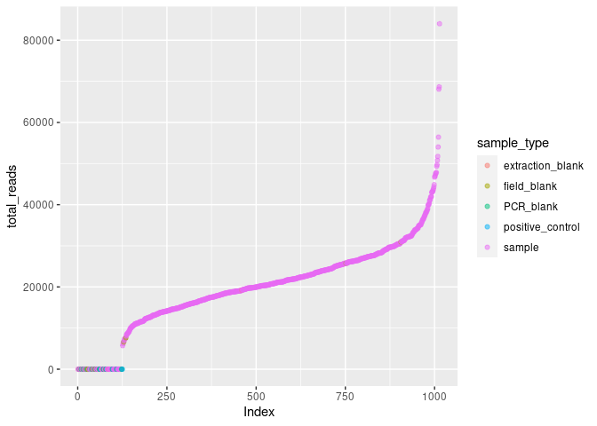

asv analysis of GOA pcod 2021 samples using MiFish
================
Kimberly Ledger
2023-05-29

analysis of mifish sequences from May 9 2023 and May 12 2023 sequencing
runs  
samples are from the GOA pcod survey in 2021

this script uses decontaminated read counts.

load libraries

``` r
library(tidyverse)
```

    ## ── Attaching packages ─────────────────────────────────────── tidyverse 1.3.2 ──
    ## ✔ ggplot2 3.4.0      ✔ purrr   0.3.5 
    ## ✔ tibble  3.2.1      ✔ dplyr   1.0.10
    ## ✔ tidyr   1.2.1      ✔ stringr 1.4.1 
    ## ✔ readr   2.1.3      ✔ forcats 0.5.2 
    ## ── Conflicts ────────────────────────────────────────── tidyverse_conflicts() ──
    ## ✖ dplyr::filter() masks stats::filter()
    ## ✖ dplyr::lag()    masks stats::lag()

``` r
library(ggplot2)
```

read in sample metadata

``` r
metadata <- read.csv("/genetics/edna/workdir/GOApcod_2021/GOA2021_metadata_20230515.csv")

#illumina output changed "_" to "-"
metadata$Sample_ID <- gsub("_", "-", metadata$Sample_ID) 
```

read in taxonomic identification - this is a table i created that
integrated INSECT and blastn classifications - i removed a few mammals
and no rank ASVs

``` r
taxon <- read.csv("/genetics/edna/workdir/GOApcod_2021/combined/trimmed/filtered/outputs/asv_taxonomy_COMBINED.csv") %>%
  rename(ASV = representative)
```

read in decontaminated sample table

``` r
asv_table <- read.csv("/home/kimberly.ledger/GOApcod_2021/decontaminated_reads.csv", row.names = 1)

asv_summary <- asv_table %>%
  group_by(ASV) %>%
  summarize(reads = sum(reads))
```

join taxon info to sample table

``` r
asv_w_id <- asv_summary %>%
  left_join(taxon, by = "ASV") %>%
  filter(!is.na(taxon))
```

plot the proportion of reads for a taxon assigning to individual ASV’s
<!-- -->

okay, so some taxa (especially species-level) are only made up of one
ASV, while other taxa have several ASVs

asv summary table - only keeping order and below because everything
above that (i.e. class) is identical

``` r
asv_id_table <- asv_w_id %>%
  select(ASV, order, family, genus, species, taxon, reads) %>%
  group_by(taxon) %>%
  filter(taxon != "NA") %>%
  mutate(sum=sum(reads)) %>%
  mutate(prop = reads/sum) %>%
  arrange(order, family, genus, species)
```

arrange taxons in a way that make sense instead of alphabetical

``` r
asv_order <- asv_w_id %>%
  arrange(order, family, genus, species) %>%
  select(taxon) %>%
  unique
```

now, join taxon and asv tables (with decontaminated read counts)

``` r
asv_id <- asv_w_id %>%
  select(ASV, taxon)

read_summary <- asv_table %>%
  left_join(asv_id, by = "ASV") %>%
  filter(reads > 0) %>%
  filter(taxon != "NA") %>%
  group_by(Sample_ID, taxon) %>%
  summarise(total_read_count = sum(reads)) %>%
  pivot_wider(names_from = "taxon", values_from = "total_read_count") %>%
  replace(is.na(.), 0)
```

    ## `summarise()` has grouped output by 'Sample_ID'. You can override using the
    ## `.groups` argument.

join to metadata - UPDATE COLUMN NUMBERS BELOW depending on input
read_summary data

``` r
join <- metadata %>%
  left_join(read_summary, by = c("Sample_ID"))

join_long <- join %>%
  pivot_longer(cols = 20:62, names_to = "taxon", values_to = "reads") %>%
  mutate(reads = ifelse(is.na(reads), 0, reads))

join_long$Sample_ID <- as.factor(join_long$Sample_ID)
join_long$pcr_replicate <- as.factor(join_long$pcr_replicate)
join_long$extraction_ID <- as.factor(join_long$extraction_ID)
join_long$extraction_replicate <- as.factor(join_long$extraction_replicate) 
join_long$run <- as.factor(join_long$run)
join_long$sample_type <- as.factor(join_long$sample_type)
join_long$taxon <- as.factor(join_long$taxon)

summary(join_long)
```

    ##     Sample_ID     pcr_replicate extraction_ID   extraction_replicate run      
    ##  e00373-A:   43   A:14534       e02072 :  258   1   :38055           A:21156  
    ##  e00373-B:   43   B:14534       e02073 :  258   2   : 5160           B:22446  
    ##  e00373-C:   43   C:14534       e02074 :  258   NA's:  387                    
    ##  e00374-A:   43                 e02075 :  258                                 
    ##  e00374-B:   43                 e02076 :  258                                 
    ##  e00374-C:   43                 e02077 :  258                                 
    ##  (Other) :43344                 (Other):42054                                 
    ##  collection_year collection_month collection_day    location1     
    ##  Min.   :2021    Min.   :6.000    Min.   : 1.00   Min.   :  1.00  
    ##  1st Qu.:2021    1st Qu.:6.000    1st Qu.:11.00   1st Qu.: 38.00  
    ##  Median :2021    Median :7.000    Median :18.00   Median : 63.00  
    ##  Mean   :2021    Mean   :6.723    Mean   :16.72   Mean   : 61.87  
    ##  3rd Qu.:2021    3rd Qu.:7.000    3rd Qu.:21.00   3rd Qu.: 92.00  
    ##  Max.   :2021    Max.   :7.000    Max.   :30.00   Max.   :104.00  
    ##  NA's   :2193    NA's   :2193     NA's   :2193    NA's   :7224    
    ##    longitude         latitude               sample_type    time_of_day       
    ##  Min.   :-162.1   Min.   :54.92   extraction_blank:  645   Length:43602      
    ##  1st Qu.:-159.4   1st Qu.:55.34   field_blank     :  387   Class :character  
    ##  Median :-153.5   Median :57.91   PCR_blank       : 1032   Mode  :character  
    ##  Mean   :-145.3   Mean   :57.20   positive_control:  516                     
    ##  3rd Qu.:-152.3   3rd Qu.:58.27   sample          :41022                     
    ##  Max.   : 157.2   Max.   :60.12                                              
    ##  NA's   :6063     NA's   :6063                                               
    ##  extraction_date    plate_or_vial      extraction_plate   extraction_well   
    ##  Length:43602       Length:43602       Length:43602       Length:43602      
    ##  Class :character   Class :character   Class :character   Class :character  
    ##  Mode  :character   Mode  :character   Mode  :character   Mode  :character  
    ##                                                                             
    ##                                                                             
    ##                                                                             
    ##                                                                             
    ##     dna_conc         pcr_conc                      taxon      
    ##  Min.   : 0.282   Min.   : 0.60   Ammodytes           : 1014  
    ##  1st Qu.: 2.494   1st Qu.:19.07   Anoplarchus         : 1014  
    ##  Median : 6.405   Median :22.20   Apodichthys flavidus: 1014  
    ##  Mean   : 8.484   Mean   :22.43   Artedius fenestralis: 1014  
    ##  3rd Qu.:11.991   3rd Qu.:29.15   Artedius harringtoni: 1014  
    ##  Max.   :36.555   Max.   :35.00   Artedius lateralis  : 1014  
    ##  NA's   :1505                     (Other)             :37518  
    ##      reads        
    ##  Min.   :    0.0  
    ##  1st Qu.:    0.0  
    ##  Median :    0.0  
    ##  Mean   :  456.6  
    ##  3rd Qu.:    0.0  
    ##  Max.   :67641.7  
    ## 

relevel the taxon factor

``` r
desired_order <- asv_order$taxon

join_long <- join_long %>%
  mutate(taxon = factor(taxon, levels = desired_order))

levels(join_long$taxon)
```

    ##  [1] "Clupea pallasii"             "Gadidae"                    
    ##  [3] "Eleginus gracilis"           "Gadus"                      
    ##  [5] "Gadus chalcogrammus"         "Hypomesus pretiosus"        
    ##  [7] "Mallotus villosus"           "Bathymaster"                
    ##  [9] "Cottidae"                    "Artedius fenestralis"       
    ## [11] "Artedius harringtoni"        "Artedius lateralis"         
    ## [13] "Clinocottus acuticeps"       "Enophrys bison"             
    ## [15] "Hemilepidotus hemilepidotus" "Leptocottus armatus"        
    ## [17] "Myoxocephalus"               "Oligocottus"                
    ## [19] "Synchirus gilli"             "Cymatogaster aggregata"     
    ## [21] "Gasterosteus aculeatus"      "Hexagrammos"                
    ## [23] "Hexagrammos decagrammus"     "Ophiodon elongatus"         
    ## [25] "Liparis greeni"              "Apodichthys flavidus"       
    ## [27] "Pholis laeta"                "Sebastes"                   
    ## [29] "Stichaeidae"                 "Anoplarchus"                
    ## [31] "Phytichthys chirus"          "Xiphister"                  
    ## [33] "Trichodon trichodon"         "Zaprora silenus"            
    ## [35] "Pleuronectidae"              "Lepidopsetta"               
    ## [37] "Limanda"                     "Oncorhynchus"               
    ## [39] "Oncorhynchus keta"           "Salvelinus"                 
    ## [41] "Scombridae"                  "Syngnathus"                 
    ## [43] "Ammodytes"

make a table with taxons and total read counts

``` r
join_long %>%
  group_by(taxon) %>%
  summarise(total_reads = sum(reads)) %>%
  arrange(desc(total_reads))
```

    ## # A tibble: 43 × 2
    ##    taxon           total_reads
    ##    <fct>                 <dbl>
    ##  1 Gadus              3757232.
    ##  2 Clupea pallasii    2562570.
    ##  3 Oncorhynchus       2451936.
    ##  4 Hexagrammos        1383299.
    ##  5 Ammodytes          1339193.
    ##  6 Gadidae            1021244.
    ##  7 Pholis laeta        850062.
    ##  8 Anoplarchus         610703.
    ##  9 Cottidae            447987.
    ## 10 Xiphister           410359.
    ## # ℹ 33 more rows

# now let’s check out data!

since reads were decontaminated it doesn’t make sense to plot positive
controls, pcr blanks, or extraction blanks… but remember there were lots
of O. nerka reads in e00562-A that i did not incorporate into the
decontamination process.

## any sequences in field blanks?

<!-- -->

well, unfortunately only three field blanks were taken during this
entire survey.

what are the read counts in the field blanks?

``` r
field_nc_reads <- join_long %>%
  filter(sample_type == "field_blank") %>% 
  filter(reads > 0) %>%
  select(Sample_ID, taxon, reads) %>%
  pivot_wider(names_from = "Sample_ID", values_from = "reads") 

field_nc_reads
```

    ## # A tibble: 3 × 5
    ##   taxon             `e00511-B` `e00513-B` `e00511-C` `e00512-C`
    ##   <fct>                  <dbl>      <dbl>      <dbl>      <dbl>
    ## 1 Oncorhynchus keta      30919        NA        6617       NA  
    ## 2 Oncorhynchus              NA        20          NA       16.6
    ## 3 Gadus                     NA      7614.         NA    25737.

some evidence for field contamination.

well, well. will need to think about how to account/deal with this.

create some read summaries

``` r
join_long %>%
  group_by(sample_type, run, Sample_ID) %>%
  summarise(total_reads = sum(reads)) %>%
  group_by(sample_type, run) %>%
  summarise(min_reads = min(total_reads),
            quant1_reads = quantile(total_reads, 0.25),
            median_reads = median(total_reads),
            mean_reads = mean(total_reads),
            quant3_reads = quantile(total_reads, 0.75),
            max_reads = max(total_reads))
```

    ## `summarise()` has grouped output by 'sample_type', 'run'. You can override
    ## using the `.groups` argument.
    ## `summarise()` has grouped output by 'sample_type'. You can override using the
    ## `.groups` argument.

    ## # A tibble: 9 × 8
    ## # Groups:   sample_type [5]
    ##   sample_type  run   min_reads quant1_reads median_reads mean_reads quant3_reads
    ##   <fct>        <fct>     <dbl>        <dbl>        <dbl>      <dbl>        <dbl>
    ## 1 extraction_… A             0           0            0       1603.           0 
    ## 2 extraction_… B             0           0            0          0            0 
    ## 3 field_blank  A             0           0            0       7880.        7634.
    ## 4 PCR_blank    A             0           0            0          0            0 
    ## 5 PCR_blank    B             0           0            0          0            0 
    ## 6 positive_co… A             0           0            0          0            0 
    ## 7 positive_co… B             0           0            0          0            0 
    ## 8 sample       A             0       17380.       23208.     23006.       28276.
    ## 9 sample       B             0       14244.       19001.     18757.       23135.
    ## # ℹ 1 more variable: max_reads <dbl>

not a huge difference in read counts for pc and samples between run A
and B so I won’t worry about any batch effects for now.

take a quick first look at the library sizes (i.e. the number of reads)
in each sample, as a function of whether that sample was a true positive
sample or a negative control

``` r
temp <- join_long %>%
  group_by(Sample_ID) %>%
  mutate(total_reads = sum(reads)) %>%
  arrange(total_reads) %>%
  select(Sample_ID, extraction_ID, sample_type, dna_conc, total_reads) %>%
  unique()

temp$Index <- seq(nrow(temp))

ggplot(temp, aes(x=Index, y = total_reads, color = sample_type)) + 
         geom_point(alpha = 0.5)
```

<!-- -->

plot total reads by DNA concentration for samples

``` r
temp %>%
  filter(sample_type == "sample") %>%
  ggplot(aes(x=dna_conc, y = total_reads)) + 
         geom_point(alpha = 0.5)
```

<!-- -->

hmm.. perhaps i should flag samples that have no reads post
decontamination but have a DNA concentration of 2ng/ul or greater??

``` r
temp %>%
  filter(dna_conc > 2) %>%
  filter(total_reads < 1) %>%
  arrange(Sample_ID)
```

    ## # A tibble: 46 × 6
    ## # Groups:   Sample_ID [46]
    ##    Sample_ID extraction_ID sample_type dna_conc total_reads Index
    ##    <fct>     <fct>         <fct>          <dbl>       <dbl> <int>
    ##  1 e00417-A  e00417        sample          2.59           0     4
    ##  2 e00417-B  e00417        sample          2.59           0    14
    ##  3 e00417-C  e00417        sample          2.59           0    22
    ##  4 e00435-A  e00435        sample          6.82           0     7
    ##  5 e00474-C  e00474        sample          2.48           0    24
    ##  6 e00481-A  e00481        sample          2.26           0     8
    ##  7 e00521-C  e00521        sample          5.48           0    52
    ##  8 e00538-C  e00538        sample          3.01           0    53
    ##  9 e00542-A  e00542        sample         21.6            0    32
    ## 10 e00542-B  e00542        sample         21.6            0    43
    ## # ℹ 36 more rows

maybe try to rerun these samples on the MiSeq???

alright, let me plot the legend for reference

    ## 
    ## Attaching package: 'gridExtra'

    ## The following object is masked from 'package:dplyr':
    ## 
    ##     combine

<!-- -->

okay, now i will summarize samples by location (remember part of the
decontamination steps included removing outlier site replicates)

``` r
location_summary <- join_long %>%
  filter(sample_type == "sample") %>%
  group_by(Sample_ID) %>%
  mutate(sum=sum(reads)) %>%
  mutate(prop = reads/sum) %>%
  group_by(location1, taxon) %>%
  summarize(mean_prop = mean(prop))
```

    ## `summarise()` has grouped output by 'location1'. You can override using the
    ## `.groups` argument.

``` r
location_summary$location1 <- as.factor(location_summary$location1)
```

``` r
location_summary %>%
  ggplot(aes(x=location1, y=mean_prop, fill=taxon)) +
  geom_bar(stat = "identity") + 
  theme_bw() +
  labs(
    y = "proportion of sequencing reads",
    x = "location",
    title = "proportion of reads") + 
  theme(
    axis.text.x=element_text(angle = 90, hjust = 0.95), #remove x axis labels
    legend.text = element_text(size = 8),
    legend.key.size = unit(0.3, "cm"),
    legend.position = "none",
    legend.title = element_blank(),
  )
```

    ## Warning: Removed 1333 rows containing missing values (`position_stack()`).

<!-- -->

note the locations without columns is not missing data, there were not
samples taken from locations of those values and my first couple
attempts to remove them from the plot failed

## now let’s take a look at reads from the samples

## and proportion of reads from the samples

``` r
# join_long %>% 
#   filter(sample_type == "sample") %>%
#   group_by(Sample_ID) %>%
#   mutate(sum=sum(reads)) %>%
#   mutate(prop = reads/sum) %>%
#   ggplot(aes(x=Sample_ID, y=prop, fill=taxon)) +
#   geom_bar(stat = "identity") + 
#   theme_bw() +
#   labs(
#     y = "proportion of sequencing reads",
#     x = "sample",
#     title = "proportion of reads") + 
#   theme(
#     axis.text.x=element_blank(), #remove x axis labels
#     legend.text = element_text(size = 8),
#     legend.key.size = unit(0.3, "cm"),
#     legend.position = "none",
#     legend.title = element_blank(),
#   )
```
