Decontaminating GOA pcod eDNA metabarcoding ASVs and samples
================
Kimberly Ledger
2023-07-07

This script is an updated version of my decontamination pipeline for the
GOA pcod 2021 samples.

Inputs: This code starts with the ASV table output from DADA2 pipeline
in my sequence_filtering.Rmd (eDNA_metabarcoding R project). We also use
sample metadata and a preliminary taxonomic id for the ASVs in this
code.

Outputs: We will end up with a decontaminated ASV table that can be used
for additional analyses.

Decontamination will involve **5 steps**  
**1. Estimate tag-jumping** - There is the potential for barcodes (that
are used to identify the individual samples in a MiSeq run) to be
assigned to the wrong sample for a variety of reasons. While we can’t
tell exactly which mechanism generated these errors, we can still
estimate the occurrence of tag-jumping and account for it in our
dataset. To do this, we will consider our positive control samples
(which have known composition and are extremely unlikely to be present
in the environmental samples) as representatives of the amount of
tag-jumping occuring across the entire dataset. Specifically, what we
will do is subtract the proportion of reads observed in the control
samples from each environmental sample. The output will be a dataset
with the same number of samples and ASVs as before, but with fewer reads
of certain sequences (ASVs). We expect this bias in tag-jumping to be
frequency-dependent (i.e. the more abundant ASVs are more likely to be
found in samples where they are not suppose to be.)

**2. Account for contaminants in positive and negative controls** - We
can use the reads that show up where we know they shouldn’t be (i.e. the
controls) to further clean up the dataset. We will remove ASVs that only
occur in controls and not in environmental samples. And then we will
subtract the maximum number of reads from ASVs found in either the
extraction or pcr controls from all samples. The output will be a
dataset with the same number of samples as before but with fewer ASVs.

**3. Discard PCR replicates with low numbers of reads** - Sometimes PCR
replicates have low read numbers, and therefore will have skewed
relative read proportions. These should be removed. To do this we will
fit the number of reads assigned to each sample to a normal distribution
and discard those samples with a **97.5%** probability of not fitting in
that distribution. The output will be a dataset with fewer samples and
potentially fewer ASVs.

**4. Hierarchical Occupancy Modeling** - We can use occupancy modeling
to help determine if rare ASVs are real or a PCR artifact. We will
remove the ASVs that probably aren’t real. The output will be a dataset
with the same number of samples as before but with fewer ASVs.

**5. Dissimilarity between PCR (biological) replicates** - PCR
replicates should be similar (this is not the case for biological
replicates because of the many stochastic processes involved in the
sequencing of a sample, but anyways…). This step removes samples for
which the dissimilarity between PCR replicates exceeds the normal
distribution of dissimilarities observed in samples. The objective of
this step is to remove any technical replicates that look like they do
not belong. The output will be a dataset with fewer samples and
potentially fewer ASVs.

# Load libraries and data

load libraries

``` r
library(stringi)
library(rstan)
```

    ## Loading required package: StanHeaders

    ## Loading required package: ggplot2

    ## rstan (Version 2.21.8, GitRev: 2e1f913d3ca3)

    ## For execution on a local, multicore CPU with excess RAM we recommend calling
    ## options(mc.cores = parallel::detectCores()).
    ## To avoid recompilation of unchanged Stan programs, we recommend calling
    ## rstan_options(auto_write = TRUE)

``` r
library(broom)
library(tibble)
library(vegan)
```

    ## Loading required package: permute

    ## Loading required package: lattice

    ## This is vegan 2.6-4

``` r
library(reshape)
library(tidyverse)
```

    ## ── Attaching packages
    ## ───────────────────────────────────────
    ## tidyverse 1.3.2 ──

    ## ✔ tidyr   1.3.0     ✔ dplyr   1.1.2
    ## ✔ readr   2.1.3     ✔ stringr 1.5.0
    ## ✔ purrr   1.0.1     ✔ forcats 0.5.2
    ## ── Conflicts ────────────────────────────────────────── tidyverse_conflicts() ──
    ## ✖ tidyr::expand()  masks reshape::expand()
    ## ✖ tidyr::extract() masks rstan::extract()
    ## ✖ dplyr::filter()  masks stats::filter()
    ## ✖ dplyr::lag()     masks stats::lag()
    ## ✖ dplyr::rename()  masks reshape::rename()

``` r
library(dplyr)
```

load ASV table and metadata

``` r
asv_table <- read.csv("/genetics/edna/workdir/GOApcod_2021/combined/trimmed/filtered/outputs/ASVtable.csv") %>%
  dplyr::rename(Sample_ID = X)

asv_table$Sample_ID <- as.factor(asv_table$Sample_ID)

metadata <- read.csv("/genetics/edna/workdir/GOApcod_2021/GOA2021_metadata_20230630.csv")

#illumina output changed "_" to "-"
metadata$Sample_ID <- gsub("_", "-", metadata$Sample_ID) 
```

let’s start by taking a closer looks at our dataset

``` r
## number of ASVs 
sum(grepl("ASV", colnames(asv_table)))  
```

    ## [1] 1859

``` r
## number of samples in ASV table 
nrow(asv_table)
```

    ## [1] 1014

``` r
## break down of the number of environmental samples, positives, negatives
summary <- metadata %>%
  group_by(sample_type) %>%
  summarize(starting_reps = n()) 

summary[6,1] <- "Total"
summary[6,2] <- sum(summary$starting_reps, na.rm = T)

summary
```

    ## # A tibble: 6 × 2
    ##   sample_type      starting_reps
    ##   <chr>                    <int>
    ## 1 PCR_blank                   24
    ## 2 extraction_blank            15
    ## 3 field_blank                  9
    ## 4 positive_control            12
    ## 5 sample                     954
    ## 6 Total                     1014

good. the number of samples in the asv file and the metadata match!

how many sites, biological replicates, and pcr replicates are we
starting with for our **environmental samples**?

``` r
metadata %>%
  filter(sample_type == "sample") %>%
  distinct(location1) %>%
  summarise(SamplingSites = n())
```

    ##   SamplingSites
    ## 1            84

``` r
unique_replicates_starting <- metadata %>%
  group_by(location1) %>%
  summarise(n_biologial_reps = n_distinct(biological_replicate),
            n_pcr_reps_per_biorep = n_distinct(pcr_replicate),
            n_pcr_reps_total = n_biologial_reps*n_pcr_reps_per_biorep)

unique_replicates_starting
```

    ## # A tibble: 84 × 4
    ##    location1 n_biologial_reps n_pcr_reps_per_biorep n_pcr_reps_total
    ##        <int>            <int>                 <int>            <int>
    ##  1         1                3                     3                9
    ##  2         2                3                     3                9
    ##  3         3                3                     3                9
    ##  4         4                3                     3                9
    ##  5         7                3                     3                9
    ##  6         8                3                     3                9
    ##  7         9                3                     3                9
    ##  8        10                3                     3                9
    ##  9        13                3                     3                9
    ## 10        23                3                     3                9
    ## # ℹ 74 more rows

Before diving into the decontamination steps, let’s get a feel for what
the data look like.

### positive controls

add column to the ASV table that labels the sample type

``` r
asv_table_with_sample_type <- metadata %>%
  dplyr::select(Sample_ID, sample_type) %>%
  left_join(asv_table, by = "Sample_ID")
```

let’s start by visualizing the reads in the positive control samples

``` r
asv_table_with_sample_type %>%
  pivot_longer(cols = c(3:1861), names_to = "ASV", values_to = "reads") %>%
  filter(sample_type == "positive_control") %>%
  ggplot(aes(x=Sample_ID, y=reads, fill=ASV)) +
  geom_bar(stat = "identity") + 
    theme_bw() +
  labs(
    y = "number of sequencing reads",
    x = "sample ID",
    title = "ASV reads in positive controls") + 
  theme(
    axis.text.x = element_text(angle = 90, hjust = 0.95),
    legend.text = element_text(size = 8),
    legend.key.size = unit(0.3, "cm"),
    legend.position = "none",
    legend.title = element_blank()
  )
```

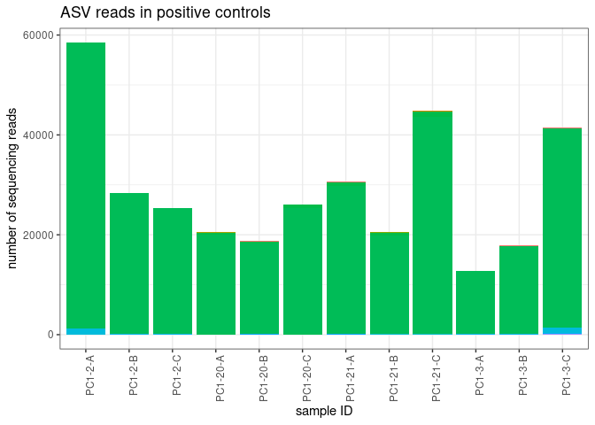<!-- -->

top asvs in positive controls

``` r
asvs_PC <- asv_table_with_sample_type %>%
  pivot_longer(cols = c(3:1861), names_to = "ASV", values_to = "reads") %>%
  filter(sample_type == "positive_control") %>%
  group_by(ASV) %>%
  summarise(total = sum(reads)) %>%
  arrange(desc(total))

head(asvs_PC, 10)
```

    ## # A tibble: 10 × 2
    ##    ASV      total
    ##    <chr>    <int>
    ##  1 ASV16   336372
    ##  2 ASV158    4222
    ##  3 ASV227    2310
    ##  4 ASV1      1067
    ##  5 ASV4       471
    ##  6 ASV3       433
    ##  7 ASV5       200
    ##  8 ASV1108    153
    ##  9 ASV2       147
    ## 10 ASV26       93

### field blanks

let me look into the reads that got into the field blanks

``` r
asv_table_with_sample_type %>%
  pivot_longer(cols = c(3:1861), names_to = "ASV", values_to = "reads") %>%
  filter(sample_type == "field_blank") %>%
  ggplot(aes(x=Sample_ID, y=reads, fill=ASV)) +
  geom_bar(stat = "identity") + 
    theme_bw() +
  labs(
    y = "number of sequencing reads",
    x = "sample ID",
    title = "ASV reads in field negatives") + 
  theme(
    axis.text.x = element_text(angle = 90, hjust = 0.95),
    legend.text = element_text(size = 8),
    legend.key.size = unit(0.3, "cm"),
    legend.position = "none",
    legend.title = element_blank()
  )
```

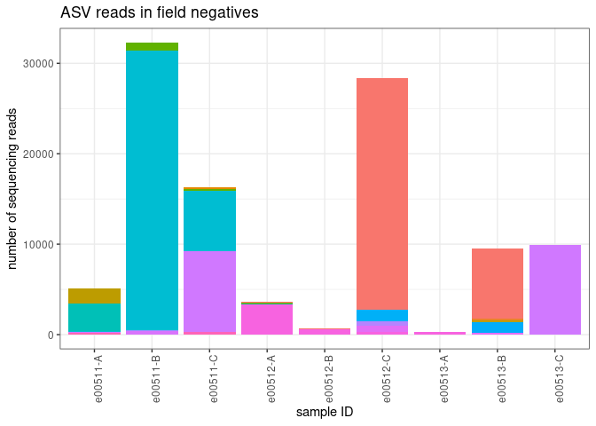<!-- -->

``` r
asvs_FN <- asv_table_with_sample_type %>%
  pivot_longer(cols = c(3:1861), names_to = "ASV", values_to = "reads") %>%
  filter(sample_type == "field_blank") %>%
  group_by(ASV) %>%
  summarise(total = sum(reads)) %>%
  arrange(desc(total))

head(asvs_FN, 10)
```

    ## # A tibble: 10 × 2
    ##    ASV    total
    ##    <chr>  <int>
    ##  1 ASV20  37606
    ##  2 ASV1   33585
    ##  3 ASV60  18886
    ##  4 ASV73   4428
    ##  5 ASV18   3068
    ##  6 ASV126  1725
    ##  7 ASV331  1209
    ##  8 ASV346  1126
    ##  9 ASV146  1036
    ## 10 ASV65    857

### extraction blanks

let me look into the reads that got into the extraction blanks

``` r
asv_table_with_sample_type %>%
  pivot_longer(cols = c(3:1861), names_to = "ASV", values_to = "reads") %>%
  filter(sample_type == "extraction_blank") %>%
  ggplot(aes(x=Sample_ID, y=reads, fill=ASV)) +
  geom_bar(stat = "identity") + 
    theme_bw() +
  labs(
    y = "number of sequencing reads",
    x = "sample ID",
    title = "ASV reads - extraction blanks") + 
  theme(
    axis.text.x = element_text(angle = 90, hjust = 0.95),
    legend.text = element_text(size = 8),
    legend.key.size = unit(0.3, "cm"),
    legend.position = "none",
    legend.title = element_blank()
  )
```

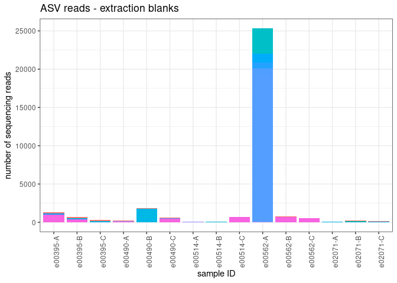<!-- -->

all but one replicate has relatively few reads. and it’s only in one pcr
rep of the extraction.

``` r
asvs_EC <- asv_table_with_sample_type %>%
  pivot_longer(cols = c(3:1861), names_to = "ASV", values_to = "reads") %>%
  filter(sample_type == "extraction_blank") %>%
  group_by(ASV) %>%
  summarise(total = sum(reads)) %>%
  arrange(desc(total))

head(asvs_EC, 10)
```

    ## # A tibble: 10 × 2
    ##    ASV    total
    ##    <chr>  <int>
    ##  1 ASV43  19277
    ##  2 ASV73   3873
    ##  3 ASV184  3285
    ##  4 ASV263  1761
    ##  5 ASV350  1100
    ##  6 ASV1     919
    ##  7 ASV406   837
    ##  8 ASV428   779
    ##  9 ASV4     333
    ## 10 ASV2     257

lots of ASV43 (Oncorhynchus) in e00562-A asv73 and asv263 is human - the
rest of the asvs seem to follow the trend that the more total reads per
ASV the more likely they are to get into other samples…

### pcr blanks

let me look into the reads that got into the pcr blanks

``` r
asv_table_with_sample_type %>%
  pivot_longer(cols = c(3:1861), names_to = "ASV", values_to = "reads") %>%
  filter(sample_type == "PCR_blank") %>%
  ggplot(aes(x=Sample_ID, y=reads, fill=ASV)) +
  geom_bar(stat = "identity") + 
    theme_bw() +
  labs(
    y = "number of sequencing reads",
    x = "sample ID",
    title = "ASV reads - pcr negatives") + 
  theme(
    axis.text.x = element_text(angle = 90, hjust = 0.95),
    legend.text = element_text(size = 8),
    legend.key.size = unit(0.3, "cm"),
    legend.position = "none",
    legend.title = element_blank()
  )
```

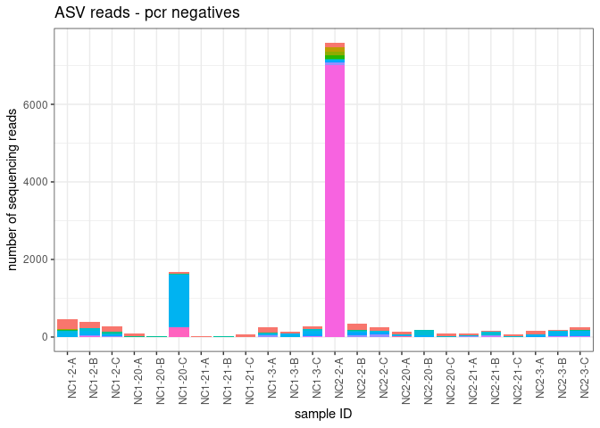<!-- -->

``` r
asvs_PCRN <- asv_table_with_sample_type %>%
  pivot_longer(cols = c(3:1861), names_to = "ASV", values_to = "reads") %>%
  filter(sample_type == "PCR_blank") %>%
  group_by(ASV) %>%
  summarise(total = sum(reads)) %>%
  arrange(desc(total))

head(asvs_PCRN, 10)
```

    ## # A tibble: 10 × 2
    ##    ASV     total
    ##    <chr>   <int>
    ##  1 ASV73    7033
    ##  2 ASV1     1762
    ##  3 ASV305   1347
    ##  4 ASV3      741
    ##  5 ASV2      418
    ##  6 ASV5      349
    ##  7 ASV4      279
    ##  8 ASV822    258
    ##  9 ASV17     122
    ## 10 ASV1262   120

again, asv73 is human.

okay, now how many sturgeon reads made it into the other samples?

``` r
sturgeon_ASV_list <- c("ASV16", "ASV158", "ASV227", "ASV1108")

sturgeon_in_samples <- asv_table_with_sample_type %>%
  pivot_longer(cols = c(3:1861), names_to = "ASV", values_to = "reads") %>%
  group_by(Sample_ID) %>%
  mutate(total_reads = sum(reads)) %>%
  filter(ASV %in% sturgeon_ASV_list) %>%
  select(!ASV) %>%
  unique() %>%
  mutate(sturgeon_reads=sum(reads)) %>%
  select(!reads) %>%
  unique() %>%
  mutate(prop_sturgeon = sturgeon_reads/total_reads) %>%
  #arrange(desc(prop_sturgeon)) %>%
  group_by(sample_type) %>%
  summarise(max_reads_sturgeon = max(sturgeon_reads),
            max_prop_sturgeon = max(prop_sturgeon),
            avg_reads_sturgeon = mean(sturgeon_reads), 
            avg_prop_sturgeon = mean(prop_sturgeon))

sturgeon_in_samples
```

    ## # A tibble: 5 × 5
    ##   sample_type      max_reads_sturgeon max_prop_sturgeon avg_reads_sturgeon
    ##   <chr>                         <int>             <dbl>              <dbl>
    ## 1 PCR_blank                        18           0.0383               0.75 
    ## 2 extraction_blank                  0           0                    0    
    ## 3 field_blank                       0           0                    0    
    ## 4 positive_control              58338           0.998            28588.   
    ## 5 sample                           56           0.00139              0.410
    ## # ℹ 1 more variable: avg_prop_sturgeon <dbl>

# 1. Estimate index hopping

subtract the proportion of reads that jumped into the positive control
samples from each environmental sample

identify the maximum proportion of reads for each ASV found in the
positive controls

``` r
prop_asvs_in_positives <- asv_table_with_sample_type %>%
  filter(sample_type == "positive_control") %>%
  pivot_longer(cols = c(3:1861), names_to = "ASV", values_to = "reads") %>%
  group_by(Sample_ID) %>%
  mutate(TotalReadsPerSample = sum(reads)) %>%
  mutate(Prop = reads/TotalReadsPerSample) %>%
  group_by(ASV) %>%
  summarise(max_prop = max(Prop))
```

let’s plot the max proportion of reads for each ASV found in the
positive controls vs the abundance of reads for that ASV (total)

``` r
reads_per_asv <-  asv_table_with_sample_type %>%
  pivot_longer(cols = c(3:1861), names_to = "ASV", values_to = "reads") %>%
  group_by(ASV) %>%
  summarise(TotalReadsPerASV = sum(reads))

for_plot <- prop_asvs_in_positives %>%
  left_join(reads_per_asv, by = "ASV") %>%
  filter(ASV != "ASV16")  ## remove the most abundant sturgeon asv from this plot

ggplot(for_plot, aes(x = TotalReadsPerASV, y = max_prop)) + 
  geom_point()
```

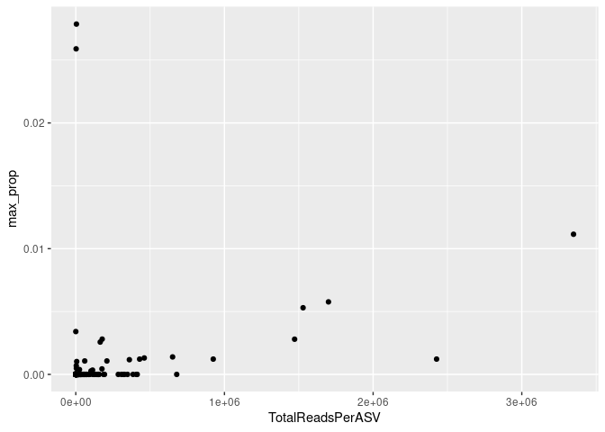<!-- -->

so there appears to be a general frequency-dependent relationship here
(more reads = more tag-jumping) but there are two clear outliers. what
are those?

``` r
for_plot %>%
  filter(max_prop > 0.02)
```

    ## # A tibble: 2 × 3
    ##   ASV    max_prop TotalReadsPerASV
    ##   <chr>     <dbl>            <int>
    ## 1 ASV158   0.0279             4222
    ## 2 ASV227   0.0259             2310

ASV158 gets assigned to the family Acipenseridae - this is also
sturgeon! ASV227 gets assigned to the genus Acipenser - also sturgeon…

let me plot this again without all sturgeon asvs

``` r
for_plot2 <- for_plot %>%
  filter(ASV != "ASV158") %>%
  filter(ASV != "ASV227") %>%
  filter(ASV != "ASV1108")  #this asv also assigns to sturgeon family

ggplot(for_plot2, aes(x = TotalReadsPerASV, y = max_prop)) + 
  geom_point()
```

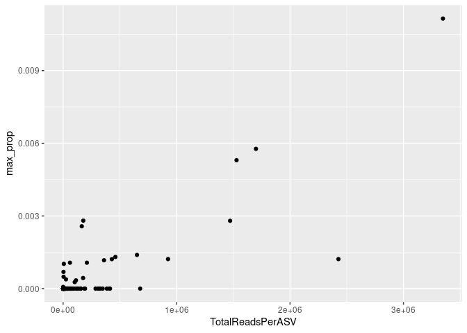<!-- -->

So I could see two approaches here…

### 1 -

subtract the max proportion of tag-jumped reads for each ASV from all
samples

``` r
indexhop_table <- asv_table_with_sample_type %>%
  pivot_longer(cols = c(3:1861), names_to = "ASV", values_to = "reads") %>%
  group_by(Sample_ID) %>%
  mutate(TotalReadsPerSample = sum(reads)) %>%
  left_join(prop_asvs_in_positives, by = "ASV") %>%
  mutate(IndexHoppingReads = TotalReadsPerSample*max_prop) %>%
  mutate(reads_IndexHop_removed = reads - IndexHoppingReads) %>%
  mutate(reads_IndexHop_removed = if_else(reads_IndexHop_removed < 0, 0, reads_IndexHop_removed))
head(indexhop_table)
```

    ## # A tibble: 6 × 8
    ## # Groups:   Sample_ID [1]
    ##   Sample_ID sample_type ASV   reads TotalReadsPerSample max_prop
    ##   <chr>     <chr>       <chr> <int>               <int>    <dbl>
    ## 1 e00373-A  sample      ASV1     76               11470  0.0111 
    ## 2 e00373-A  sample      ASV2   7492               11470  0.00122
    ## 3 e00373-A  sample      ASV3     33               11470  0.00577
    ## 4 e00373-A  sample      ASV4     12               11470  0.00530
    ## 5 e00373-A  sample      ASV5     35               11470  0.00280
    ## 6 e00373-A  sample      ASV6      0               11470  0.00122
    ## # ℹ 2 more variables: IndexHoppingReads <dbl>, reads_IndexHop_removed <dbl>

### 2

**OR** do i want to fit a line to my total reads vs prop in PC and then
subtract reads based on that? i’m forcing the y-int to be zero.

``` r
fit <- lm(max_prop ~ TotalReadsPerASV - 1, data = for_plot2)
summary(fit)
```

    ## 
    ## Call:
    ## lm(formula = max_prop ~ TotalReadsPerASV - 1, data = for_plot2)
    ## 
    ## Residuals:
    ##        Min         1Q     Median         3Q        Max 
    ## -0.0045473 -0.0000015 -0.0000005 -0.0000002  0.0031934 
    ## 
    ## Coefficients:
    ##                   Estimate Std. Error t value Pr(>|t|)    
    ## TotalReadsPerASV 2.376e-09  3.443e-11      69   <2e-16 ***
    ## ---
    ## Signif. codes:  0 '***' 0.001 '**' 0.01 '*' 0.05 '.' 0.1 ' ' 1
    ## 
    ## Residual standard error: 0.0001832 on 1854 degrees of freedom
    ## Multiple R-squared:  0.7197, Adjusted R-squared:  0.7196 
    ## F-statistic:  4761 on 1 and 1854 DF,  p-value: < 2.2e-16

``` r
indexhop_table_version2 <- asv_table_with_sample_type %>%
  pivot_longer(cols = c(3:1861), names_to = "ASV", values_to = "reads") %>%
  group_by(ASV) %>%
  mutate(TotalReadsPerASV = sum(reads)) %>%
  mutate(IndexHoppingReads = TotalReadsPerASV*fit$coefficients) %>%  ## maybe the slope should be X100??? anyways the # of reads removed would still be very very small (<1 per ASV per sample in most cases)
  mutate(reads_IndexHop_removed = reads - IndexHoppingReads) %>%
  mutate(reads_IndexHop_removed = if_else(reads_IndexHop_removed < 0, 0, reads_IndexHop_removed))
head(indexhop_table_version2)
```

    ## # A tibble: 6 × 7
    ## # Groups:   ASV [6]
    ##   Sample_ID sample_type ASV   reads TotalReadsPerASV IndexHoppingReads
    ##   <chr>     <chr>       <chr> <int>            <int>             <dbl>
    ## 1 e00373-A  sample      ASV1     76          3348003           0.00795
    ## 2 e00373-A  sample      ASV2   7492          2426864           0.00577
    ## 3 e00373-A  sample      ASV3     33          1699681           0.00404
    ## 4 e00373-A  sample      ASV4     12          1528814           0.00363
    ## 5 e00373-A  sample      ASV5     35          1471844           0.00350
    ## 6 e00373-A  sample      ASV6      0           924597           0.00220
    ## # ℹ 1 more variable: reads_IndexHop_removed <dbl>

okay this lm slope coefficient is so small that \<1 read is being
removed from ASVs in a given sample. so this method doesn’t really do
anything. i will stick with the subtracting the max proportion of reads
for each ASV found in the PC from all samples.

clean up the table by removing columns no longer needed

``` r
asv_table_filter1 <- indexhop_table %>%
  dplyr::select(Sample_ID, sample_type, ASV, reads_IndexHop_removed) %>%
  dplyr::rename(reads = reads_IndexHop_removed)
```

this is a summary of the number of reads removed by ASV and sample_ID

``` r
decontaminated_1 <- indexhop_table %>%
  dplyr::select(Sample_ID, ASV, IndexHoppingReads) %>%
  pivot_wider(names_from = "ASV", values_from = "IndexHoppingReads")
head(decontaminated_1)
```

    ## # A tibble: 6 × 1,860
    ## # Groups:   Sample_ID [6]
    ##   Sample_ID  ASV1  ASV2  ASV3  ASV4  ASV5  ASV6  ASV7  ASV8  ASV9 ASV10 ASV11
    ##   <chr>     <dbl> <dbl> <dbl> <dbl> <dbl> <dbl> <dbl> <dbl> <dbl> <dbl> <dbl>
    ## 1 e00373-A   128.  14.0  66.2  60.8  32.1  14.0     0  15.9  15.0  13.9     0
    ## 2 e00374-A   176.  19.2  90.9  83.5  44.1  19.2     0  21.9  20.6  19.2     0
    ## 3 e00375-A   270.  29.6 140.  129.   67.9  29.6     0  33.7  31.7  29.5     0
    ## 4 e00376-A   400.  43.7 207.  190.  100.   43.7     0  49.9  46.9  43.6     0
    ## 5 e00377-A   205.  22.4 106.   97.5  51.5  22.4     0  25.6  24.0  22.4     0
    ## 6 e00378-A   203.  22.1 105.   96.3  50.9  22.1     0  25.3  23.7  22.1     0
    ## # ℹ 1,848 more variables: ASV12 <dbl>, ASV13 <dbl>, ASV14 <dbl>, ASV15 <dbl>,
    ## #   ASV16 <dbl>, ASV17 <dbl>, ASV18 <dbl>, ASV19 <dbl>, ASV20 <dbl>,
    ## #   ASV21 <dbl>, ASV22 <dbl>, ASV23 <dbl>, ASV24 <dbl>, ASV25 <dbl>,
    ## #   ASV26 <dbl>, ASV27 <dbl>, ASV28 <dbl>, ASV29 <dbl>, ASV30 <dbl>,
    ## #   ASV31 <dbl>, ASV32 <dbl>, ASV33 <dbl>, ASV34 <dbl>, ASV35 <dbl>,
    ## #   ASV36 <dbl>, ASV37 <dbl>, ASV38 <dbl>, ASV39 <dbl>, ASV40 <dbl>,
    ## #   ASV41 <dbl>, ASV42 <dbl>, ASV43 <dbl>, ASV44 <dbl>, ASV45 <dbl>, …

and a list of the proportion of reads from ASVs removed

``` r
prop_removed_1 <- prop_asvs_in_positives %>%
  arrange(desc(max_prop))
head(prop_removed_1)
```

    ## # A tibble: 6 × 2
    ##   ASV    max_prop
    ##   <chr>     <dbl>
    ## 1 ASV16   0.993  
    ## 2 ASV158  0.0279 
    ## 3 ASV227  0.0259 
    ## 4 ASV1    0.0111 
    ## 5 ASV3    0.00577
    ## 6 ASV4    0.00530

ASV16, ASV158 and ASV227 are sturgeon (the positive control).

okay, just to be clear. subtracting the max proportion of ASVs found in
the positive controls from the enivornmental samples and negative
controls accounts for tag-jumping. but the subtraction of max proportion
of ASVs found in the positive controls from the positive controls just
gets rid of the reads in PC completely. which i think is okay…

# 2. Account for contaminants in positive and negative controls

next we will remove ASVs that only occur in controls and not in
environmental samples. and then we will subtract the maximum number of
reads from ASVs found in the controls from all samples. i will start by
working with the extraction negatives, pcr negatives, and positive
controls (though there should not really be too many reads left in
positives after step 1).

let’s start by taking a look at what reads remain in these controls

``` r
asv_table_filter1 %>%
  filter(sample_type != "sample") %>%
  filter(sample_type != "field_blank") %>%
  ggplot(aes(x=Sample_ID, y=reads, fill=ASV)) +
  geom_bar(stat = "identity") + 
    theme_bw() +
  labs(
    y = "number of sequencing reads",
    x = "sample ID",
    title = "ASV reads - controls") + 
  theme(
    axis.text.x = element_text(angle = 90, hjust = 0.95),
    legend.text = element_text(size = 8),
    legend.key.size = unit(0.3, "cm"),
    legend.position = "none",
    legend.title = element_blank()
  )
```

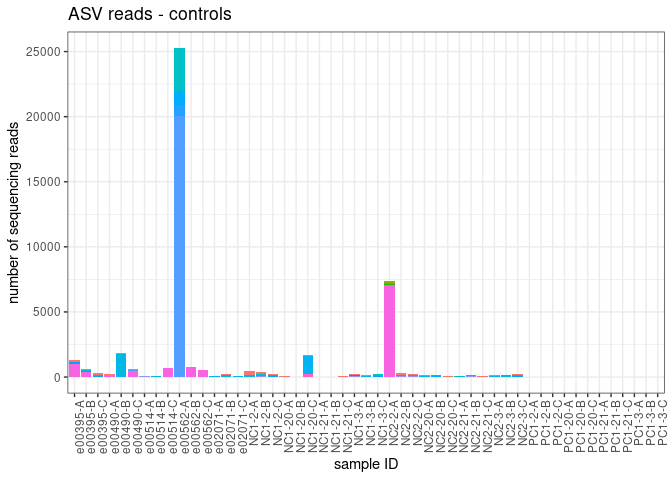<!-- -->

number of reads

``` r
tempA <- asv_table_filter1 %>%
  group_by(ASV, sample_type) %>%
  summarize(TotalReadsPerASV = sum(reads)) %>%
  arrange(ASV)
```

    ## `summarise()` has grouped output by 'ASV'. You can override using the `.groups`
    ## argument.

what ASVs have no reads in samples, but reads in the controls?

``` r
tempB <- tempA %>%
  pivot_wider(names_from = "sample_type", values_from = c("TotalReadsPerASV")) %>%
    filter(sample < 1)
head(tempB)
```

    ## # A tibble: 6 × 6
    ## # Groups:   ASV [6]
    ##   ASV     PCR_blank extraction_blank field_blank positive_control sample
    ##   <chr>       <dbl>            <dbl>       <dbl>            <dbl>  <dbl>
    ## 1 ASV1108         0                0           0                0      0
    ## 2 ASV1112         0                0         152                0      0
    ## 3 ASV1262       120                0           0                0      0
    ## 4 ASV1266         0                0         119                0      0
    ## 5 ASV1357         0                0         103                0      0
    ## 6 ASV1382        98                0           0                0      0

remove these from the data frame

``` r
asv_table_filter1.5 <- asv_table_filter1 %>%
  filter(!ASV %in% tempB$ASV)
```

calculate the maximum number of reads in an ASV to still show up in an
extraction or PCR control

``` r
reads_to_remove_per_ASV <- asv_table_filter1.5 %>%
  filter(sample_type == "extraction_blank"| sample_type == "PCR_blank") %>%
  group_by(ASV) %>%
  summarize(max_reads = max(reads))

reads_to_remove_per_sample <- asv_table_filter1.5 %>%
  left_join(reads_to_remove_per_ASV, by = "ASV") %>%
  mutate(read_minus_contamination = reads - max_reads) %>%
  mutate(read_minus_contamination = if_else(read_minus_contamination < 0, 0, read_minus_contamination))
```

filter the data frame

``` r
asv_table_filter2 <- reads_to_remove_per_sample %>%
  select(!reads) %>%
  select(!max_reads) %>%
  rename(reads = read_minus_contamination)
```

number of ASVs remaining

``` r
length(unique(asv_table_filter2$ASV)) 
```

    ## [1] 1828

# 3. Discard PCR replicates with low numbers of reads

calculate reads per sample

``` r
all_reads <- asv_table_filter2 %>%
  group_by(Sample_ID) %>%
  summarize(ReadsPerSample = sum(reads))
```

visualize

``` r
all_reads$x_reordered <- reorder(all_reads$Sample_ID, -all_reads$ReadsPerSample)

all_reads %>%
  ggplot(aes(x = x_reordered, y = ReadsPerSample)) + 
  geom_bar(stat = "identity")
```

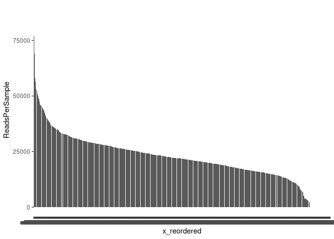<!-- -->

fit a normal distribution

``` r
fit <- MASS::fitdistr(all_reads$ReadsPerSample, "normal")

all_reads %>%  
  mutate(prob = pnorm(all_reads$ReadsPerSample, fit$estimate[[1]], fit$estimate[[2]])) -> all_reads
```

identify and remove the outliers

``` r
low_dist_probability_cutoff <- 0.025
minimum_read_cutoff <- 1000

outliers <- all_reads %>% 
  filter(prob < low_dist_probability_cutoff  | ReadsPerSample < minimum_read_cutoff)
outlierIDs <- outliers$Sample_ID
```

which samples are removed because of the 2.5%/1000 reads threshold??

``` r
replicates_removed_2 <- asv_table_filter2 %>%
  filter(Sample_ID %in% outlierIDs) %>%
  pivot_wider(names_from = "ASV", values_from = "reads")
#head(replicates_removed_2)
```

number of pcr replicates removed

``` r
nrow(replicates_removed_2)
```

    ## [1] 71

plot them

``` r
replicates_removed_2 %>%
  pivot_longer(cols = c(3:143), names_to = "ASV", values_to = "count") %>%
ggplot(aes(x=Sample_ID, y=count, fill=ASV)) +
  geom_bar(stat = "identity") + 
    theme_bw() + 
   labs(
    y = "sequencing reads",
    x = "sample ID",
    title = "samples with low read numbers")  +
  theme(
    axis.text.x = element_text(angle = 90, hjust = 0.95),
    legend.position = "none",
    legend.title = element_blank()
  )  
```

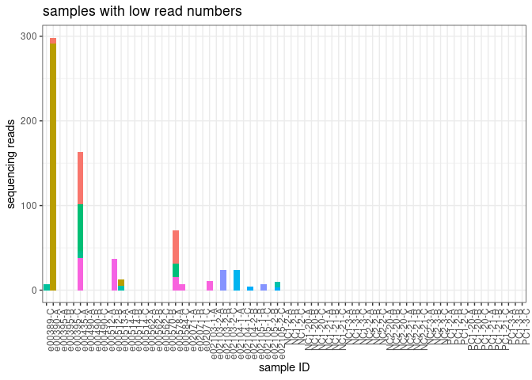<!-- -->

double check that the probability threshold is appropriate. i.e. make
sure no replicates with lots of reads (usually \>2000 are removed)

filter the data frame

``` r
asv_table_filter3 <- asv_table_filter2 %>%
  filter(!Sample_ID %in% outlierIDs)
```

how many environmental samples, control samples did we get rid of here?

``` r
removed_2_summary <- replicates_removed_2 %>%
  group_by(sample_type) %>%
  summarize(removed_2 = n())
removed_2_summary
```

    ## # A tibble: 5 × 2
    ##   sample_type      removed_2
    ##   <chr>                <int>
    ## 1 PCR_blank               24
    ## 2 extraction_blank        15
    ## 3 field_blank              3
    ## 4 positive_control        12
    ## 5 sample                  17

join to summary table

``` r
summary %>%
  left_join(removed_2_summary)
```

    ## Joining with `by = join_by(sample_type)`

    ## # A tibble: 6 × 3
    ##   sample_type      starting_reps removed_2
    ##   <chr>                    <int>     <int>
    ## 1 PCR_blank                   24        24
    ## 2 extraction_blank            15        15
    ## 3 field_blank                  9         3
    ## 4 positive_control            12        12
    ## 5 sample                     954        17
    ## 6 Total                     1014        NA

did we lose any ASVs during this step?

``` r
length(unique(asv_table_filter3$ASV)) 
```

    ## [1] 1828

Nope, 1828 is what we had after step 2.

# 4. Hierarchical Occupancy Modeling

this is based on work by Ryan Kelly:
<https://github.com/invertdna/OccupancyModeling_Stan/tree/master>

the hierarchical stan model used here:
<https://github.com/zjgold/gruinard_decon/blob/master/gruinard_decontam_script.R>

``` r
##Stan Model
sink("Stan_SOM_hierarchical_with_occuprob.stan")
cat(
  "data{/////////////////////////////////////////////////////////////////////
    int<lower=1> S;    // number of samples (nrow)
    int<lower=1> Species[S];    // index of species, each of which will have a different value for p11 and p10
    int<lower=1> Nspecies;    // number of species, each of which will have a different value for p11 and p10
    int<lower=1> L[S];   // index of locations or species/site combinations, each of which will have a different value psi
    int<lower=1> Nloc;   // number of locations or species/site combinations, each of which will have a different value psi
    int<lower=1> K[S];   // number of replicates per site (ncol)
    int<lower=0> N[S]; // number of detections among these replicates
    int z[S];   // integer flag to help estimate psi parameter
}

parameters{/////////////////////////////////////////////////////////////////////
    real<lower=0,upper=1> psi[Nloc];  //commonness parameter
    real<lower=0,upper=1> p11[Nspecies]; //true positive detection rate
    real<lower=0,upper=1> p10[Nspecies]; //false positive detection rate
}

transformed parameters{/////////////////////////////////////////////////////////////////////
}

model{/////////////////////////////////////////////////////////////////////
  real p[S];
  
    for (i in 1:S){
            z[i] ~ bernoulli(psi[L[i]]);
            p[i] = z[i]*p11[Species[i]] + (1-z[i])*p10[Species[i]];
            N[i] ~ binomial(K[i], p[i]);
    }; 
  
  //priors
  psi ~ beta(2,2); 
  p11 ~ beta(2,2); 
  p10 ~ beta(1,10);
}

generated quantities{
  real<lower=0,upper=1> Occupancy_prob[S];    //after inferring parameters above, now calculate occupancy probability for each observation. Equation from Lahoz-Monfort et al. 2015
  
  for (i in 1:S){
  Occupancy_prob[i]  = (psi[L[i]]*(p11[Species[i]]^N[i])*(1-p11[Species[i]])^(K[i]-N[i])) 
  / ((psi[L[i]]*(p11[Species[i]]^N[i])*(1-p11[Species[i]])^(K[i]-N[i])) 
  + (((1-psi[L[i]])*(p10[Species[i]]^N[i]))*((1-p10[Species[i]])^(K[i]-N[i])))
  );
  }
 }
  
",
fill=TRUE)
```

    ## data{/////////////////////////////////////////////////////////////////////
    ##     int<lower=1> S;    // number of samples (nrow)
    ##     int<lower=1> Species[S];    // index of species, each of which will have a different value for p11 and p10
    ##     int<lower=1> Nspecies;    // number of species, each of which will have a different value for p11 and p10
    ##     int<lower=1> L[S];   // index of locations or species/site combinations, each of which will have a different value psi
    ##     int<lower=1> Nloc;   // number of locations or species/site combinations, each of which will have a different value psi
    ##     int<lower=1> K[S];   // number of replicates per site (ncol)
    ##     int<lower=0> N[S]; // number of detections among these replicates
    ##     int z[S];   // integer flag to help estimate psi parameter
    ## }
    ## 
    ## parameters{/////////////////////////////////////////////////////////////////////
    ##     real<lower=0,upper=1> psi[Nloc];  //commonness parameter
    ##     real<lower=0,upper=1> p11[Nspecies]; //true positive detection rate
    ##     real<lower=0,upper=1> p10[Nspecies]; //false positive detection rate
    ## }
    ## 
    ## transformed parameters{/////////////////////////////////////////////////////////////////////
    ## }
    ## 
    ## model{/////////////////////////////////////////////////////////////////////
    ##   real p[S];
    ##   
    ##     for (i in 1:S){
    ##          z[i] ~ bernoulli(psi[L[i]]);
    ##          p[i] = z[i]*p11[Species[i]] + (1-z[i])*p10[Species[i]];
    ##          N[i] ~ binomial(K[i], p[i]);
    ##  }; 
    ##   
    ##   //priors
    ##   psi ~ beta(2,2); 
    ##   p11 ~ beta(2,2); 
    ##   p10 ~ beta(1,10);
    ## }
    ## 
    ## generated quantities{
    ##   real<lower=0,upper=1> Occupancy_prob[S];    //after inferring parameters above, now calculate occupancy probability for each observation. Equation from Lahoz-Monfort et al. 2015
    ##   
    ##   for (i in 1:S){
    ##   Occupancy_prob[i]  = (psi[L[i]]*(p11[Species[i]]^N[i])*(1-p11[Species[i]])^(K[i]-N[i])) 
    ##   / ((psi[L[i]]*(p11[Species[i]]^N[i])*(1-p11[Species[i]])^(K[i]-N[i])) 
    ##   + (((1-psi[L[i]])*(p10[Species[i]]^N[i]))*((1-p10[Species[i]])^(K[i]-N[i])))
    ##   );
    ##   }
    ##  }
    ## 

``` r
sink()
```

the first step is to format my data for the stan model - i need site
information so will start by getting that from the metadata

``` r
sites <- metadata %>%
  dplyr::select(Sample_ID, biological_replicate, pcr_replicate, extraction_ID, location1)

rep_table <- asv_table_filter3 %>%
  left_join(sites, by = "Sample_ID") %>%
  filter(location1 != 'NA') %>%            ##remove sample for which we don't have site locations
  arrange(location1)

occu_df <- rep_table %>%
  ungroup() %>%  
  mutate(reads = ifelse(reads > 0, 1, 0)) %>% # change counts to presence/absence
  dplyr::select(ASV, location1, biological_replicate, pcr_replicate, extraction_ID, reads) %>%
  group_by(ASV, location1, extraction_ID) %>%
  summarise(K = n(),  #count the number of rows for K 
            N = sum(reads)) %>% #sum the detections (now in reads column) for N 
  dplyr::rename(Site = location1,
         BiologicalRep = extraction_ID) %>% ## just renaming so that it matches the naming used in the stan model
  separate(ASV, into = c(NA, "Species"), sep = 3, remove = FALSE)
```

    ## `summarise()` has grouped output by 'ASV', 'location1'. You can override using
    ## the `.groups` argument.

``` r
occu_df$Species <- as.integer(occu_df$Species) #convert ASV to an integer

occu_df <- occu_df %>%
  arrange(Species)
```

**NOTE: i set the extraction_ID as the biological replicate!!!**

running the occupancy model on this entire data set will take a VERY
long time, so now I will reduce the data set down to the patterns of
presence (many ASVs/species have identical patterns of presence, aka.
pattern of technical reps)

``` r
pattern.of.replication <- rep_table %>%
  ungroup() %>%  
  mutate(reads = ifelse(reads > 0, 1, 0)) %>% # change counts to presence/absence
 # filter(!grepl("-2-", Sample_ID)) %>%    ## the extraction replicates are messing thing up right now... i need to code this better in the metadata/etc eventually 
  #dplyr::select(location1, biological_replicate, pcr_replicate, ASV, reads) %>%
  dplyr::select(location1, extraction_ID, pcr_replicate, ASV, reads) %>%
  pivot_wider(names_from = pcr_replicate, values_from = reads) %>%
  mutate(ndetections = A + B + C) %>%
  group_by(location1, ndetections, ASV) %>%
  summarize(tot = sum(!is.na(ndetections)))
```

    ## `summarise()` has grouped output by 'location1', 'ndetections'. You can
    ## override using the `.groups` argument.

``` r
pattern.of.presense <- pattern.of.replication %>%
  spread(ndetections, tot, fill = 0) %>%
  unite(repetition.level, '0', '1', '2', '3', sep = '.') %>%
  select(!`<NA>`)

#select a representative 
unique.pattern <- pattern.of.presense %>%
  group_by(repetition.level) %>%
  summarise(ASV = head(ASV,1) ,
            Site = head(location1, 1)) %>%
  unite(Site, ASV, col = 'key', sep = '.', remove = F)


#subset my full data frame (occu_df) to just include one representative of each unique detection pattern 
occu_df_subset <- occu_df %>%
  unite(Site, ASV, col = 'key', sep = '.', remove = F) %>%
  filter(key %in% unique.pattern$key) 
```

``` r
temp.df <- occu_df_subset

  #make a new species column to that values are consecutive
  Species <- temp.df$Species
  temp.df$Species_1 <- match(Species, unique(Species))

  #create unique identifier for combinations of site-biologicalrep-ASV; for use in hierarchical modeling
  SDS <- unite(data = temp.df, col = SDS, c("Site", "BiologicalRep", "Species")) %>% pull(SDS)
  temp.df$SiteRepSpecies <- match(SDS, unique(SDS)) #index for unique site-biologicalrep-species combinations
  
  #create unique identifier for combinations of site-ASV; for use in hierarchical modeling
  SS <- unite(data = temp.df, col = SS, c("Site", "Species")) %>% pull(SS)
  temp.df$SiteSpecies <- match(SS, unique(SS)) #index for unique site-species combinations
  
  #####################
  #run Stan model
  #note this will take a while the first time you run a particular model, because it needs to compile from C++
  #####################      
  myHierarchicalModel <- stan(file = "Stan_SOM_hierarchical_with_occuprob.stan", 
                        data = list(
                          S = nrow(temp.df),
                          Species = temp.df$Species_1,
                          Nspecies = length(unique(temp.df$Species_1)),
                          L = temp.df$SiteSpecies,
                          Nloc = length(unique(temp.df$SiteSpecies)),
                          K = temp.df$K,
                          N = temp.df$N,
                          z = ifelse(temp.df$N > 0, 1, 0)
                             ), 
                             chains = 4,   #number of chains
                             iter = 4000   #number of iterations per chain
       )
```

    ## Trying to compile a simple C file

    ## Running /opt/R/devel/lib/R/bin/R CMD SHLIB foo.c
    ## gcc -I"/opt/R/devel/lib/R/include" -DNDEBUG   -I"/home/kimberly.ledger/R/x86_64-pc-linux-gnu-library/4.2/Rcpp/include/"  -I"/home/kimberly.ledger/R/x86_64-pc-linux-gnu-library/4.2/RcppEigen/include/"  -I"/home/kimberly.ledger/R/x86_64-pc-linux-gnu-library/4.2/RcppEigen/include/unsupported"  -I"/home/kimberly.ledger/R/x86_64-pc-linux-gnu-library/4.2/BH/include" -I"/home/kimberly.ledger/R/x86_64-pc-linux-gnu-library/4.2/StanHeaders/include/src/"  -I"/home/kimberly.ledger/R/x86_64-pc-linux-gnu-library/4.2/StanHeaders/include/"  -I"/home/kimberly.ledger/R/x86_64-pc-linux-gnu-library/4.2/RcppParallel/include/"  -I"/home/kimberly.ledger/R/x86_64-pc-linux-gnu-library/4.2/rstan/include" -DEIGEN_NO_DEBUG  -DBOOST_DISABLE_ASSERTS  -DBOOST_PENDING_INTEGER_LOG2_HPP  -DSTAN_THREADS  -DBOOST_NO_AUTO_PTR  -include '/home/kimberly.ledger/R/x86_64-pc-linux-gnu-library/4.2/StanHeaders/include/stan/math/prim/mat/fun/Eigen.hpp'  -D_REENTRANT -DRCPP_PARALLEL_USE_TBB=1   -I/usr/local/include   -fpic  -g -O2  -c foo.c -o foo.o
    ## In file included from /home/kimberly.ledger/R/x86_64-pc-linux-gnu-library/4.2/RcppEigen/include/Eigen/Core:88,
    ##                  from /home/kimberly.ledger/R/x86_64-pc-linux-gnu-library/4.2/RcppEigen/include/Eigen/Dense:1,
    ##                  from /home/kimberly.ledger/R/x86_64-pc-linux-gnu-library/4.2/StanHeaders/include/stan/math/prim/mat/fun/Eigen.hpp:13,
    ##                  from <command-line>:
    ## /home/kimberly.ledger/R/x86_64-pc-linux-gnu-library/4.2/RcppEigen/include/Eigen/src/Core/util/Macros.h:628:1: error: unknown type name ‘namespace’
    ##  namespace Eigen {
    ##  ^~~~~~~~~
    ## /home/kimberly.ledger/R/x86_64-pc-linux-gnu-library/4.2/RcppEigen/include/Eigen/src/Core/util/Macros.h:628:17: error: expected ‘=’, ‘,’, ‘;’, ‘asm’ or ‘__attribute__’ before ‘{’ token
    ##  namespace Eigen {
    ##                  ^
    ## In file included from /home/kimberly.ledger/R/x86_64-pc-linux-gnu-library/4.2/RcppEigen/include/Eigen/Dense:1,
    ##                  from /home/kimberly.ledger/R/x86_64-pc-linux-gnu-library/4.2/StanHeaders/include/stan/math/prim/mat/fun/Eigen.hpp:13,
    ##                  from <command-line>:
    ## /home/kimberly.ledger/R/x86_64-pc-linux-gnu-library/4.2/RcppEigen/include/Eigen/Core:96:10: fatal error: complex: No such file or directory
    ##  #include <complex>
    ##           ^~~~~~~~~
    ## compilation terminated.
    ## make: *** [/opt/R/devel/lib/R/etc/Makeconf:168: foo.o] Error 1
    ## 
    ## SAMPLING FOR MODEL 'Stan_SOM_hierarchical_with_occuprob' NOW (CHAIN 1).
    ## Error in sampler$call_sampler(args_list[[i]]) : 
    ##   Must use algorithm="Fixed_param" for model that has no parameters.
    ## [1] "In addition: Warning message:" "In sink() : no sink to remove"

    ## error occurred during calling the sampler; sampling not done

``` r
  #myHierarchicalStanResults <- tidy(tibble(as.data.frame(myHierarchicalModel)))
  
  #write_rds(myHierarchicalStanResults, "occupancy_output_20230707.rds")  ## not that this version actually takes very long to rerun but anyways... 
```

``` r
myHierarchicalStanResults <- read_rds("occupancy_output_20230707.rds")

  ## occupancy probabilities 
  myHierarchicalStanResults_occu <- myHierarchicalStanResults %>%
    filter(grepl("Occupancy_prob", column)) %>%
    separate(column, into=c("column","SiteRepSpecies"), sep="([\\[\\]])")
```

    ## Warning: Expected 2 pieces. Additional pieces discarded in 90 rows [1, 2, 3, 4, 5, 6, 7,
    ## 8, 9, 10, 11, 12, 13, 14, 15, 16, 17, 18, 19, 20, ...].

``` r
  myHierarchicalStanResults_occu$SiteRepSpecies <- as.numeric(myHierarchicalStanResults_occu$SiteRepSpecies)
  
  occupancy_prob <- temp.df %>% 
    select(ASV, Species, Site, SiteSpecies, SiteRepSpecies) %>%
    left_join(myHierarchicalStanResults_occu, by = "SiteRepSpecies") %>% 
    group_by(ASV, Site, SiteSpecies) %>%
    summarise(max_Occupancy_prob = max(mean))
```

    ## `summarise()` has grouped output by 'ASV', 'Site'. You can override using the
    ## `.groups` argument.

``` r
# join my occupancy probabilities the unique.pattern df and then the pattern of presence... 
occu_with_key <- occupancy_prob %>%
  unite(Site, ASV, col = 'key', sep = '.', remove = F) %>%
  left_join(unique.pattern, by = c('key', 'ASV', 'Site')) 

occu_with_key_to_join <- occu_with_key[, c("repetition.level", "max_Occupancy_prob")]

site.asv_occupancy_probs <- pattern.of.presense %>%
  left_join(occu_with_key_to_join)
```

    ## Joining with `by = join_by(repetition.level)`

``` r
keepers <- site.asv_occupancy_probs %>%
  filter(max_Occupancy_prob >= 0.8) %>%
  unite(location1, ASV, col = 'filter_id', sep = '.', remove = F)
discard <- site.asv_occupancy_probs %>%
  filter(max_Occupancy_prob < 0.8)
```

``` r
asv_table_filter4 <- rep_table %>% 
  unite(location1, ASV, col = 'loc.asv', sep = '.', remove = F) %>%
  filter(loc.asv %in% keepers$filter_id)
```

how many unique ASVs are now in the data set?

``` r
length(unique(asv_table_filter4$ASV)) 
```

    ## [1] 207

now i want to quickly check that none of the remaining ASVs obviously
should not be there (i.e. human, dog, etc…)

``` r
## for this i will use the insect taxonomy output (even though i don't think i want to use that for later analyses)

taxonomy <- read.csv("/genetics/edna/workdir/GOApcod_2021/combined/trimmed/filtered/outputs/asv_full_taxonomy_insect.csv") %>%
  select(!X) %>%
  dplyr::rename(ASV = representative)

my_asvs <- unique(asv_table_filter4$ASV)

my_taxon_assignments <- taxonomy %>%
  filter(ASV %in% my_asvs)

my_taxon_assignments %>%
  group_by(class) %>%
  summarise(count = n())
```

    ## # A tibble: 3 × 2
    ##   class       count
    ##   <chr>       <int>
    ## 1 Actinopteri   195
    ## 2 Aves            2
    ## 3 Mammalia       10

alrighty, let me get rid of the birds and mammals… but note that some of
these are probably legit sequences (i.e. seals, otters, bear, deer)

``` r
remove_4 <- my_taxon_assignments %>%
  filter(!class == "Actinopteri")

asv_table_filter4B <- asv_table_filter4 %>%
  filter(!ASV %in% remove_4$ASV)
```

how many unique ASVs are now in the data set?

``` r
length(unique(asv_table_filter4B$ASV)) 
```

    ## [1] 195

# 5. Dissimilarity between PCR (biological) replicates

This step removes samples for which the dissimilarity between PCR
replicates exceeds the normal distribution of dissimilarities observed
in samples. The objective of this step is to remove any technical
replicates that look like they do not belong.

are there any samples that have made it to this point that don’t
actually have any reads?

``` r
asv_table_filter4B %>%
  group_by(Sample_ID) %>%
  summarise(total_reads = sum(reads)) %>%
  arrange(total_reads)
```

    ## # A tibble: 840 × 2
    ##    Sample_ID  total_reads
    ##    <chr>            <dbl>
    ##  1 e00390-C            0 
    ##  2 e00582-B           96 
    ##  3 e00558-A         1668.
    ##  4 e00544-A         2010.
    ##  5 e00547-A         2153.
    ##  6 e00542-B         2215.
    ##  7 e00599-B         2237.
    ##  8 e02076-2-A       2248.
    ##  9 e00542-C         2491.
    ## 10 e00542-A         2563.
    ## # ℹ 830 more rows

hmm… two samples (e00390-C and e00582-B) now have very few reads after
the previous filtering steps. let’s get rid of them now.

``` r
remove_5 <- c("e00390-C", "e00582-B")

temp_table <- asv_table_filter4B %>%
  filter(!Sample_ID %in% remove_5)
```

instead of filtering by the biological replicates, i need to filter by
the unique extractions. the ‘dist_to_centroid’ function later on doesn’t
like the different number of replicates or that there are so many for a
few.. not sure exactly.

let me get the extraction_ID column from the metadata file…

``` r
#extraction_table <- metadata %>%
#  select(Sample_ID, extraction_ID)

#another_temp_table <- temp_table %>%
#  left_join(extraction_table, by = "Sample_ID")
```

how many pcr replicates does each extraction replicate have?

``` r
temp_table %>%
  group_by(extraction_ID) %>%
  summarise(nrep = n_distinct(Sample_ID)) %>%
  filter(nrep == 2)  # there are 6 
```

    ## # A tibble: 6 × 2
    ##   extraction_ID  nrep
    ##   <chr>         <int>
    ## 1 e00389            2
    ## 2 e00435            2
    ## 3 e00570            2
    ## 4 e00578            2
    ## 5 e00582            2
    ## 6 e00584            2

``` r
  #filter(nrep == 1) # there is one - e00390
```

okay, so there are 6 extraction_IDs with only 2 pcr replicates. and one
extraction_ID with only 1 pcr replicate.

remove the extraction with only one pcr rep from the data frame

``` r
temp_table <- temp_table %>%
  filter(extraction_ID != "e00390")
```

first, i’ll calculate an eDNA index

``` r
normalized <- temp_table %>%
  group_by(Sample_ID) %>%
  mutate(Tot = sum(reads),
         Prop_reads = reads/Tot) %>%
  dplyr::group_by(ASV) %>%
  mutate(Colmax = max(Prop_reads, na.rm = TRUE),
         Normalized_reads = Prop_reads/Colmax)

#add a new sample id column that also includes the location - will use this for dissimilarity measures
normalized <- normalized %>%
  unite(site_biorep, location1, biological_replicate, sep = "_", remove = FALSE) %>%
  unite(new_ID, site_biorep, pcr_replicate, sep = "-", remove = FALSE)
```

``` r
tibble_to_matrix <- function (tb) {
  
  tb %>%
  #normalized %>%
    group_by(new_ID, ASV) %>% 
    summarise(nReads = sum(Normalized_reads)) %>% 
    spread ( key = "ASV", value = "nReads", fill = 0) %>%
    ungroup() -> matrix_1
    samples <- pull (matrix_1, new_ID)
    matrix_1[,-1] -> matrix_1
    data.matrix(matrix_1) -> matrix_1
    dimnames(matrix_1)[[1]] <- samples
    vegdist(matrix_1) -> matrix_1
}
```

``` r
all.distances.full <- tibble_to_matrix(normalized)
```

    ## `summarise()` has grouped output by 'new_ID'. You can override using the
    ## `.groups` argument.

``` r
# Do all samples have a name?
summary(is.na(names(all.distances.full)))
```

    ##    Mode 
    ## logical

make the pairwise distances a long table

``` r
as_tibble(subset(melt(as.matrix(all.distances.full)))) -> all.distances.melted
```

    ## Warning in type.convert.default(X[[i]], ...): 'as.is' should be specified by the
    ## caller; using TRUE

    ## Warning in type.convert.default(X[[i]], ...): 'as.is' should be specified by the
    ## caller; using TRUE

``` r
# Any major screw ups
summary(is.na(all.distances.melted$value))
```

    ##    Mode   FALSE 
    ## logical  700569

``` r
# Now, create a three variables for all distances, they could be PCR replicates, BIOL replicates, or from the same site

all.distances.melted %>%
  separate (X1, into = "Bottle1", sep = "\\-", remove = FALSE) %>%
  separate (Bottle1, into = "Site1", remove = FALSE) %>%
  separate (X2, into ="Bottle2", sep = "\\-", remove = FALSE) %>%
  separate (Bottle2, into = "Site2", remove = FALSE) %>%
  mutate ( #Day.site1 = str_sub(Bottle1, start = 1, end = -2),
           #Day.site2 = str_sub(Bottle2, start = 1, end = -2),
           Distance.type = case_when( Bottle1 == Bottle2 ~ "PCR.replicates",
                                      #Day.site1 == Day.site2 ~ "Biol.replicates",
                                      Site1 == Site2 ~ "Same Site",
                                      TRUE ~ "Different Site"
                                     )) %>%
  dplyr::select(Sample1 = X1, Sample2 = X2 , value , Distance.type) %>%
  filter (Sample1 != Sample2) -> all.distances.to.plot
```

    ## Warning: Expected 1 pieces. Additional pieces discarded in 700569 rows [1, 2, 3, 4, 5,
    ## 6, 7, 8, 9, 10, 11, 12, 13, 14, 15, 16, 17, 18, 19, 20, ...].

    ## Warning: Expected 1 pieces. Additional pieces discarded in 700569 rows [1, 2, 3, 4, 5,
    ## 6, 7, 8, 9, 10, 11, 12, 13, 14, 15, 16, 17, 18, 19, 20, ...].
    ## Expected 1 pieces. Additional pieces discarded in 700569 rows [1, 2, 3, 4, 5,
    ## 6, 7, 8, 9, 10, 11, 12, 13, 14, 15, 16, 17, 18, 19, 20, ...].
    ## Expected 1 pieces. Additional pieces discarded in 700569 rows [1, 2, 3, 4, 5,
    ## 6, 7, 8, 9, 10, 11, 12, 13, 14, 15, 16, 17, 18, 19, 20, ...].

``` r
# Checking all went well

sapply(all.distances.to.plot, function(x) summary(is.na(x)))
```

    ##       Sample1   Sample2   value     Distance.type
    ## Mode  "logical" "logical" "logical" "logical"    
    ## FALSE "699732"  "699732"  "699732"  "699732"

``` r
all.distances.to.plot$Distance.type <- all.distances.to.plot$Distance.type  %>% fct_relevel("PCR.replicates", "Same Site")

ggplot (all.distances.to.plot) +
  geom_histogram (aes (fill = Distance.type, x = value, after_stat(ndensity)), position = "dodge",  alpha = 0.9, bins = 50) +
  facet_wrap( ~ Distance.type) +
  labs (x = "Pairwise dissimilarity", y = "density" ,
        Distance.type = "Distance") +
    guides (fill = "none")
```

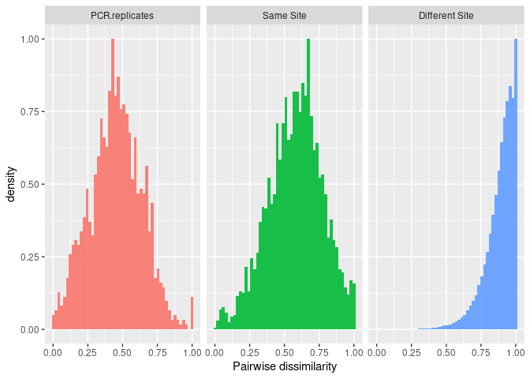<!-- -->

``` r
  #ggsave("visual.anova.png", dpi = "retina")
```

i think this looks as expected, lowest dissimilarity in pcr reps, then
samples from the same site, then samples from different sites. cool.

will try to follow what was done here
(<https://github.com/ramongallego/eDNA.and.Ocean.Acidification.Gallego.et.al.2020/blob/master/Scripts/Denoising.all.runs.Rmd>)
and instead of choosing outliers based on the pairwise distances, we can
do a similar thing using the distance to centroid.

now identify and discard outliers

``` r
normalized %>%
  group_by(extraction_ID) %>% nest() -> nested.cleaning 

nested.cleaning %>% 
  mutate(matrix = map(data, tibble_to_matrix)) -> nested.cleaning

nested.cleaning %>% mutate(ncomparisons = map(matrix, length)) -> nested.cleaning
```

``` r
dist_to_centroid <- function (x,y) {
  
  #biol <- rep(y, dim(x)[[1]])
  biol <- rep(y, length(x))
  
  if (length(biol) == 1) {
    output = rep(x[1]/2,2)
    names(output) <- attr(x, "Labels")
  }else{ 
    
  dispersion <- betadisper(x, group = biol)
  output = dispersion$distances
  }
  output
    }
```

``` r
nested.cleaning.temp <- nested.cleaning %>% 
  mutate (distances = map2(matrix, extraction_ID, dist_to_centroid))

all_distances <- nested.cleaning.temp %>%
  unnest_longer(distances) %>%
  dplyr::select(extraction_ID, distances_id, distances)

hist(all_distances$distances)
```

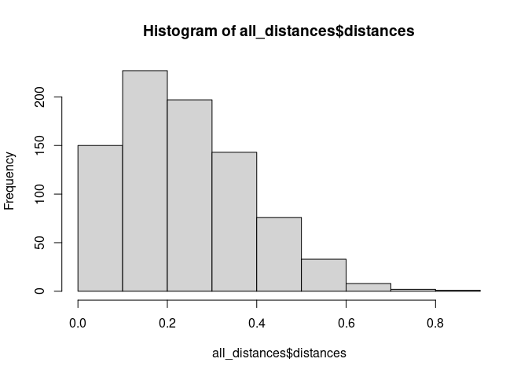<!-- -->

calculate normal distribution of distances to centroid

``` r
normparams <- MASS::fitdistr(all_distances$distances, "normal")$estimate                                      
probs <- pnorm(all_distances$distances, normparams[1], normparams[2])
outliers_centroid <- which(probs>0.95)

discard_centroid <- all_distances$distances_id[outliers_centroid]
discard_centroid
```

    ##  [1] "7_e00388-B"   "8_e00385-B"   "10_e00396-C"  "25_e00409-B"  "27_e00426-A" 
    ##  [6] "29_e00421-C"  "29_e00422-B"  "31_e00430-C"  "33_e00470-C"  "36_e00474-C" 
    ## [11] "36_e00475-B"  "36_e00476-A"  "38_e00481-A"  "40_e00489-A"  "40_e00491-C" 
    ## [16] "48_e00508-B"  "48_e00510-B"  "52_e00525-B"  "55_e00533-B"  "56_e00538-C" 
    ## [21] "57_e00539-C"  "59_e00545-A"  "59_e00545-B"  "59_e00547-A"  "60_e00551-B" 
    ## [26] "60_e00552-C"  "66_e00582-A"  "66_e00582-C"  "66_e00583-C"  "66_e00584-A" 
    ## [31] "66_e00584-B"  "70_e00590-B"  "79_e02041-B"  "81_e02042-C"  "82_e02046-C" 
    ## [36] "82_e02047-C"  "85_e02055-A"  "85_e02056-A"  "85_e02056-C"  "86_e02058-A" 
    ## [41] "87_e02061-C"  "93_e02069-C"  "94_e02074-C"  "94_e02074-E"  "95_e02077-D" 
    ## [46] "96_e02081-E"  "99_e02094-D"  "99_e02095-E"  "100_e02091-A" "100_e02091-C"
    ## [51] "101_e02100-A" "101_e02101-C" "101_e02101-E" "102_e02097-F" "103_e02106-C"
    ## [56] "103_e02108-F" "104_e02110-D" "104_e02111-F"

output the samples that pass this filter

``` r
asv_table_filter5 <- temp_table %>%
  unite(site_biorep, location1, biological_replicate, sep = "_", remove = FALSE) %>%
  unite(new_ID, site_biorep, pcr_replicate, sep = "-", remove = FALSE) %>%
  filter(!new_ID %in% discard_centroid)
```

which extraction IDs had a pcr replicate with low similarity??

``` r
to_discard <- data.frame(discard_centroid) %>%
  separate(discard_centroid, into = c("location1", "extraction_ID", "rep_ID"))

removed_step5 <- temp_table %>%
  filter(extraction_ID %in% to_discard$extraction_ID)
```

maybe just plot a few.

these samples have at least one dissimilar pcr replicates

``` r
unique(removed_step5$extraction_ID)
```

    ##  [1] "e00388" "e00385" "e00396" "e00409" "e00426" "e00421" "e00422" "e00430"
    ##  [9] "e00470" "e00474" "e00475" "e00476" "e00481" "e00489" "e00491" "e00508"
    ## [17] "e00510" "e00525" "e00533" "e00538" "e00539" "e00545" "e00547" "e00551"
    ## [25] "e00552" "e00582" "e00583" "e00584" "e00590" "e02041" "e02042" "e02046"
    ## [33] "e02047" "e02055" "e02056" "e02058" "e02061" "e02069"

``` r
length(unique(removed_step5$extraction_ID))  ## these are just the extraction_ID with at least one PCR rep removed 
```

    ## [1] 38

``` r
first_six <- unique(removed_step5$extraction_ID)[1:6]

removed_step5 %>%
  filter(extraction_ID %in% first_six) %>%
  group_by(Sample_ID) %>%
  mutate(sum=sum(reads)) %>%
  mutate(prop = reads/sum) %>%
  ggplot(aes(x=Sample_ID, y=prop, fill=ASV)) +
  geom_bar(stat = "identity") + 
  facet_wrap(~extraction_ID, scales = 'free', ncol = 3) +
  theme_bw() + 
  theme(
    axis.text.x = element_text(angle = 90, hjust = 0.95),
    legend.position = "none",
    legend.title = element_blank()
  )  
```

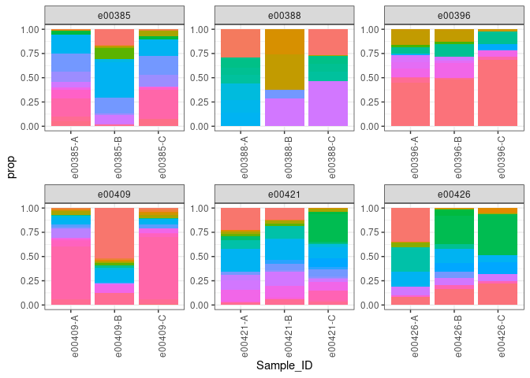<!-- -->

# Some results of read decontamination

compared to samples that do have similar pcr replicates…

**site 1**

``` r
asv_table_filter5 %>%
  group_by(Sample_ID) %>%
  mutate(sum=sum(reads)) %>%
  mutate(prop = reads/sum) %>%
  filter(location1 == 1) %>%
  ggplot(aes(x=Sample_ID, y=prop, fill=ASV)) +
  geom_bar(stat = "identity") + 
  facet_wrap(~extraction_ID, scales = 'free', ncol = 3) +
  theme_bw() + 
  theme(
    axis.text.x = element_text(angle = 90, hjust = 0.95),
    legend.position = "none",
    legend.title = element_blank()
  )  
```

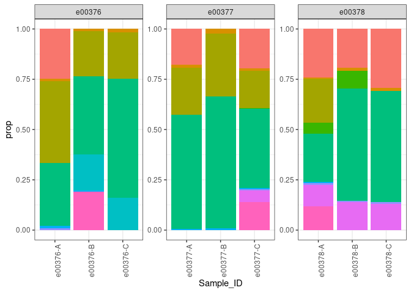<!-- -->

**site 2**

``` r
asv_table_filter5 %>%
  group_by(Sample_ID) %>%
  mutate(sum=sum(reads)) %>%
  mutate(prop = reads/sum) %>%
  filter(location1 == 2) %>%
  ggplot(aes(x=Sample_ID, y=prop, fill=ASV)) +
  geom_bar(stat = "identity") + 
  facet_wrap(~extraction_ID, scales = 'free', ncol = 3) +
  theme_bw() + 
  theme(
    axis.text.x = element_text(angle = 90, hjust = 0.95),
    legend.position = "none",
    legend.title = element_blank()
  )  
```

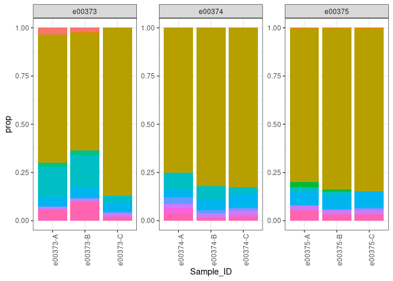<!-- -->

**site 3**

``` r
asv_table_filter5 %>%
  group_by(Sample_ID) %>%
  mutate(sum=sum(reads)) %>%
  mutate(prop = reads/sum) %>%
  filter(location1 == 3) %>%
  ggplot(aes(x=Sample_ID, y=prop, fill=ASV)) +
  geom_bar(stat = "identity") + 
  facet_wrap(~extraction_ID, scales = 'free', ncol = 3) +
  theme_bw() + 
  theme(
    axis.text.x = element_text(angle = 90, hjust = 0.95),
    legend.position = "none",
    legend.title = element_blank()
  )  
```

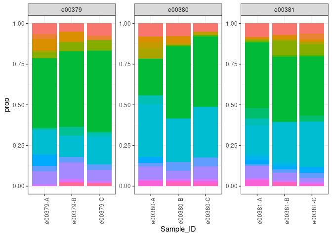<!-- -->

**site 7**

``` r
asv_table_filter5 %>%
  group_by(Sample_ID) %>%
  mutate(sum=sum(reads)) %>%
  mutate(prop = reads/sum) %>%
  filter(location1 == 7) %>%
  ggplot(aes(x=Sample_ID, y=prop, fill=ASV)) +
  geom_bar(stat = "identity") + 
  facet_wrap(~extraction_ID, scales = 'free', ncol = 3) +
  theme_bw() + 
  theme(
    axis.text.x = element_text(angle = 90, hjust = 0.95),
    legend.position = "none",
    legend.title = element_blank()
  )  
```

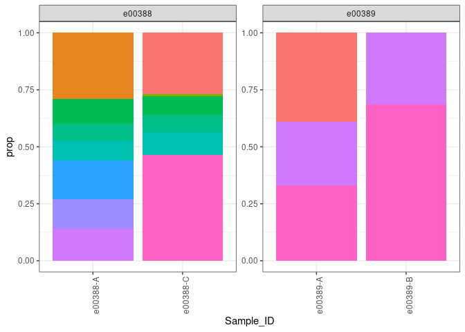<!-- -->

site 7 is an example where dissimilar pcr reps have been filtered out…
even these don’t really looka all that similar…

**site 29**

``` r
asv_table_filter5 %>%
  group_by(Sample_ID) %>%
  mutate(sum=sum(reads)) %>%
  mutate(prop = reads/sum) %>%
  filter(location1 == 29) %>%
  ggplot(aes(x=Sample_ID, y=prop, fill=ASV)) +
  geom_bar(stat = "identity") + 
  facet_wrap(~extraction_ID, scales = 'free', ncol = 3) +
  theme_bw() + 
  theme(
    axis.text.x = element_text(angle = 90, hjust = 0.95),
    legend.position = "none",
    legend.title = element_blank()
  )  
```

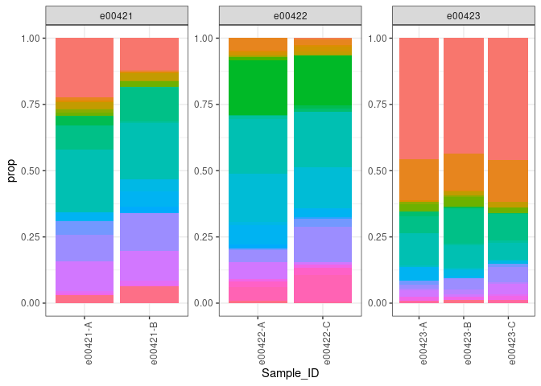<!-- -->

**site 60**

``` r
asv_table_filter5 %>%
  group_by(Sample_ID) %>%
  mutate(sum=sum(reads)) %>%
  mutate(prop = reads/sum) %>%
  filter(location1 == 60) %>%
  ggplot(aes(x=Sample_ID, y=prop, fill=ASV)) +
  geom_bar(stat = "identity") + 
  facet_wrap(~extraction_ID, scales = 'free', ncol = 3) +
  theme_bw() + 
  theme(
    axis.text.x = element_text(angle = 90, hjust = 0.95),
    legend.position = "none",
    legend.title = element_blank()
  )  
```

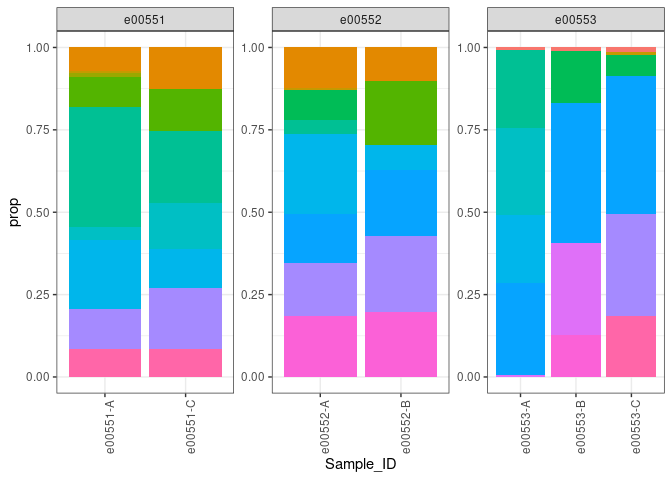<!-- -->

how many ASV’s do we have in our post-decontamination dataset

``` r
length(unique(asv_table_filter5$ASV))
```

    ## [1] 195

how many sites, biological replicates, and pcr replicates did we end up
with for our **environmental samples**?

``` r
length(unique(asv_table_filter5$location1))
```

    ## [1] 83

``` r
#unique_replicates_ending <- asv_table_filter5 %>%
#  group_by(location1) %>%
#  summarise(n_biologial_reps = n_distinct(biological_replicate),
#            n_pcr_reps_per_biorep = n_distinct(pcr_replicate),
#            n_pcr_reps_total = n_biologial_reps*n_pcr_reps_per_biorep)

#unique_replicates_ending
```

compare the pre and post decontamination sample summaries

``` r
#differences <- anti_join(unique_replicates_starting, unique_replicates_ending) 
#differences
```

save the post-decontamination table

``` r
#write.csv(asv_table_filter5, "decontamination_output_20230707.csv", row.names = FALSE)
```
