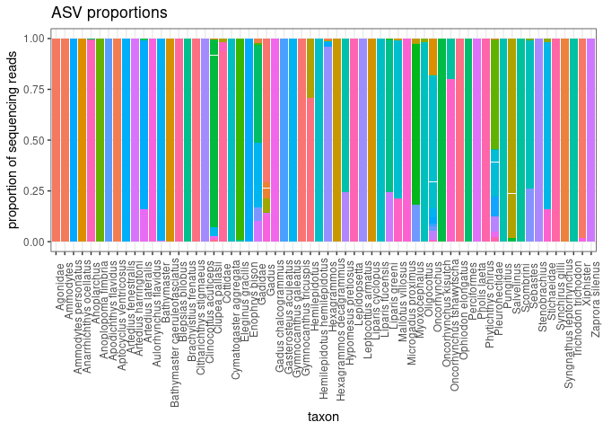
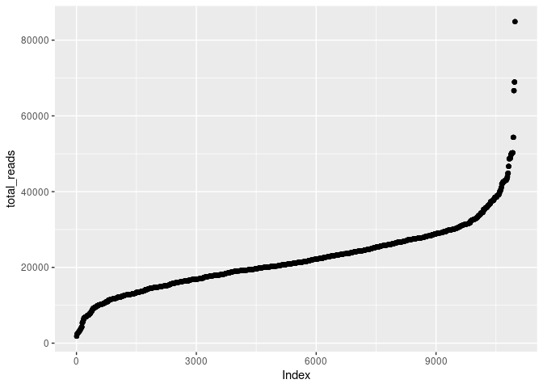
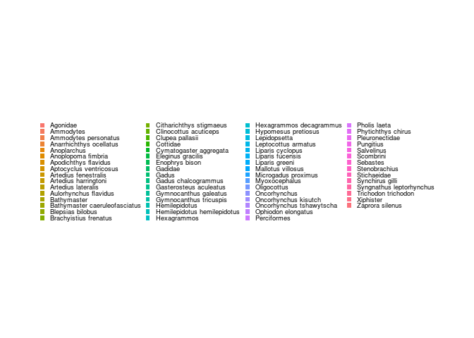
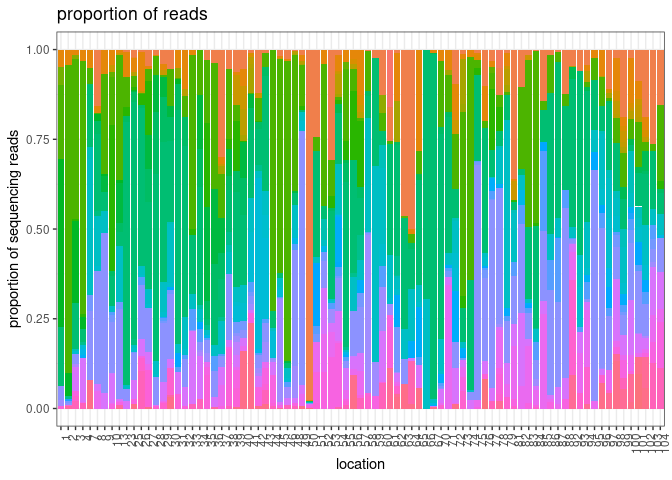
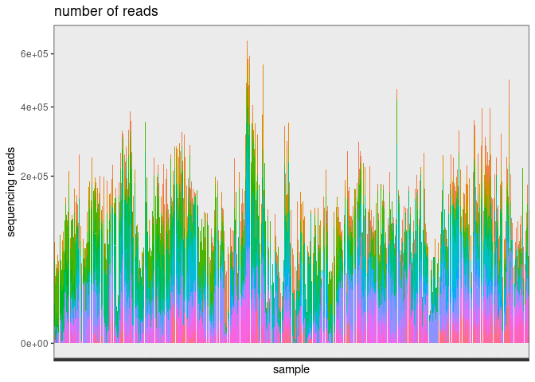
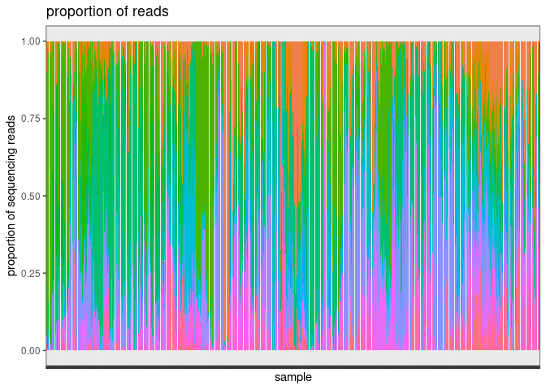

asv analysis of GOA pcod 2021 samples using MiFish
================
Kimberly Ledger
2023-07-05

- analysis of mifish sequences from May 9 2023 and May 12 2023
  sequencing runs  
- samples are from the GOA pcod survey in 2021  
- this script uses decontaminated read counts from my June 30 2023 run
  of “ASV_decontamination_GOApcod_NEW.Rmd”

load libraries

``` r
library(tidyverse)
```

    ## ── Attaching packages ─────────────────────────────────────── tidyverse 1.3.2 ──
    ## ✔ ggplot2 3.4.0     ✔ purrr   1.0.1
    ## ✔ tibble  3.2.1     ✔ dplyr   1.1.2
    ## ✔ tidyr   1.3.0     ✔ stringr 1.5.0
    ## ✔ readr   2.1.3     ✔ forcats 0.5.2
    ## ── Conflicts ────────────────────────────────────────── tidyverse_conflicts() ──
    ## ✖ dplyr::filter() masks stats::filter()
    ## ✖ dplyr::lag()    masks stats::lag()

``` r
library(ggplot2)
```

read in sample metadata

``` r
metadata <- read.csv("/genetics/edna/workdir/GOApcod_2021/GOA2021_metadata_20230630.csv")

#illumina output changed "_" to "-"
metadata$Sample_ID <- gsub("_", "-", metadata$Sample_ID) 
```

read in taxonomic identification  
- for now using insect IDs and blastn taxonomy with 1% similarity
threshold

``` r
taxon_insect <- read.csv("/genetics/edna/workdir/GOApcod_2021/combined/trimmed/filtered/outputs/asv_full_taxonomy_insect.csv") %>%
  select(!X) %>%
  dplyr::rename(ASV = representative)

taxon_blastn <- read.csv("/genetics/edna/workdir/GOApcod_2021/combined/trimmed/filtered/outputs/asv_taxonomy_blastn_20230630.csv") %>%
  select(!X) %>%
  dplyr::rename(ASV = qseqid)
```

read in decontaminated sample table

``` r
decontam_reads <- read.csv("/home/kimberly.ledger/GOApcod_2021/decontamination_output_20230630.csv") %>%
  select(!sample_type) %>%   ## clean-up this table - remove irrelevant columns 
  select(!loc.asv) %>%
  select(!new_ID) %>%
  select(!site_biorep)

asv_summary <- decontam_reads %>%
  group_by(ASV) %>%
  summarize(reads = sum(reads)) %>%
  arrange(desc(reads))
```

join the taxon id’s ti the ASVs in the decontaminated read dataset

``` r
my_asvs <- asv_summary$ASV

join <- taxon_insect %>%
  filter(ASV %in% my_asvs) %>%
  left_join(taxon_blastn, by = "ASV")
```

compare insect vs blastn ids

``` r
join_taxon <- join %>%
  select(ASV, taxon.x, rank, species.y, diff, taxon.y, taxonomic_level)
```

rename taxa with different scientific names in the blastn vs insect  
- Polypera greeni is also called Liparis greeni

``` r
join_taxon <- join_taxon %>%
   mutate(across(everything(), ~ifelse(. == "Polypera greeni", "Liparis greeni", .)))
```

what asvs do the taxonomies match?

``` r
matches <- join_taxon %>%
  filter(taxon.x == taxon.y) %>%
  select(!diff) %>%
  select(!species.y) %>%
  unique()

matches_id <- matches %>%
  select(ASV, taxon.x, rank) %>%
  rename(taxon = taxon.x)

nrow(matches_id)
```

    ## [1] 93

okay. just under half (93/196) of the asv’s have matching blastn and
insect ids…

what about the rest?

``` r
mismatches <- join_taxon %>%
  filter(!ASV %in% matches$ASV) %>%
  filter(!rank == "no rank") %>%
  rename(taxon_insect = taxon.x,
         rank_insect = rank, 
         species_blastn = species.y,
         diff_blastn = diff,
         taxon_blastn = taxon.y, 
         rank_blastn = taxonomic_level)

#write.csv(mismatches, "/genetics/edna/workdir/GOApcod_2021/combined/trimmed/filtered/outputs/asv_mismatches.csv")
```

can i remove species from this list that do not occur in the GOA???  
- try out the rFishBase package - look for species in Pacific, Northeast
Waters

``` r
#remotes::install_github("ropensci/rfishbase")
#library(rfishbase)
```

i’m having trouble installing rfishbase… going to just upload a species
list i downloaded from fishbase for all Pacific, Northeast waters
species.

``` r
in_range <- read.csv("/home/kimberly.ledger/GOApcod_2021/FishBase_Pacific_NE_SpeciesList.csv") %>%
  mutate(taxon = paste(Genus, Species, sep = " "))
```

filter to keep only taxa that occur in the NE Pacific

``` r
mismatches_inrange <- mismatches %>%
  filter(species_blastn %in% in_range$taxon)
```

look at what is “out of range”

``` r
out_of_range <- mismatches %>%
  filter(!species_blastn %in% in_range$taxon) %>%
  select(species_blastn) %>%
  unique

out_of_range
```

    ##                   species_blastn
    ## 1                   Gadus morhua
    ## 2                Clupea harengus
    ## 3              Sprattus sprattus
    ## 4         Oncorhynchus kawamurae
    ## 5            Ammodytes japonicus
    ## 6              Ammodytes marinus
    ## 7             Ammodytes tobianus
    ## 8         Hyperoplus immaculatus
    ## 9         Hyperoplus lanceolatus
    ## 10              Pholis gunnellus
    ## 11          Arctogadus glacialis
    ## 13              Salvelinus albus
    ## 14         Salvelinus kuznetzovi
    ## 15            Salvelinus curilus
    ## 16           Salvelinus drjagini
    ## 17          Salvelinus kronocius
    ## 18        Salvelinus leucomaenis
    ## 19         Salvelinus levanidovi
    ## 20           Salvelinus schmidti
    ## 22               Limanda limanda
    ## 23     Hippoglossus hippoglossus
    ## 24              Scomber scombrus
    ## 27            Hexagrammos otakii
    ## 28          Hexagrammos agrammus
    ## 29       Lepidopsetta mochigarei
    ## 31                          <NA>
    ## 40      Lumpenus lampretaeformis
    ## 41         Myoxocephalus aenaeas
    ## 47       Brachyopsis segaliensis
    ## 54     Syngnathus californiensis
    ## 55           Syngnathus euchrous
    ## 56             Syngnathus exilis
    ## 66      Melanogrammus aeglefinus
    ## 67          Merlangius merlangus
    ## 68            Oncorhynchus gilae
    ## 75     Cottocomephorus grewingki
    ## 76                  Cottus asper
    ## 77              Cottus beldingii
    ## 78                  Cottus gobio
    ## 79                Cottus gulosus
    ## 80              Cottus perplexus
    ## 81                  Cottus ricei
    ## 82  Batrachocottus multiradiatus
    ## 83      Batrachocottus nikolskii
    ## 84        Batrachocottus talievi
    ## 85        Comephorus baikalensis
    ## 86          Comephorus dybowskii
    ## 87       Cottocomephorus inermis
    ## 88              Cottus aleuticus
    ## 89                Cottus bairdii
    ## 90               Cottus bendirei
    ## 91               Cottus cognatus
    ## 92               Cottus confusus
    ## 93            Cottus dzungaricus
    ## 94          Cottus hangiongensis
    ## 95             Cottus perifretum
    ## 96               Cottus pitensis
    ## 97                 Cottus pollux
    ## 98               Cottus rhenanus
    ## 99               Cottus rhotheus
    ## 100              Procottus major
    ## 104          Sebastes baramenuke
    ## 105               Sebastes cheni
    ## 106              Sebastes hubbsi
    ## 107             Sebastes inermis
    ## 108             Sebastes joyneri
    ## 109         Sebastes longispinis
    ## 110            Sebastes oculatus
    ## 111             Sebastes owstoni
    ## 112       Sebastes pachycephalus
    ## 113        Sebastes rubrivinctus
    ## 114          Sebastes schlegelii
    ## 115       Sebastes steindachneri
    ## 116        Sebastes taczanowskii
    ## 117           Sebastes thompsoni
    ## 118         Sebastes ventricosus
    ## 119             Sebastes wakiyai
    ## 133           Taurocottus bergii
    ## 139            Cottus marginatus
    ## 141            Cottus poecilopus
    ## 157    Gymnocanthus herzensteini

should any of these still be there?? - need to consult someone else
here.

now, what asvs only have one species match?

``` r
one_species_asv <- mismatches_inrange %>%
  group_by(ASV) %>%
  summarize(n_spp = n()) %>%
  filter(n_spp == 1)

one_spp <- mismatches_inrange %>%
  filter(ASV %in% one_species_asv$ASV)

one_spp_id <- one_spp %>%
  select(ASV, species_blastn) %>%
  mutate(rank = "species") %>%
  rename(taxon = species_blastn)

nrow(one_spp_id)
```

    ## [1] 32

what asvs still have multiple matches?

``` r
many_species_asv <- mismatches_inrange %>%
  group_by(ASV) %>%
  summarize(n_spp = n()) %>%
  filter(n_spp > 1)

many_spp <- mismatches_inrange %>%
  filter(ASV %in% many_species_asv$ASV)

nrow(many_spp)
```

    ## [1] 85

use the blastn id for these

``` r
many_spp_id <- many_spp %>%
  select(ASV, taxon_blastn, rank_blastn) %>%
  unique() %>%
  rename(rank = rank_blastn) %>%
  rename(taxon = taxon_blastn)
```

manually change these next….  
- ASV7 change to Gadus, genus  
- ASV67 change to Gadus, genus  
- ASV102 change to Ammodytes, genus  
- AV126 change to Gadus, genus

to do later maybe… write code to identify if the taxon_blast id could be
a higher taxonomic resolution (i.e. genus rather than family)

``` r
#ASV7
many_spp_id[3,2] <- "Gadus"
many_spp_id[3,3] <- "genus"
#ASV67
many_spp_id[14,2] <- "Gadus"
many_spp_id[14,3] <- "genus"
#ASV102
many_spp_id[21,2] <- "Ammodytes"
many_spp_id[21,3] <- "genus"
#ASV126
many_spp_id[23,2] <- "Gadus"
many_spp_id[23,3] <- "genus"
```

join all the id tables

``` r
my_ids <- bind_rows(matches_id, one_spp_id, many_spp_id)
```

now join the read numbers

``` r
asv_w_id <- decontam_reads %>%
  left_join(my_ids, by = "ASV")
```

find out what ASVs didn’t get a taxon id and see if that was a big
problem…

``` r
asv_w_id %>%
  filter(is.na(taxon)) %>%
  group_by(ASV) %>%
  summarize(total_reads = sum(reads)) %>%
  arrange(desc(total_reads))
```

    ## # A tibble: 39 × 2
    ##    ASV    total_reads
    ##    <chr>        <dbl>
    ##  1 ASV23       129759
    ##  2 ASV61        39786
    ##  3 ASV65        32546
    ##  4 ASV77        24294
    ##  5 ASV101       11004
    ##  6 ASV121        7255
    ##  7 ASV113        7070
    ##  8 ASV105        7001
    ##  9 ASV119        6664
    ## 10 ASV103        6642
    ## # ℹ 29 more rows

most of these ASVs without taxonomic ids don’t have very many reads… but
let me take a closer looks at the top few (asvs with \>10000 reads).

``` r
join_taxon %>%
  filter(ASV == "ASV23")
```

    ##     ASV   taxon.x  rank        species.y diff          taxon.y taxonomic_level
    ## 1 ASV23 Scombrini tribe Scomber scombrus    0 Scomber scombrus         species

okay, this is atlantic mackerel… not in range. tribe is above genus but
below family/subfamily. let’s go with that.

``` r
join_taxon %>%
  filter(ASV == "ASV61")
```

    ##     ASV    taxon.x     rank species.y diff taxon.y taxonomic_level
    ## 1 ASV61 Clupeoidei suborder      <NA>   NA    <NA>            <NA>

hmm.. not sure what to do here. for now, i’m going to remove this asv.
it may be Clupea pallasii - but this spp already has 2.5 million reads
so 40,000 more may not be a big deal.

``` r
join_taxon %>%
  filter(ASV == "ASV65")
```

    ##     ASV taxon.x  rank species.y diff taxon.y taxonomic_level
    ## 1 ASV65   Gadus genus      <NA>   NA    <NA>            <NA>

keep this as Gadus… i wonder why the blastn id didn’t return anything…

``` r
join_taxon %>%
  filter(ASV == "ASV77")
```

    ##     ASV   taxon.x    rank         species.y diff           taxon.y
    ## 1 ASV77 Stomiatii no rank Mallotus villosus    0 Mallotus villosus
    ##   taxonomic_level
    ## 1         species

keep this as Mallotus villosus… i wonder why insect gave this no rank…

``` r
join_taxon %>%
  filter(ASV == "ASV101")
```

    ##      ASV    taxon.x    rank species.y diff taxon.y taxonomic_level
    ## 1 ASV101 Eupercaria no rank      <NA>   NA    <NA>            <NA>

removing this one.

add these ids to ‘my_id’

``` r
asv23 <- join_taxon %>%
  filter(ASV == "ASV23") %>%
  select(ASV, taxon.x, rank) %>%
  rename(taxon = taxon.x)

asv65 <- join_taxon %>%
  filter(ASV == "ASV65") %>%
  select(ASV, taxon.x, rank) %>%
  rename(taxon = taxon.x)

asv77 <- join_taxon %>%
  filter(ASV == "ASV77") %>%
  select(ASV, taxon.y, rank) %>%
  rename(taxon = taxon.y)
```

join all the id tables

``` r
my_ids_2 <- bind_rows(my_ids, asv23, asv65, asv77)
```

now join the read numbers

``` r
asv_w_id <- decontam_reads %>%
  left_join(my_ids_2, by = "ASV")
```

now i will remove ASVs with no taxon ID

``` r
asv_w_id <- asv_w_id %>%
  filter(!is.na(taxon)) 
```

plot the proportion of reads for a taxon assigning to individual ASV’s
<!-- -->

okay, so most taxa (especially species-level) are only made up of one
ASV, while other taxa have several ASVs

asv summary table - only keeping order and below because everything
above that (i.e. class) is identical

``` r
#asv_id_table <- asv_w_id %>%
#  #select(ASV, order, family, genus, species, taxon, reads) %>%
#  select(ASV, taxon, reads) %>%
#  group_by(taxon) %>%
#  filter(taxon != "NA") %>%
#  mutate(sum=sum(reads)) %>%
#  mutate(prop = reads/sum) # %>%
# # arrange(order, family, genus, species)
```

\*\* can’t do this unless i rejoin the full taxon information… arrange
taxons in a way that make sense instead of alphabetical

``` r
#asv_order <- asv_w_id %>%
#  arrange(order, family, genus, species) %>%
#  select(taxon) %>%
#  unique
```

now, join taxon and asv tables (with decontaminated read counts)

``` r
asv_id <- asv_w_id %>%
  select(ASV, taxon)

read_summary_wide <- asv_w_id %>%
  group_by(Sample_ID, taxon) %>%
  summarise(total_read_count = sum(reads)) %>%
  pivot_wider(names_from = "taxon", values_from = "total_read_count") %>%
  replace(is.na(.), 0)
```

    ## `summarise()` has grouped output by 'Sample_ID'. You can override using the
    ## `.groups` argument.

``` r
read_summary<- asv_w_id %>%
  group_by(Sample_ID, taxon) %>%
  summarise(reads = sum(reads))
```

    ## `summarise()` has grouped output by 'Sample_ID'. You can override using the
    ## `.groups` argument.

join to metadata

``` r
join <- metadata %>%
  left_join(read_summary, by = c("Sample_ID")) %>%
  filter(!is.na(reads))

join$Sample_ID <- as.factor(join$Sample_ID)
join$pcr_replicate <- as.factor(join$pcr_replicate)
join$biological_replicate <- as.factor(join$biological_replicate)
join$extraction_ID <- as.factor(join$extraction_ID)
join$extraction_replicate <- as.factor(join$extraction_replicate)
join$run <- as.factor(join$run)
join$location1 <- as.factor(join$location1)
join$sample_type <- as.factor(join$sample_type)
join$taxon <- as.factor(join$taxon)

#summary(join)
```

\*\* need full taxonomic info to do this relevel the taxon factor

``` r
# desired_order <- asv_order$taxon
# 
# join_long <- join_long %>%
#   mutate(taxon = factor(taxon, levels = desired_order))
# 
# levels(join_long$taxon)
```

make a table with taxons and total read counts

``` r
join %>%
  group_by(taxon) %>%
  summarise(total_reads = sum(reads)) %>%
  arrange(desc(total_reads))
```

    ## # A tibble: 62 × 2
    ##    taxon                total_reads
    ##    <fct>                      <dbl>
    ##  1 Gadus                   3726814.
    ##  2 Clupea pallasii         2451229.
    ##  3 Oncorhynchus            2183027.
    ##  4 Ammodytes personatus    1196527.
    ##  5 Hexagrammos             1091239.
    ##  6 Pholis laeta             734320.
    ##  7 Anoplarchus              521445.
    ##  8 Pleuronectidae           518780 
    ##  9 Cottidae                 398865.
    ## 10 Gadidae                  312918.
    ## # ℹ 52 more rows

## now let’s check out data!

take a quick first look at the library sizes (i.e. the number of reads)
in each sample

``` r
temp <- join %>%
  group_by(Sample_ID) %>%
  mutate(total_reads = sum(reads)) %>%
  arrange(total_reads) %>%
  unique()

temp$Index <- seq(nrow(temp))

ggplot(temp, aes(x=Index, y = total_reads)) + 
         geom_point(alpha = 0.5)
```

<!-- -->

remember, the read decontamination process already excluded
samples/replicates with no or few reads

alright, let me plot the legend for reference

    ## 
    ## Attaching package: 'gridExtra'

    ## The following object is masked from 'package:dplyr':
    ## 
    ##     combine

<!-- -->

okay, now i will summarize samples by location (remember part of the
decontamination steps included removing outlier site replicates)

i am calculating the mean read proportions at a site here

``` r
location_summary <- join %>%
  group_by(Sample_ID) %>%
  mutate(sum=sum(reads)) %>%
  mutate(prop = reads/sum) %>%
  filter(sum > 1) %>%
  group_by(location1, taxon) %>%
  summarize(mean_prop = mean(prop))
```

    ## `summarise()` has grouped output by 'location1'. You can override using the
    ## `.groups` argument.

``` r
location_summary$location1 <- as.factor(location_summary$location1)
```

``` r
location_summary %>%
  ggplot(aes(x=location1, y=mean_prop, fill=taxon)) +
  geom_bar(stat = "identity") + 
  theme_bw() +
  labs(
    y = "proportion of sequencing reads",
    x = "location",
    title = "proportion of reads") + 
  theme(
    axis.text.x=element_text(angle = 90, hjust = 0.95), #remove x axis labels
    legend.text = element_text(size = 8),
    legend.key.size = unit(0.3, "cm"),
    legend.position = "none",
    legend.title = element_blank(),
  )
```

<!-- -->

## now let’s take a look at reads from all of the samples

<!-- -->

## and proportion of reads from the samples

<!-- -->
